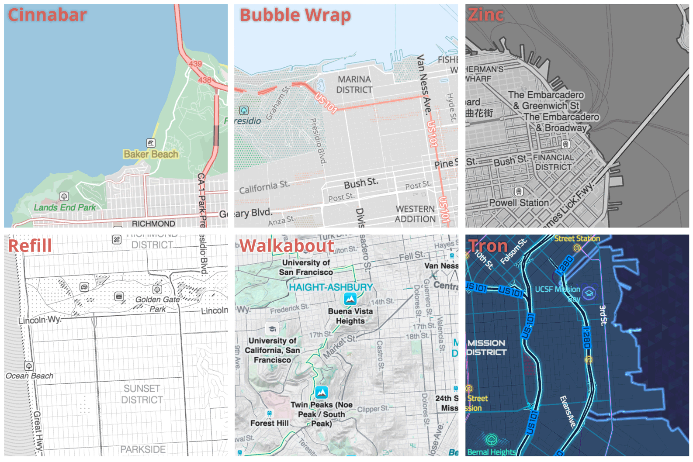

# Display Mapzen vector tiles in a map

You can use Mapzen’s vector tile service with a variety of browser-based rendering software packages. Following the syntax of the library you are using, you need to specify the URL to the Mapzen vector tile service, the layers that you want to draw on the map, and styling information about how to draw the features.

## Tangram

* **Bubble Wrap demo:** [preview](https://mapzen.com/products/maps/bubble-wrap/) | [source code](http://github.com/tangrams/refill-style-more-labels)
* **Refill demo:** [preview](https://mapzen.com/products/maps/refill/more-labels/) | [source code](http://github.com/tangrams/refill-style-more-labels)
* **Walkabout demo:** [preview](https://mapzen.com/products/maps/walkabout/more-labels) | [source code](http://github.com/tangrams/refill-style-more-labels)
* **Tron demo:** [preview](https://mapzen.com/products/maps/tron/more-labels) | [source code](http://github.com/tangrams/refill-style-more-labels)
* **Cinnabar demo:** [preview](https://mapzen.com/products/maps/cinnabar/more-labels) | [source code](http://github.com/tangrams/cinnabar-style-more-labels)
* **Zinc demo:** [preview](https://mapzen.com/products/maps/zinc/more-labels) | [source code](http://github.com/tangrams/zinc-style-more-labels)

[Tangram](https://mapzen.com/projects/tangram) is a WebGL mapping engine designed for real-time rendering of 2D and 3D maps from vector tiles. More details are available on the [Tangram home  page](https://mapzen.com/projects/tangram).

We offer several free world basemap styles for Tangram, including [Bubble Wrap, Refill, Walkabout, Tron, Cinnabar, and Zinc](https://mapzen.com/blog/updated-house-styles/) and include variants with more or less labels. Please remix them to suite your own designs!



## D3

* **D3 demo:** [preview](http://mapzen.github.io/d3-vector-tiles) | [source code](https://github.com/mapzen/d3-vector-tiles)

D3 is a JavaScript visualization library that you can use to render to SVG format in your browser. [Mike Bostock](http://bl.ocks.org/mbostock) adapted d3.geo.til [to show OpenStreetMap vector tiles](http://bl.ocks.org/mbostock/5593150). To use D3 with Mapzen vector tiles, use either GeoJSON or TopoJSON format, which have similar syntax, or the Mapbox Vector Tiles format. The layer styling can be inline or referenced from a CSS file.

With D3, specifying the URL to the Mapzen vector tile service takes the form of

`d3.json("https://tile.mapzen.com/mapzen/vector/v1/{layers}/{zoom}/{x}/{y}.{format}", function(error, json)`

where .{format} can be .json for GeoJSON, .topojson for TopoJSON, or .mvt for Mapbox Vector Tiles.

D3 uses a different zoom level than other map tiles. Default zoom for a map is set using `d3.geo.mercator` and `.scale()`. In this example, 21 is roughly equivalent to z13.

```
var projection = d3.geo.mercator()
    .scale((1 << 21) / 2 / Math.PI)
```

Upper and lower zoom levels are set using `d3.behavior.zoom()` and `.scaleExtent()`. In this example, the scale extent of 12 to 25 is roughly z4-z5 to z17:

```
.scaleExtent([1 << 12, 1 << 25])
```

See also the [D3 documentation on zoom behavior](https://github.com/mbostock/d3/wiki/Zoom-Behavior).

See the examples in the [d3-vector-tiles](https://github.com/mapzen/d3-vector-tiles) repo for more information. This repository has samples using each input format (see geojson.html, topojson.html, or index.html for .mvt).

## MapboxGL

* **MapboxGL demo:** [preview](https://apollomapping.github.io/ap-tilezen-mapbox-styles/demo/demo.html) | [source code](https://github.com/apollomapping/ap-tilezen-mapbox-styles)

[MapboxGL](https://www.mapbox.com/mapbox-gl/) is a JavaScript library used to render the Mapbox Vector Tiles protocol buffer format through OpenGL on both web and native platforms.

To specify Mapzen vector tile server as the source, use the following URL string, where .mvt is the file format.

```
  "sources": {
    "osm": {
      "type": "vector",
      "tiles": ["https://tile.mapzen.com/mapzen/vector/v1/{layers}/{zoom}/{x}/{y}.mvt"]
```

See https://github.com/apollomapping/ap-tilezen-mapbox-styles for a sample map of Mapzen vector tiles displayed in MapboxGL.

## OpenLayers

* **OpenLayers demo:** [preview](https://mapzen.github.io/openlayers-mapzen-vector-tile-example/) | [source code](https://github.com/mapzen/openlayers-mapzen-vector-tile-example/)

[OpenLayers](http://openlayers.org) is a high-performance, feature-packed JavaScript library for all your mapping needs. OpenLayers supports the Mapzen vector tiles in GeoJSON format.
