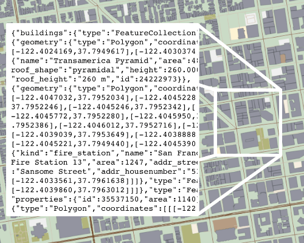

The [Mapzen vector tile service](https://mapzen.com/projects/vector-tiles) provides [OpenStreetMap](www.openstreetmap.org) base layer data, with worldwide coverage updated daily. Vector tiles are square-shaped collections of geographic data that contain the map feature geometry, such as lines and points. Information about how map features are drawn is maintained in a separate stylesheet file. For many purposes, vector tiles are more flexible than raster tiles, which are images that already have the visual appearance of the map features integrated in them. 

To start integrating vector tiles to your apps, you need a [developer API key](https://mapzen.com/developers).

Vector tiles make real-time rendering possible by sending the underlying OSM geometry and tags directly to the client, whether that’s a browser or a native mobile app. Buildings and roads can be rendered in different ways, or not at all, when the vector tile is downloaded, and changes happen instantly on the client's side. There is no need to head back to the server and fetch a different set of tiles if you want to filter the output or change the style of a road or color of a building.

The Mapzen vector tile service provides [tiles in a variety of formats](use-service.md#formats), including GeoJSON, TopoJSON, and binary. How to [draw the tile](display-tiles.md) in a browser is up to the vector-friendly visualization tool, such as SVG, Canvas, or WebGL. The [Tangram](https://mapzen.com/projects/tangram) rendering engine, which uses WebGL, is one way that you can draw the vector tile service in 2D and 3D maps.

Vector tiles are served by clipping geometries to the tile bounding box, and then simplified to match the zoom level to avoid unnecessary complexity at lower zoom levels. These geometries and features are also further processed to facilitate styling. When changes are made to the OSM base layer, rather than waiting for an image tile to be redrawn, only the coordinates and drawing instructions for that particular building or road need to be updated. Depending on the URL syntax, vector tiles can return all of the OSM data, or just individual [layers](layers.md), or combinations of layers, including water, earth, landuse, roads, buildings and points of interest.

This is based on the work of [Michal Migurski](http://mike.teczno.com/), and extends his [OSM.US-hosted vector tile service](http://openstreetmap.us/~migurski/vector-datasource/) with additional data and format support.

If you are interested in setting up your own version of this service, follow these [installation instructions](https://github.com/mapzen/vector-datasource/wiki/Mapzen-Vector-Tile-Service), or you can also try this [Vagrant VM](https://github.com/mapzen/vagrant-tiles), which will additionally set up other tile components as well.
