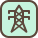

# Layers in Tilezen's vector tiles


The [Tilezen vector tiles](https://mapzen.com/projects/vector-tiles) provides worldwide basemap coverage sourced from [OpenStreetMap](http://www.openstreetmap.org) and other open data projects, updated intermittently as a free & shared service at [Nextzen.org](http://www.nextzen.org).

Data is organized into several thematic layers, each of which is named, for example; `buildings`, `pois`, and `water`. A selection of these layers are typically used for base map rendering, and are provided under the short-hand name `all`. Each layer includes a simplified view of OpenStreetMap data for easier consumption, with common tags often condensed into a single `kind` field as noted below.

Need help displaying vector tiles in a map? Here are several [examples](display-tiles.md) using Tilezen vector tiles to style in your favorite graphics library including Tangram, Mapbox GL, D3, and OpenLayers.

### Overview

#### Data sources and attribution

Tilezen primarily sources from OpenStreetMap, but includes a variety of other open data. For a full listing, view the [data sources](data-sources.md). Each source may require [attribution](https://github.com/tilezen/vector-datasource/blob/master/docs/attribution.md) in your project.

#### Feature names

Most Tilezen vector tile features include a basic name property (`common`):

* `name` - Generally the name the locals call the feature, in the local script.

It supports several additional name related properties (`optional`):

* `alt_name`
* `int_name`
* `loc_name`
* `name:short` - For example: `CA` for California. _See planned bug fix [#1102](https://github.com/tilezen/vector-datasource/issues/1102) and see planned bug fix [#1094](https://github.com/tilezen/vector-datasource/issues/1094) for abbreviated names._
* `name_left`
* `name_right`
* `nat_name`
* `official_name`
* `old_name`
* `reg_name`
* `short_name`

#### Name localization

Tilezen includes all language variants of the `name:*` values to enable full internationalization (when different from `name`).

Language variants are identified by an ISO 639-1 two-letter language code and optional country code, for example `en` for English and less commonly `en_GB` for British English. Mapzen [house styles](https://mapzen.com/products/maps/) designed in Tangram support displaying all language scripts.

We additionally localize `alt_name:*` and `old_name:*` properties for features across all layers.

For features in the `boundaries` layer, there are two additional variants `name:left` and `name:right` to support oriented labeling on the appropriate side of the boundary line (so the labeled polygon's text can appear inside that polygon consistently). _See planned bug fix [#1102](https://github.com/tilezen/vector-datasource/issues/1102)._

**Localized name properties** (`common-optional`)**:**

* `name:*`
* `alt_name:*`
* `old_name:*`
* `name:left:*` _See planned bug fix [#1102](https://github.com/tilezen/vector-datasource/issues/1102)._
* `name:right:*` _See planned bug fix [#1102](https://github.com/tilezen/vector-datasource/issues/1102)._

##### Chinese name localization

We populate two fields for Chinese variants based on [ISO 15924](https://en.wikipedia.org/wiki/ISO_15924) codes::

* `name:zh-Hans`: Simplified Chinese
* `name:zh-Hant`: Traditional Chinese

Both `name:zh-Hans` and `name:zh-Hant` properties are best-effort. It means `name:zh-Hans` can sometimes contain Traditional Chinese and `name:zh-Hant` can sometimes contain Simplified Chinese. And we don't auto-translate Traditional Chinese to Simplified Chinese or vice versa.

The `name:zh` field is now deprecated. But for backward-compatibility we also populate it, and this field is Simplified Chinese most time but can also be Traditional Chinese. Don't rely on this field.

If Tilezen cannot find any Chinese properties in the predefined list of each provider (see below), none of `name:zh`, `name:zh-Hans` or `name:zh-Hant` will be populated.

###### OSM

We use several tags from OSM to populate the two properties:

* `name:zh-Hans`: Simplified Chinese
* `name:zh-SG`: Simplified Chinese
* `name:zh`: Simplified/Traditional Chinese
* `name:zh-Hant`: Traditional Chinese
* `name:zh-Hant-tw`: Traditional Chinese
* `name:zh-Hant-hk`: Traditional Chinese
* `name:zh-yue`: Traditional Chinese
* `name:zh-HK`: Traditional Chinese

We first try to use OSM tag `name:zh-Hans` to populate `name:zh-Hans` and OSM tag `name:zh-Hant` to populate `name:zh-Hant`, but if they are not available we parse other OSM tags such as `name:zh-SG`, `name:zh-Hant-tw`, `zh-Hant-hk`, `name:zh-yue`, `name:zh-HK`, `name:zh` to backfill them. After the backfilling, if either one is still missing, we will use the other variant to further backfill, i.e. Traditional Chinese can be used to backfill `name:zh-Hans` or Simplified Chinese can be used to backfill `name:zh-Hant`.


###### WhosOnFirst

We use several properties to populate Simplified Chinese and Traditional Chinese with the following priority (first priority is at the top):

Simplified Chinese
* `name:zho_cn_x_preferred`
* `name:zho_x_preferred`
* `name:wuu_x_preferred`

Traditional Chinese
* `name:zho_tw_x_preferred`
* `name:zho_x_variant`

If either variant is missing, we will use the other variant to backfill, i.e. Traditional Chinese can be used to backfill `name:zh-Hans` or Simplified Chinese can be used to backfill `name:zh-Hant`.


###### NaturalEarth

We use two properties to populate Simplified Chinese and Traditional Chinese:

Simplified Chinese
* `name_zh`

Traditional Chinese
* `name_zht`

If either variant is missing, we will use the other variant to backfill, i.e. Traditional Chinese can be used to backfill `name:zh-Hans` or Simplified Chinese can be used to backfill `name:zh-Hant`.


#### Geometry types

Individual Tilezen vector tile layers can include mixed geometry types. This is common in the `landuse`, `water`, and `buildings` layers.

A tile geometry can be one of three types:

* Point, MultiPoint
* LineString, MultiLineString
* Polygon, MultiPolygon

In Tangram, Mapzen's GL graphics library, the keyword `$geometry` matches the feature's geometry type, for cases when a FeatureCollection includes more than one type of geometry. Valid geometry types are:

* `point`: matches Point, MultiPoint
* `line`: matches LineString, MultiLineString
* `polygon`: matches Polygon, MultiPolygon

**Tangram scene file examples:**

```
filter: { $geometry: polygon }            # matches polygons only
filter: { $geometry: [point, line] }      # matches points & lines
filter: function() { return $geometry === 'line' }  # matches lines
```

Mapnik supports geometry filtering via the special `mapnik::geometry_type` keyword.

**CartoCSS Examples:**

```
#layer['mapnik::geometry_type'=1] { /* point styles */ }
#layer['mapnik::geometry_type'=2] { /* line styles */ }
#layer['mapnik::geometry_type'=3] { /* polygon styles */ }
```

#### Data updates

Most Tilezen vector tile content is updated minutely from OpenStreetMap. Low and mid-zoom tiles are updated approximately monthly. Some source data rarely updates – Natural Earth updates approximately yearly.

#### Changelog

The current version of Tilezen vector tile data schema is **v1.9.0**.

Tiles are still in active development, but Tilezen promises to minimize backwards incompatible breaking changes. Data model promises are listed in the Tilezen [SEMANTIC VERSIONING](https://github.com/mapzen/vector-datasource/tree/master/SEMANTIC-VERSIONING.md) statement.

You can send your feedback at hello@nextzen.org or via our [Gitter chat](https://gitter.im/tilezen/tilezen-chat) room.

Read the full details in the project [CHANGELOG](https://github.com/mapzen/vector-datasource/tree/v1.6.0/CHANGELOG.md).

#### Feature ordering

Ordering of features - which ones draw "on top of" other features - can be an important feature of display maps. To help out with this, there is a `sort_rank` property on some features which suggests in what order the features should appear. Lower numbers mean that features should appear "towards the back" and higher numbers mean "towards the front". These numbers are consistent across layers. The layers which include `sort_rank` on their features are: `boundaries`, `buildings`, `earth`, `landuse`, `roads`, `transit` and `water`.

To facilitate **data visualization** overlays and underlays, the following client-side `order` ranges are suggested:

* `0-9`: Under everything. _Tip: disable earth layer._
* `190-199`: Under water. Above earth and most landuse.
* `290-299`: Under roads. Above borders, water, landuse, and earth. **Your classic "underlay".**
* `490-499`: Over all line and polygon features. Under map labels (icons and text), under UI elements (like routeline and search result pins). **Your classic raster map overlay.**

**Tangram scene file example:**

```
draw:
    polygons:
        order: 490
```

### Layer reference

Tilezen vector tiles include 9 default layers (and 2 optional layers):

* `boundaries`, `buildings`, `earth`, `landuse`, `places`, `pois`, `roads`, `transit`, and `water`

These individual layers are grouped into an `all` layer – use this special layer for all your general purpose mapping needs.

While the service can return just a single layer or combination of layers, the `all` layer is more performant.

The Tilezen vector tiles schema defines 2 optional layers:

* `traffic_flow` and `traffic_incidents`


## Boundaries


* Layer name: `boundaries`
* Geometry types: `line`

Combination of OpenStreetMap administrative boundaries (zoom >= 8) and Natural Earth boundaries (zoom < 8).


#### Boundaries properties (common):

* `name`: A suggested label, formed from the left and right region names, if available. If the name appears to be too long to be rendered on the geometry at a particular zoom it may be omitted.
* `id`: Identifier for the feature, only provided at zoom 13+.
* `kind`: mapping of OpenStreetMap's `admin_level` int values to strings like `country` and `state`, plus `aboriginal_lands` boundary type, and also includes normalized Natural Earth values. To handle disagreements about the location of borders, the `kind` may be prefixed with `unrecognized_`, e.g: `unrecognized_country`, for some differing viewpoints (see `kind:xx` below).
* `kind_detail`: mapping of OpenStreetMap's `admin_level` values. `2` for countries, `4` for regions, and `6`, `8` (zoom 10+)
* `source`: `openstreetmap.org` or `naturalearthdata.com`
* `sort_rank`: a suggestion for which order to draw features. The value is an integer where smaller numbers suggest that features should be "behind" features with larger numbers.
* `min_zoom`: a suggested minimum zoom at which the boundary line should become visible based on `scalerank` and `min_zoom` value from Natural Earth, and invented for OpenStreetMap, a float.

#### Boundaries properties (common optional):

* `kind:xx`: alternate `kind` according to the viewpoint `XX`. If you want to show features according to a particular viewpoint, then use `kind:xx` if it exists and fall back to `kind` if not. The range of values is the same as for `kind`. Note that the viewpoints are either lower-case [ISO 3166-1 alpha-2](https://en.wikipedia.org/wiki/ISO_3166-1_alpha-2) codes or the pseudo-code `iso`.
* `id:left`: For the relation on the left side of the boundary line. This is only provided at zoom 13+.
* `id:right`: For the relation on the right side of the boundary line. This is only provided at zoom 13+.
* `name:left`: See name section above, other variants like `old_name` also supported. _See planned bug fix in [#1102](https://github.com/tilezen/vector-datasource/issues/1102)._
* `name:right`: See name section above, other variants like `old_name` also supported. _See planned bug fix in [#1102](https://github.com/tilezen/vector-datasource/issues/1102)._
* `maritime_boundary`: a special Tilezen calculated value loosely coupled with OpenStreetMap's maritime tag, but with spatial buffer processing for lines falling in the ocean.

#### Boundaries properties (optional):

* `osm_relation`: `true`, which can also be deduced from negative `id` values.

#### Boundary `kind` values:

* `aboriginal_lands`
* `country`
* `county`
* `disputed`
* `disputed_breakaway`
* `disputed_claim`
* `disputed_elusive`
* `disputed_reference_line`
* `indefinite`
* `indeterminate`
* `lease_limit`
* `line_of_control`
* `locality`
* `macroregion`
* `map_unit`
* `overlay_limit`
* `region`
* `unrecognized_country`
* `unrecognized_region`

### Viewpoints for Disputed Boundaries

When there is a **boundary dispute** between two countries, the default boundary between them is generally shown according to the _de facto_ status marking where one country's on the ground administration ends and another's begins. The boundary line itself is marked `disputed`, and the extend of the other country's claim is tagged with one of `disputed_breakaway`, `disputed_claim`, `disputed_elusive`, and `disputed_reference_line`.

Audiences in different countries may have different expectations and legal requirements so Tilezen optionally supports _de jure_ boundary viewpoints with `kind:xx` properties, where `xx` is a lower-cased [ISO 3166-1 codes](https://en.wikipedia.org/wiki/ISO_3166-1_alpha-2) with support for `ar`, `bd`, `br`, `cn`, `de`, `eg`, `es`, `fr`, `gb`, `gr`, `id`, `il`, `in`, `it`, `jp`, `ko`, `ma`, `nl`, `np`, `pk`, `pl`, `ps`, `pt`, `ru`, `sa`, `se`, `tr`, `tw`, `ua`, `us`, `vn`. Use these properties to "turn off" `unrecognized_country` and `unrecognized_region` boundary lines, and restyle the claims as `country` and `region`. The range of values is the same as for `kind`, and should be used in conjunction with `kind` as `kind:xx` in a coalesce as it's only included when that country's viewpoint is different than the default. These should be paired with **places** layer viewpoint support for country and region capitals.

Some disputed boundaries, like the [China 9-dashed line](https://en.wikipedia.org/wiki/Nine-dash_line), are marked `unrecognized_country` by default and are only available in a specific `kind:xx` viewpoint (in this case `kind:cn` and `kind:tw`).

## Buildings and Addresses


* Layer name: `buildings`
* Geometry types: `point` and `polygon`

Polygons from OpenStreetMap representing building footprints, building label placement points, `building_part` features, address points, and entrance and exit points. Starts at zoom 13 by including huge buildings, progressively adding all buildings at zoom 16+. Address points are available at zoom 16+, but marked with `min_zoom: 17` to suggest that they are suitable for display at zoom level 17 and higher.

Individual `building_part` geometries from OpenStreetMap following the [Simple 3D Buildings](http://wiki.openstreetmap.org/wiki/Simple_3D_Buildings) tags at higher zoom levels. Building parts may receive a `root_id` corresponding to the building feature, if any, with which they intersect.

Tilezen calculates the `landuse_kind` value by intercutting `buildings` with the `landuse` layer to determine if a building is over a parks, hospitals, universities or other landuse features. Use this property to modify the visual appearance of buildings over these features. For instance, light grey buildings look great in general, but aren't legible over most landuse colors unless they are darkened (or colorized to match landuse styling).

Label position points may also have `closed` or `historical` `kind_detail` values if the original building name ended in "(closed)" or "(historical)", respectively. These points will have a `min_zoom` of 17, suggesting that they are suitable for display only at high zooms. _See related bug fix in [#1026](https://github.com/tilezen/vector-datasource/issues/1026)._

Values for `kind_detail`  are sourced from OpenStreetMap's `building` tag for building footprints and from `building:part` tag for building parts.

Note that building geometries, like most geometries in Tilezen tiles, are clipped to the bounds of the tile, even if the building extends beyond the tile. This means that it might be necessary to assemble geometry from several neighbouring tiles to recreate the full building. Some buildings are exceptionally large and span many tiles, so this can be tricky.

#### Building properties (common):

* `name`
* `id`: from OpenStreetMap
* `root_id`: so building parts can be associated back with their "root" building relation
* `kind`: see below
* `kind_detail`: see below
* `source`: `openstreetmap.org`
* `landuse_kind`: See description above, values match values in the `landuse` layer.
* `sort_rank`: a suggestion for which order to draw features. The value is an integer where smaller numbers suggest that features should be "behind" features with larger numbers.
* `min_zoom`: a suggested minimum zoom at which the building should become visible based on area and volume limits.

#### Building properties (common optional):

* `addr_housenumber`: value from OpenStreetMap's `addr:housenumber` tag
* `addr_street`: value from OpenStreetMap's `addr:street` tag
* `area`: in square meters (spherical Mercator, no real-world), `polygon` features only.
* `building_material`: A description of the material covering the outside of the building or building part, if the information is available. Common values are: `brick`, `cement_block`, `clay`, `concrete`, `glass`, `masonry`, `metal`, `mud`, `other`, `permanent`, `plaster`, `sandstone`, `semi-permanent`, `steel`, `stone`, `timber-framing`, `tin`, `traditional` and `wood`, and there are many other less common values.
* `height`: in meters, where available
* `layer`
* `location`: from OpenStreetMap to indicate if building is underground, similar to `layer`.
* `min_height`: value from `min_height` in meters, where available, otherwise estimated from `building:min_levels` if present
* `roof_color`: from `roof:color` tag
* `roof_height`: from `roof:height` tag
* `roof_material`: from `roof:material` tag
* `roof_orientation`: from `roof:orientation` tag
* `roof_shape`: from `roof:shape` tag
* `scale_rank`: calculation of a feature's importance
* `volume`: calculated on feature's `area` and `height`, when `height` or `min_height` is available.

#### Building layer `kind` values:

* `building`
* `building_part`
* `address`
* `entrance`
* `exit`

#### Building footprint and label placement `kind_detail` values:

* `abandoned`
* `administrative`
* `agricultural`
* `airport`
* `allotment_house`
* `apartments`
* `arbour`
* `bank`
* `barn`
* `basilica`
* `beach_hut`
* `bell_tower`
* `boathouse`
* `brewery`
* `bridge`
* `bungalow`
* `bunker`
* `cabin`
* `carport`
* `castle`
* `cathedral`
* `chapel`
* `chimney`
* `church`
* `civic`
* `clinic`
* `closed`. _See planned bug fix in [#1026](https://github.com/tilezen/vector-datasource/issues/1026)._
* `clubhouse`
* `collapsed`
* `college`
* `commercial`
* `construction`
* `container`
* `convent`
* `cowshed`
* `dam`
* `damaged`
* `depot`
* `destroyed`
* `detached`
* `disused`
* `dormitory`
* `duplex`
* `factory`
* `farm`
* `farm_auxiliary`
* `fire_station`
* `garage`
* `garages`
* `gazebo`
* `ger`
* `glasshouse`
* `government`
* `grandstand`
* `greenhouse`
* `hangar`
* `healthcare`
* `hermitage`
* `historical`. _See planned bug fix in [#1026](https://github.com/tilezen/vector-datasource/issues/1026)._
* `hospital`
* `hotel`
* `house`
* `houseboat`
* `hut`
* `industrial`
* `kindergarten`
* `kiosk`
* `library`
* `mall`
* `manor`
* `manufacture`
* `mixed_use`
* `mobile_home`
* `monastery`
* `mortuary`
* `mosque`
* `museum`
* `office`
* `outbuilding`
* `parking`
* `pavilion`
* `power`
* `prison`
* `proposed`
* `pub`
* `public`
* `residential`
* `restaurant`
* `retail`
* `roof`
* `ruin`
* `ruins`
* `school`
* `semidetached_house`
* `service`
* `shed`
* `shelter`
* `shop`
* `shrine`
* `silo`
* `slurry_tank`
* `stable`
* `stadium`
* `static_caravan`
* `storage`
* `storage_tank`
* `store`
* `substation`
* `summer_cottage`
* `summer_house`
* `supermarket`
* `synagogue`
* `tank`
* `temple`
* `terrace`
* `tower`
* `train_station`
* `transformer_tower`
* `transportation`
* `university`
* `utility`
* `veranda`
* `warehouse`
* `wayside_shrine`
* `works`

Additional `kind_detail` values are provided from POI `kind`s where one is not available from the building feature. This means that you could see any POI `kind` value as a building `kind_detail` value.

#### Building part `kind_detail` values:

* `arch`
* `balcony`
* `base`
* `column`
* `door`
* `elevator`
* `entrance`
* `floor`
* `hall`
* `main`
* `passageway`
* `pillar`
* `porch`
* `ramp`
* `roof`
* `room`
* `steps`
* `stilobate`
* `tier`
* `tower`
* `verticalpassage`
* `wall`
* `window`

#### Entrance and exit `kind_detail` values

Entrances can have an optional `kind_detail`. If present, it will be one of:

* `garage`
* `home`
* `main`
* `private`
* `residence`
* `secondary`
* `service`
* `staircase`
* `unisex` - seems to be mostly mapped on building containing toilets.

Exits can have an optional `kind_detail`. If present, it will be one of:

* `emergency`
* `fire_exit`

## Earth


* Layer name: `earth`
* Geometry types: `polygon`, `line`, `point`.

Polygons representing earth landmass and natural feature lines. Uses coastline-derived land polygons from [osmdata.openstreetmap.de](https://osmdata.openstreetmap.de). Natural lines from OpenStreetMap representing cliffs, aretes. This layer also includes earth `label_placement` lines for ridges and valleys (which should not otherwise be symbolized).

_Uses Natural Earth until zoom 7, then switches to OSM land at zoom 8+._

**Earth properties:**

* `name`: generally only for lines or label placement points
* `id`: The `osm_id` **or** funky value when from Natural Earth or OSMData.OpenStreetMap.de
* `kind`: either `earth` or "natural" value from OSM tag.
* `source`: `openstreetmap.org` or `naturalearthdata.com`
* `sort_rank`: a suggestion for which order to draw features. The value is an integer where smaller numbers suggest that features should be "behind" features with larger numbers.
* `min_zoom`: a suggestion for which zoom to draw a feature. The value is a float. _See planned bug fix in [#1073](https://github.com/tilezen/vector-datasource/issues/1073)._

#### Earth `kind` values:

* `archipelago` - point, intended for label placement only
* `arete` - line
* `cliff` - line, intended for label placement only
* `continent` - point, intended for label placement only
* `earth` - polygon
* `island` - point, intended for label placement only
* `islet` - point, intended for label placement only
* `ridge` - line, intended for label placement only
* `valley` - line, intended for label placement only

## Landuse


* Layer name: `landuse`
* Geometry types: `point` and `polygon`

Landuse polygons from OpenStreetMap representing parks, forests, residential, commercial, industrial, university, sports and other areas. Includes OpenStreetMap data at higher zoom levels, and [Natural Earth](http://naturalearthdata.com) polygons at lower zoom levels. This layer also includes landuse `label_placement` points for labeling polygons de-duplicated across tile boundaries.

Zooms 4 and 5, 6 and 7 includes a mix of Natural Earth `urban_area` (zooms 0-9 only) features and OpenStreetMap data for `national_park`, `protected_area`, and `nature_reserve` only. After that more more feature kinds are included, and they have a richer set of properties including `sport`, `religion`, `surface`, `attraction`, `zoo`, and `natural`. Feature selection is filtered per zoom until zoom 15.

At mid- and low-zooms, between 4-12, some landuse polygons are merged to reduce payload size. To facilitate this, the name of the landuse area may be dropped for small polygons. When polygons are merged, the original `id` properties are dropped, and the `area` is re-calculated for the new size.

_TIP: Some `landuse` features only exist as point features in OpenStreetMap. Find those in the `pois` layer._

(below) Fence lines around the petting zoo in San Francisco are included in the `landuse` layer.


#### Landuse properties (common):

* `name`
* `id`: From OpenStreetMap or Natural Earth. Dropped at low- and mid-zooms when features are merged.
* `kind`: combination of the `landuse`, `leisure`, `natural`, `highway`, `aeroway`, `amenity`, `tourism`, `zoo`, `attraction`, `man_made`, `power`, and `boundary` OSM tags, or `urban_area` for Natural Earth features. Also includes of some `barrier` and `waterway` tags: `city_wall` (zoom 12+), `dam` (zoom 12+), `power_line` (zoom 14+), `retaining_wall`, `snow_fence` (zoom 15+), `crane`, `fence`, `gate`, `wall` (zoom 16+ only), and `power_minor_line` (zoom 17+).
* `source`: `openstreetmap.org` or `naturalearthdata.com`
* `sort_rank`: a suggestion for which order to draw features. The value is an integer where smaller numbers suggest that features should be "behind" features with larger numbers.
* `area`: in square meters (spherical Mercator, no real-world), `polygon` features only
* `min_zoom`: a suggestion for which zoom to draw a feature. The value is a float.

#### Landuse properties (common optional):

* `protect_class`: Common values include: `1`, `2`, `3`, `4`, `5`, `6`. See [OSM wiki](https://wiki.openstreetmap.org/wiki/Tag:boundary%3Dprotected_area#Protect_classes_for_various_countries) for more information.
* `operator`: e.g. `United States National Park Service`, `United States Forest Service`, `National Parks & Wildlife Service NSW`.
* `mooring`: Common values include: `no`, `yes`, `commercial`, `cruise`, `customers`, `declaration`, `ferry`, `guest`, `private`, `public`, `waiting`, `yacht` or `yachts`.

#### Landuse `kind` values:

* `aerodrome` - with `kind_detail` in `public`, `private`, `military_public`, `airfield`, `international`, `regional`, `gliding`. And _optional_ `passenger_count` giving the number of passengers through the aerodrome per year.
* `airfield`
* `allotments`
* `amusement_ride`
* `animal`
* `apron`
* `aquarium`
* `artwork`
* `attraction`
* `aviary`
* `bare_rock`
* `barren` - Only used at mid and low zooms, see "Low zoom consolidation" below.
* `battlefield`
* `beach` - Where the land meets the sea gradually.
* `boatyard` - a place for building, fixing, and storing boats.
* `breakwater`
* `bridge`
* `camp_site`
* `caravan_site`
* `carousel`
* `cemetery` with `kind_detail` and `denomination` properties.
* `cinema`
* `city_wall`
* `college`
* `commercial`
* `common`
* `container_terminal`
* `crane`
* `cutline`
* `cutting` - A lowered area of land, usually to carry a road or railway.
* `dam` - polygon, line
* `danger_area` - e.g: military training zones, firing ranges.
* `desert`
* `dike`
* `ditch` line.
* `dog_park`
* `embankment` - A raised area of land, usually to carry a road or railway.
* `enclosure`
* `farm`
* `farmland`
* `farmyard`
* `fence` with `kind_detail` property.
* `ferry_terminal`
* `footway`
* `forest` with `kind_detail` property.
* `fort`
* `fuel`
* `garden`
* `gate`
* `generator`
* `glacier`
* `golf_course`
* `grass`
* `grassland`
* `grave_yard` with `kind_detail` and `denomination` properties.
* `groyne`
* `guard_rail` line.
* `hanami`
* `harbour`
* `heath`
* `hospital`
* `industrial`
* `kerb` line.
* `land`
* `library`
* `low_emission_zone` - An area beloging to a low emission zone, such as the [London Low Emission Zone](https://en.wikipedia.org/wiki/London_low_emission_zone). Check also the [OSM wiki](https://wiki.openstreetmap.org/wiki/Tag:boundary%3Dlow_emission_zone).
* `maze`
* `meadow`
* `military`
* `mud` - An area where the surface is bare mud.
* `national_park`
* `natural_forest`
* `natural_park`
* `natural_wood`
* `nature_reserve`
* `naval_base`
* `orchard` - An area intentionally planted with trees or shrubs for their crops, rather than their wood. With `kind_detail` property.
* `park`
* `parking`
* `pedestrian`
* `petting_zoo`
* `picnic_site`
* `pier` with mooring property.
* `pitch`
* `place_of_worship`
* `plant_nursery` - Land used for growing young plants.
* `plant`
* `playground`
* `port_terminal`
* `port`
* `power_line` line.
* `power_minor_line` line.
* `prison`
* `protected_area`
* `quarry`
* `quay` with mooring property.
* `railway`
* `range` - e.g: military training zones where soldiers practice with their weapons
* `recreation_ground`
* `recreation_track`
* `residential`
* `resort`
* `rest_area`
* `retail`
* `retaining_wall`
* `rock`
* `roller_coaster`
* `runway`
* `rural`
* `sand`
* `school`
* `scree`
* `scrub`
* `service_area`
* `shingle`
* `shipyard`
* `snow_fence`
* `sports_centre`
* `stadium`
* `stone`
* `substation`
* `summer_toboggan`
* `taxiway`
* `theatre`
* `theme_park`
* `tower`
* `trail_riding_station`
* `university`
* `urban_area` - Only used at mid and low zooms, see "Low zoom consolidation" below.
* `urban`
* `village_green`
* `vineyard`
* `wall` line with `kind_detail` property.
* `wastewater_plant`
* `water_park`
* `water_slide`
* `water_works`
* `wetland` with `kind_detail` property.
* `wharf`
* `wilderness_hut`
* `wildlife_park`
* `winery`
* `winter_sports`
* `wood` with `kind_detail` property.
* `works`
* `zoo`

#### Beach `kind_detail` values:

If known, `kind_detail` gives the surface type, one of: `grass`, `gravel`, `pebbles`, `pebblestone`, `rocky`, `sand`.

#### Cemetery and grave_yard `kind_detail` values:

The value of the OpenStreetMap `religion` tag is used for `kind_detail` on `cemetery` and `grave_yard` features. Common values include `animist`, `bahai`, `buddhist`, `caodaism`, `catholic`, `christian`, `confucian`, `hindu`, `jain`, `jewish`, `multifaith`, `muslim`, `pagan`, `pastafarian`, `scientologist`, `shinto`, `sikh`, `spiritualist`, `taoist`, `tenrikyo`, `unitarian_universalist`, `voodoo`, `yazidi`, and `zoroastrian`.

NOTE: A `denomination` attribute is also available with the value of the OpenStreetMap denomination tag. Common values include `adventist`, `anglican`, `armenian_apostolic`, `assemblies_of_god`, `baptist`, `buddhist`, `bulgarian_orthodox`, `catholic`, `christian`, `church_of_scotland`, `episcopal`, `evangelical`, `greek_catholic`, `greek_orthodox`, `iglesia_ni_cristo`, `jehovahs_witness`, `lutheran`, `mennonite`, `methodist`, `mormon`, `new_apostolic`, `nondenominational`, `orthodox`, `pentecostal`, `presbyterian`, `protestant`, `quaker`, `reformed`, `roman_catholic`, `romanian_orthodox`, `russian_orthodox`, `salvation_army`, `serbian_orthodox`, `seventh_day_adventist`, `shia`, `shingon_shu`, `sunni`, `theravada`, `tibetan`, `united`, `united_methodist`, `united_reformed`, `uniting`, and `曹洞宗`.

#### Fence `kind_detail` values:

The value of the OpenStreetMap `fence_type` tag. Common values include `avalanche`, `barbed_wire`, `bars`, `brick`, `chain`, `chain_link`, `concrete`, `electric`, `hedge`, `metal`, `metal_bars`, `net`, `pole`, `railing`, `split_rail`, `stone`, `wall`, `wire`, and `wood`.

#### Wall `kind_detail` values:

The value of the OpenStreetMap `wall` tag. Common values include `brick`, `castle_wall`, `concrete`, `dry_stone`, `drystone`, `flood_wall`, `gabion`, `jersey_barrier`, `noise_barrier`, `pise`, `retaining_wall`, `seawall`, `stone`, and `stone_bank`.

##### Wetland `kind_detail` values:

The value of the OpenStreetMap `wetland` tag. If available, value will be one of: `bog`, `fen`, `mangrove`, `marsh`, `mud`, `reedbed`, `saltern`, `saltmarsh`, `string_bog`, `swamp`, `tidalflat`, `wet_meadow`.

#### Wood and forest `kind_detail` values

* The value of the OpenStreetMap `leaf_type` tag, whitelisted to `broadleaved`, `needleleaved`, `mixed` or `leafless`.

#### Orchard `kind_detail` values

The tree or shrub type. Values are: `agave_plants`, `almond_trees`, `apple_trees`, `avocado_trees`, `banana_plants`, `cherry_trees`, `coconut_palms`, `coffea_plants`, `date_palms`, `hazel_plants`, `hop_plants`, `kiwi_plants`, `macadamia_trees`, `mango_trees`, `oil_palms`, `olive_trees`, `orange_trees`, `papaya_trees`, `peach_trees`, `persimmon_trees`, `pineapple_plants`, `pitaya_plants`, `plum_trees`, `rubber_trees`, `tea_plants`, and `walnut_trees`.

### Low zoom consolidation

At zoom 12 and below, we consolidate some landuse kinds to reduce the amount of superfluous detail and give adjacent landuse areas a better chance to merge together. This merging allows them to form an appropriately-sized polygon for the zoom level, and avoid the "billion colour patchwork" that comes from keeping each distinct feature.

The current mappings are:

* `airfield` -> `aerodrome`
* `allotments` -> `urban_area`
* `artwork` -> `urban_area`
* `attraction` -> `urban_area`
* `bare_rock` -> `desert`
* `college` -> `university`
* `commercial` -> `urban_area`
* `common` -> `grassland`
* `dam` -> `barren`
* `danger_area` -> `military`
* `farm` -> `farmland`
* `fort` -> `urban_area`
* `generator` -> `urban_area`
* `grass` -> `grassland`
* `heath` -> `grassland`
* `industrial` -> `urban_area`
* `land` -> `barren`
* `meadow` -> `grassland`
* `mud` -> `wetland`
* `natural_wood` -> `forest`
* `orchard` -> `farmland`
* `pitch` -> `urban_area`
* `place_of_worship` -> `urban_area`
* `plant` -> `urban_area`
* `plant_nursery` -> `farmland`
* `prison` -> `urban_area`
* `quarry` -> `barren`
* `railway` -> `urban_area`
* `range` -> `military`
* `residential` -> `urban_area`
* `retail` -> `urban_area`
* `rock` -> `barren`
* `sand` -> `desert`
* `scree` -> `barren`
* `scrub` -> `grassland`
* `shingle` -> `barren`
* `stone` -> `barren`
* `village_green` -> `urban_area`
* `vineyard` -> `farmland`
* `wastewater_plant` -> `urban_area`
* `water_works` -> `urban_area`
* `wood` -> `forest`
* `works` -> `urban_area`


## Places


* Layer name: `places`
* Geometry types: `point`

Combination of OpenStreetMap `place` points, Natural Earth populated places, and Who's On First neighbourhoods.

Places with `kind` values of `continent`, `country`, with others added starting at zoom 4 for `region` and starting at zoom 8 for `locality`. Specific `locality` and `region` types are added to the `kind_detail` tag.


**Neighbourhoods:** [Who's On First](http://www.whosonfirst.org/) `neighbourhood` and `macrohood` features are added starting at zoom 12. Neighbourhoods are included one zoom earlier than their `min_zoom`, and stay included 1 zoom past their `max_zoom`.


#### Place properties (common):

* `name`
* `id`: The `osm_id` from OpenStreetMap or Natural Earth id
* `kind`: normalized values between OpenStreetMap and Natural Earth
* `population`: population integer values from OpenStreetMap or Natural Earth's minimum population value(`pop_min`) if the place has a join from OpenStreetMap and NatualEarth or an estimate based on the type of place.
* `population_rank`: A value from 18 down to 0, indicating how large the population is on a particular place. A larger value indicates a bigger population. See "Population Rank" below for more details.
* `source`: `openstreetmap`, `naturalearthdata.com`, or `whosonfirst.org`
* `min_zoom`: a suggested minimum zoom at which the place should become visible based on scalerank and population values from Natural Earth, and invented for OpenStreetMap. Note that this is not an integer, and may contain fractional parts.

#### Place properties (common optional):

* `country_capital`: a `true` value normalizes values between OpenStreetMap and Natural Earth for kinds of `Admin-0 capital`, `Admin-0 capital alt`, and `Admin-0 region capital`.
* `country_capital:xx`: when present, either `true` or `false` to override the `country_capital` value for XX's viewpoint. Note that the viewpoints are either lower-case [ISO 3166-1 alpha-2](https://en.wikipedia.org/wiki/ISO_3166-1_alpha-2) codes or the pseudo-code `iso`, same as for `kind:xx` on boundaries.
* `region_capital`: a `true` value normalizes values between OpenStreetMap and Natural Earth for kinds of `Admin-1 capital` and `Admin-1 region capital`.
* `region_capital:xx`: when present, either `true` or `false` to override the `region_capital` value for XX's viewpoint. Note that the viewpoints are either lower-case [ISO 3166-1 alpha-2](https://en.wikipedia.org/wiki/ISO_3166-1_alpha-2) codes or the pseudo-code `iso`, same as for `kind:xx` on boundaries.
* `max_zoom`: a suggested maximum zoom beyond which the place should not be visible. Currently neighbourhoods only, from Who's On First.
* `is_landuse_aoi`: Currently neighbourhoods only, from Who's On First
* `kind_detail`: the original value of the OSM `place` tag and Natural Earth `featurecla`, see below.
* `wikidata_id`: when present, the [Wikidata](https://www.wikidata.org) ID corresponding to this feature.

#### Place `kind` values:

* `borough`
* `country`
* `locality`
* `macrohood`
* `microhood`
* `neighbourhood`
* `region`

#### Place `kind_detail` values:

Primarily these are available for features of kind `locality` or `region`.

* `city`
* `farm`
* `hamlet`
* `isolated_dwelling`
* `locality`
* `province`
* `scientific_station`
* `state`
* `town`
* `village`

#### Population Rank

The values of population rank are derived from the `population` value as follows:

* 18: Over 1b
* 17: 100m to 1b
* 16: 50m to 100m
* 15: 20m to 50m
* 14: 10m to 20m
* 13: 5m to 10m
* 12: 1m to 5m
* 11: 500k to 1m
* 10: 200k to 500k
* 9: 100k to 200k
* 8: 50k to 100k
* 7: 20k to 50k
* 6: 10k to 20k
* 5: 5k to 10k
* 4: 2k to 5k
* 3: 1k to 2k
* 2: 200 to 1k
* 1: Less than 200
* 0: No `population` value available or `population` value zero.

When available, for the largest cities, OSM localities gets their `population_rank` from NaturalEarth's `pop_max` tag because NaturalEarth `pop_max` is for the metro area and is more useful for label grading in the stylesheet.

## Points of Interest


* Layer name: `pois`
* Geometry types: `point`

Over 400 points of interest (POI) kinds are supported. POIs are included starting at zoom 4 for `national_park`, zoom 9 for `park`, and zoom 12 for other major features like `airport`, `hospital`, `zoo`, and `motorway_junction`. Progressively more features are added at each additional zoom based on a combination of feature area (if available) and `kind` value. For instance, by zoom 15 most `police`, `library`, `university`, and `beach` features are included, and by zoom 16 things like `car_sharing`, `picnic_site`, and `tree` are added. By zoom 16 all local features are added, like `amusement_ride`, `atm`, and `bus_stop`, but may be marked with a `min_zoom` property to suggest at which zoom levels they are suitable for display. For example, `bench` and `waste_basket` features may be marked `min_zoom: 18` to suggest that they are displayed at zoom 18 and higher.  Note that `min_zoom` is not an integer, and may contain a fractional component.

NOTE: The `pois` layer includes point "labels" for most polygon features otherwise found in the `landuse` layer (eg: `national_park` and `park`); these points are suitable for drawing as icon-and-text labels. The remaining `label_position` points in the `landuse` layer and `buildings` layer are suitable for text-only labels.

Points of interest from OpenStreetMap, with per-zoom selections similar to the primary [openstreetmap.org carto stylesheet](https://github.com/gravitystorm/openstreetmap-carto).

The range of kinds has expanded to cover nearly all of the basic OpenStreetMap.org cartography, iD editor preset icons, Maki icons, Humanitarian OpenStreetMap Team's map style, and more. Icons are provided in the related Mapzen icon library project.

Features from OpenStreetMap which are tagged `disused=*` for any other value than `disused=no` are not included in the data. Features which have certain parenthetical comments after their name are suppressed until zoom 17 and have their `kind` property set to that comment. Currently anything with a name ending in '(closed)' or '(historical)' will be suppressed in this manner. Railway stops, halts, stations and tram stops from OpenStreetMap tagged with a `historic` tag are also not included in the data.

To resolve inconsistency in data tagging in OpenStreetMap we normalize several operator values for United States National Parks as `United States National Park Service`, several United States Forest Service values as `United States Forest Service`, and several values for New South Wales National Parks in Australia as `National Parks & Wildlife Service NSW`.

#### POI properties (common):

* `name`
* `id`
* `source`: `openstreetmap.org`
* `kind`: combination of the `aerialway`, `aeroway`, `amenity`, `attraction`, `barrier`, `craft`, `highway`, `historic`, `leisure`, `lock`, `man_made`, `natural`, `office`, `power`, `railway`, `rental`, `shop`, `tourism`, `waterway`, and `zoo` tags. Can also be one of `closed` or `historical` if the original feature was parenthetically commented as closed or historical.
* `min_zoom`: a suggested minimum zoom at which the POI should become visible. Note that this is not an integer, and may contain fractional parts.

#### POI properties (common optional):

* `kind_detail`: cuisine, sport
* `attraction`: TODO
* `direction`: generally only for `viewpoint` and other oriented features. Expressed as an integer in range of 0-359, where 0 is equal to north, using a clockwise rotation of the "main" direction.
* `exit_to`: only for highway exits
* `ref`: generally only for `aeroway_gate` and `station_entrance` features
* `religion`: TODO
* `wikidata_id`: when present, the [Wikidata](https://www.wikidata.org) ID corresponding to this feature.
* `zoo`: TODO

#### POI properties (only on `kind:station`):

* `state`: only on `kind:station`, status of the station. Values include: `proposed`, `connection`, `inuse`, `alternate`, `temporary`.
* `*_routes`: a list of the reference name/number or full name (if there is no `ref`) of the OSM route relations which are reachable by exploring the local public transport relations or site relations. These are:
  * `train_routes` a list of train routes, generally above-ground and commuter or inter-city "heavy" rail.
  * `subway_routes` a list of subway or underground routes, generally underground commuter rail.
  * `light_rail_routes` a list of light rail or rapid-transit passenger train routes.
  * `tram_routes` a list of tram routes.
* `is_*` a set of boolean flags indicating whether this station has any routes of the given type. These are: `is_train`, `is_subway`, `is_light_rail`, `is_tram`, corresponding to the above `*_routes`. This is provided as a convenience for styling.
* `root_id` an integer ID (of an OSM relation) which can be used to link or group together features which are related by being part of a larger feature. A full explanation of [relations](http://wiki.openstreetmap.org/wiki/Relation) wouldn't fit here, but the general idea is that all the station features which are part of the same [site](http://wiki.openstreetmap.org/wiki/Relation:site), [stop area](http://wiki.openstreetmap.org/wiki/Tag:public_transport%3Dstop_area) or [stop area group](http://wiki.openstreetmap.org/wiki/Relation:public_transport) should have the same ID to show they're related. Note that this information is only present on some stations.

#### POI properties (only on `kind:bicycle_rental_station`):

* `capacity`: Approximate number of total rental bicycles at the bike share station.
* `network`: The common (sometimes branded) name of the bike share network, eg: "Citi Bike".
* `operator`: Who actually runs the bike share station, eg: "NYC Bike Share".
* `ref`: The reference of this rental station, if one is available.

#### POI properties (only on `kind:bicycle_parking` and `kind:motorcycle_parking`):

* `access`: Whether the parking is for general public use (`yes`, `permissive`, `public`) or for customers only (`customers`) or private use only (`private`, `no`).
* `capacity`: Approximate number of total bicycle parking spots.
* `covered`: Is the parking area covered.
* `fee`: If present, indicates whether a fee must be paid to use the parking. A value of `true` means a fee must be paid, a value of `false` means no fee is required. If the property is not present, then it is unknown whether a fee is required or not.
* `operator`: Who runs the parking lot.
* `maxstay`: A duration indicating the maximum time a bike is allowed to be parked.
* `surveillance`: If present, then indicates whether there is surveillance. A value of `true` means the parking is covered by surveillance, a value of `false` means it is not. If the property is not present, then it is unknown whether surveillance is in place or not.

#### POI properties (only on `kind:peak` and `kind:volcano`):

* `elevation`: Elevation of the peak or volcano in meters, where available.
* `kind_tile_rank`: A rank of each peak or volcano, with 1 being the most important. Both peaks and volcanos are scored in the same scale. When the zoom is less than 16, only five of these features are included in each tile. At zoom 16, all the features are - although it's rare to have more than 5 peaks in a zoom 16 tile.

#### POI properties (only on `kind:marina`, `kind:camp_site` and `kind:caravan_site`)

* `sanitary_dump_station`: One of `yes`, `customers` or `public` if there are sanitary dump facilities at this location, and who is permitted to use them.

#### POI properties (only on `charging_station`):

* `bicycle`, `scooter`, `car`, `truck`: True, false, or omitted based on if that type of vehicle can be charged, or if the information is not present

#### POI properties (only on `quary`, `wharf`):

* `mooring` with values: `no`, `yes`, `commercial`, `cruise`, `customers`, `declaration`, `ferry`, `guest`, `private`, `public`, `waiting`, `yacht` or `yachts`.

#### POI `kind` values:

Icon sprite artwork from Mapzen's Bubble Wrap and Walkabout map styles ([docs](https://github.com/tangrams/cartography-docs/blob/master/icons.md)), when available.

kind | icon | wikidata id | definition
:--- | :---: | :--------- | :---------
`accountant` |  | [Q326653](https://www.wikidata.org/wiki/Q326653) | An office responsible for preparing finances, billing, and payroll-type services.
`adit` |  | [Q58917](https://www.wikidata.org/wiki/Q58917) | A man-made, horizontal entrance shaft to an underground mine.
`administrative` |  | [Q304157](https://www.wikidata.org/wiki/Q304157) | An office for government agencies and other support staff. It's better to use the government category instead.
`adult_gaming_centre` |  | [Q47521258](https://www.wikidata.org/wiki/Q47521258) | A place of leisure for adults with gaming machines, often with monetary payouts.
`advertising_agency` |  | [Q216931](https://www.wikidata.org/wiki/Q216931) | An office that creates advertisements and/or placing them in third-party media publications.
`aerodrome` |  | [Q62447](https://www.wikidata.org/wiki/Q62447) | An aeroway landuse area containing all runways, taxiways, passenger terminals, and other facilities for aircraft flight operations, for civilian and commercial airport use. With `kind_detail` in `public`, `private`, `military_public`, `airfield`, `international`, `regional`, `gliding`. And _optional_ `passenger_count` giving the number of passengers through the aerodrome per year.
`aeroway_gate` |  |  | An access door at an airport terminal used to board and disembark flights.
`airfield` |  |  | A military airport.
`airport` |  | [Q1248784](https://www.wikidata.org/wiki/Q1248784) | An aeroway landuse area containing all runways, taxiways, passenger terminals, and other facilities for aircraft flight operations, for civilian and commercial use.
`alcohol` |  | [Q156](https://www.wikidata.org/wiki/Q156) | A shop selling and sometimes producing beer, liquor, and other beverages.
`alpine_hut` |  | [Q182676](https://www.wikidata.org/wiki/Q182676) | A tourist building located in the mountains, often offering lodging and refreshment.
`ambulatory_care` |  |  | A social facility that acts as a hub for outpatient care and administrative office for home nurses or streetworkers.
`amusement_ride` |  | [Q64514817](https://www.wikidata.org/wiki/Q64514817) | An attraction or other structure at a fair, theme park, or carnival that people can ride.
`animal` |  | [Q729](https://www.wikidata.org/wiki/Q729) | An attraction featuring animals at zoos and other tourist spots.
`aquarium` |  | [Q45782](https://www.wikidata.org/wiki/Q45782) | A tourism attraction featuring fish or other water-dwelling species.
`archaeological_site` |  | [Q839954](https://www.wikidata.org/wiki/Q839954) | A historic place preserving ancient man-made buildings and artifacts, sometimes with an excavation.
`architect` |  | [Q42973](https://www.wikidata.org/wiki/Q42973) | An office that plans and designs buildings, and oversees their construction.
`art` |  | [Q735](https://www.wikidata.org/wiki/Q735) | A shop selling artwork that is appreciated for its beauty or emotional power.
`arts_centre` |  |  | An amenity where arts are performed or exhibited.
`artwork` |  | [Q838948](https://www.wikidata.org/wiki/Q838948) | A tourism spot with art installations like statues or paintings.
`association` |  | [Q2864132](https://www.wikidata.org/wiki/Q2864132) | An office for a group of people organized around a common purpose.
`atm` |  | [Q299037](https://www.wikidata.org/wiki/Q299037) | An amenity that provides access to financial transactions like a cash machine
`attraction` |  | [Q744128](https://www.wikidata.org/wiki/Q744128) | A tourism feature, object, or area that attracts people.
`atv` |  |  | A shop selling all terrain vehicles.
`aviary` |  | [Q1363025](https://www.wikidata.org/wiki/Q1363025) | A large enclosure that confines birds but allows human access, commonly at a zoo.
`baby_hatch` |  |  | An amenity where parents can leave their baby anonymously in a safe place (or “safe haven”) for foster care.
`bakery` |  | [Q274393](https://www.wikidata.org/wiki/Q274393) | A shop selling baked goods, often made at that location.
`bank` |  | [Q22687](https://www.wikidata.org/wiki/Q22687) | An amenity otherwise known as a financial institution.
`bar` |  | [Q187456](https://www.wikidata.org/wiki/Q187456) | An amenity serving alcoholic beverages for consumption on the premises, sometimes also selling food.
`battlefield` |  | [Q4895508](https://www.wikidata.org/wiki/Q4895508) | A historic location of a battle, often managed as a local or national park.
`bbq` |  |  | A food service amenity selling bbq meat, either sit down or take out.
`beach` |  | [Q40080](https://www.wikidata.org/wiki/Q40080) | A natural area at the edge of the sea, lake or other body of water offering a sandy or stony surface for recreation. With `kind_detail` property.
`beach_resort` |  | [Q1021711](https://www.wikidata.org/wiki/Q1021711) | A leisure resort community or hotel located on the coast.
`beacon` |  | [Q17484395](https://www.wikidata.org/wiki/Q17484395) | A man-made structure built to send signals that are visible from long distance, on land or water.
`beauty` |  | [Q7242](https://www.wikidata.org/wiki/Q7242) | A shop focusing on cosmetic treatments for aesthetic value.
`bed_and_breakfast` |  | [Q367914](https://www.wikidata.org/wiki/Q367914) | A tourism establishment for lodging that includes breakfast, often in a residential area.
`bench` |  | [Q622346](https://www.wikidata.org/wiki/Q622346) | An amenity used to sit down and rest, often able to accommodate multiple people, sometimes with a nice view.
`bicycle` |  | [Q11442](https://www.wikidata.org/wiki/Q11442) | A shop selling bicycles and other pedal-driven two-wheel vehicles, sometimes with a repair service.
`bicycle_junction` |  |  | A place where two bike paths intersect along an international, national, regional, or local trail network. Common in Europe for signed bicycle routes with named junctions. The cycle network reference point's `ref` value is derived from one of `icn_ref`, `ncn_ref`, `rcn_ref` or `lcn_ref`, in descending order and is suitable for naming or use in a shield.
`bicycle_parking` |  | [Q16243822](https://www.wikidata.org/wiki/Q16243822) | A parking amenity for bicycles, sometimes named.
`bicycle_rental` |  | [Q10611118](https://www.wikidata.org/wiki/Q10611118) | An amenity in a shop or at a kiosk for the rental of, pick up, or drop off a bicycle.
`bicycle_rental_station` |  |  | An amenity on the street for free or low cost rental of, pick up, or drop off a bicycle, part of a public bike scheme. Often requires a membership or day-pass.
`bicycle_repair_station` |  |  | An amenity or kiosk with tools necessary to perform basic bike repairs and maintenance, often along bike paths or roads.
`biergarten` |  | [Q857909](https://www.wikidata.org/wiki/Q857909) | An outdoor amenity in which beer, other drinks, and local food are served.
`block` |  | [Q6536648](https://www.wikidata.org/wiki/Q6536648) | A large barrier used to control vehicular traffic, often an immobile block of stone or concrete that was placed by heavy machinery.
`blood_bank` |  |  | A health care facility for blood donation or storage.
`boat_lift` |  |  | A waterway adjacent structure for lowering or raising a boat out of the water.
`boat_rental` |  | [Q17020200](https://www.wikidata.org/wiki/Q17020200) | A shop or kiosk, usually attended, where you can pick up and drop off rental watercraft, similar to a lock.
`boat_storage` |  |  | An amenity to store watercraft, often on land.
`boatyard` |  |  | A waterway adjacent area for building, fixing, and storing boats.
`bollard` |  | [Q1148389](https://www.wikidata.org/wiki/Q1148389) | A barrier used to control vehicular traffic, often a short vertical post made out of metal or concrete.
`bookmaker` |  | [Q664702](https://www.wikidata.org/wiki/Q664702) | A shop or person that takes bets on sporting events.
`books` |  | [Q571](https://www.wikidata.org/wiki/Q571) | A shop selling or dealing in written materials and sometimes images.
`border_control` |  | [Q218719](https://www.wikidata.org/wiki/Q218719) | A barrier or checkpoint that controls movement of people and objects at borders.
`brewery` |  | [Q131734](https://www.wikidata.org/wiki/Q131734) | A craft place that makes and sells beer.
`bunker` |  |  | A military building that is reinforced and sometimes underground. With `kind_detail` property.
`bureau_de_change` |  | [Q2002539](https://www.wikidata.org/wiki/Q2002539) | An amenity where people can exchange one currency for another.
`bus_station` |  | [Q494829](https://www.wikidata.org/wiki/Q494829) | An amenity, larger than a bus stop, where city or intercity buses stop to pick up and drop off passengers.
`bus_stop` |  | [Q953806](https://www.wikidata.org/wiki/Q953806) | A highway pole, shelter, or other designated place where buses stop for passengers that isn't a fully developed platform.
`butcher` |  | [Q329737](https://www.wikidata.org/wiki/Q329737) | A shop selling poultry, meat, and sometimes fish.
`cafe` |  | [Q30022](https://www.wikidata.org/wiki/Q30022) | An amenity serving coffee, tea, and light cuisine.
`camera` |  | [Q15328](https://www.wikidata.org/wiki/Q15328) | A shop selling cameras and other optical devices used for recording or transmitting photographic images or videos.
`camp_site` |  | [Q832778](https://www.wikidata.org/wiki/Q832778) | A tourist site used for overnight stay in the outdoors, often developed and sometimes with a sanitary dump station.
`car` |  | [Q786803](https://www.wikidata.org/wiki/Q786803) | A shop selling, buying, and trading motorized passenger vehicles, aka an automotive car dealership.
`car_parts` |  |  | A shop selling car parts.
`car_rental` |  | [Q291240](https://www.wikidata.org/wiki/Q291240) | An amenity or business that rents automobiles for short periods of time, often in a building and lot and near an airport.
`car_repair` |  | [Q16846061](https://www.wikidata.org/wiki/Q16846061) | A shop that conducts maintenance on motor vehicles.
`car_sharing` |  | [Q847201](https://www.wikidata.org/wiki/Q847201) | An amenity specializing in car rental, usually on the street, sometimes with a name.
`car_wash` |  | [Q1139861](https://www.wikidata.org/wiki/Q1139861) | An amenity for cleaning the exterior and sometimes the interior of a motor vehicle.
`caravan_site` |  | [Q5643618](https://www.wikidata.org/wiki/Q5643618) | A tourism site for parking for an overnight stay in a motorhome, RV, or caravan, often with a sanitary dump station.
`carousel` |  | [Q208322](https://www.wikidata.org/wiki/Q208322) | An attraction or other amusement that rotates riders on a circular platform, sometimes with seats that move up and down.
`carpenter` |  | [Q203605](https://www.wikidata.org/wiki/Q203605) | A craftsperson with a skilled trade related to wood construction and repair.
`casino` |  | [Q133215](https://www.wikidata.org/wiki/Q133215) | An amenity which houses and accommodates certain types of gambling activities.
`cattle_grid` |  |  | A barrier to prevent cattle and other animals crossing a road, usually connecting with a fence.
`cave_entrance` |  |  | A natural amenity where one enters an underground cave.
`cemetery` |  | [Q39614](https://www.wikidata.org/wiki/Q39614) | A landuse area where people are buried but not next to a place of worship, though often for certain religious denominations indicated with a `kind_detail` and `denomination` properties.
`chalet` |  | [Q136689](https://www.wikidata.org/wiki/Q136689) | A tourist building or house, common to the Alps in Europe, but also found worldwide.
`charging_station` |  | [Q2140665](https://www.wikidata.org/wiki/Q2140665) | An amenity infrastructure that supplies electric energy for the recharging of electric vehicles including cars, trucks, scooters, and bicycles. May also have `bicycle`, `scooter`, `car`, and `truck` set to true or false.
`charity` |  | [Q445832](https://www.wikidata.org/wiki/Q445832) | A shop selling items, often second-hand clothes, in order to raise money to fundraise for a charitable foundation or organization.
`chemist` |  | [Q13107184](https://www.wikidata.org/wiki/Q13107184) | A shop selling household chemicals including soaps, toothpaste, and cosmetics.
`childcare` |  | [Q1455871](https://www.wikidata.org/wiki/Q1455871) | An amenity providing day-care, babysitting, or otherwise looking after children.
`chiropractor` |  |  | A healthcare office providing diagnosis and treatment of misaligned joints.
`cinema` |  | [Q567053](https://www.wikidata.org/wiki/Q567053) | An amenity that shows movies and films, aka movie theater, cineplex or multiplex.
`clinic` |  | [Q1774898](https://www.wikidata.org/wiki/Q1774898) | An amenity for outpatient health care. With `kind_detail` property.
`closed` |  |  | A recently closed place. _See planned bug fix in [#1026](https://github.com/tilezen/vector-datasource/issues/1026)._
`clothes` |  | [Q2090555](https://www.wikidata.org/wiki/Q2090555) | A shop selling clothes and other body coverings.
`club` |  | [Q182949](https://www.wikidata.org/wiki/Q182949) | A place of leisure where food and drinks are often served, often with restricted access.
`coffee` |  | [Q8486](https://www.wikidata.org/wiki/Q8486) | A shop specializing in brewed beverages prepared from roasted coffee beans, often with sit down seating and sometimes selling food.
`college` |  | [Q189004](https://www.wikidata.org/wiki/Q189004) | An amenity for higher education and learning, stand alone or part of a university.
`common` |  | [Q9828451](https://www.wikidata.org/wiki/Q9828451) | A leisure or protected open area used by people to congregate.
`communications_tower` |  | [Q1068623](https://www.wikidata.org/wiki/Q1068623) | A man-made structure that is tall and supports large radio and TV broadcast antennas.
`community_centre` |  | [Q77115](https://www.wikidata.org/wiki/Q77115) | An amenity where members of a community gather for group activities, social support, and public information.
`company` |  | [Q783794](https://www.wikidata.org/wiki/Q783794) | An office of a private company that doesn't match a more specific category.
`computer` |  | [Q43182520](https://www.wikidata.org/wiki/Q43182520) | A shop selling computers, computer related equipment, and other electronic devices.
`confectionery` |  | [Q5159627](https://www.wikidata.org/wiki/Q5159627) | A craft that focuses on creating items of sweet food.
`consulting` |  | [Q15978655](https://www.wikidata.org/wiki/Q15978655) | An office for professionals who provides advice in their specific field of expertise.
`container_terminal` |  |  | A landuse area where containers are stored and loaded onto or off ships, often with cranes.
`convenience` |  | [Q7361709](https://www.wikidata.org/wiki/Q7361709) | A shop selling convenience items including food, beverage, and other small household items.
`copyshop` |  | [Q1131628](https://www.wikidata.org/wiki/Q1131628) | A shop that offers photocopying, printing, or design services.
`cosmetics` |  | [Q47508166](https://www.wikidata.org/wiki/Q47508166) | A shop selling products to enhance the body's appearance.
`courthouse` |  | [Q1137809](https://www.wikidata.org/wiki/Q1137809) | A building where legal cases are adjudicated by judges and lawyers.
`craft` |  | [Q2207288](https://www.wikidata.org/wiki/Q2207288) | A fallback for pastime or profession that requires particular skills and knowledge of skilled work, when no other category applies.
`crane` |  |  | A man-made structure that is permanent built to move items from one place to another, usually outdoors at a dock. With `kind_detail` property.
`cross` |  | [Q361665](https://www.wikidata.org/wiki/Q361665) | A man-made navigational aid marking the summit of a mountain peak that does not have religious context.
`customs` |  | [Q182290](https://www.wikidata.org/wiki/Q182290) | A border station responsible for collecting customs duties and for controlling the flow of goods.
`cycle_barrier` |  |  | A barrier at the entrance to a bicycle path designed to discourage motor vehicle access by cars or motorcycles.
`dam` |  | [Q12323](https://www.wikidata.org/wiki/Q12323) | A waterway barrier that holds back and raises the water level.
`danger_area` |  |  | A military training zone like a firing range that uses live amunition.
`defibrillator` |  |  | An emergency first-aid device that can restart the heart during cardiac arrest.
`deli` |  | [Q406177](https://www.wikidata.org/wiki/Q406177) | A shop selling cold cuts of meats, sandwiches, and other foods.
`dentist` |  | [Q27349](https://www.wikidata.org/wiki/Q27349) | A healthcare amenity specializing in teeth and gums. With `kind_detail` property.
`department_store` |  | [Q216107](https://www.wikidata.org/wiki/Q216107) | A large retail shop offering a wide range of consumer goods.
`dispensary` |  |  | A shop selling cannabis and related products that is legally permitted.
`dive_centre` |  | [Q3664857](https://www.wikidata.org/wiki/Q3664857) | A recreation amenity for diver training, equipment, and dive outings.
`doctors` |  | [Q1233862](https://www.wikidata.org/wiki/Q1233862) | An amenity offering in-person checkups and other medical services. With `kind_detail` property.
`dog_park` |  | [Q38516](https://www.wikidata.org/wiki/Q38516) | A leisure area for dog-owners to exercise their dogs, typically a fenced outdoor space.
`doityourself` |  |  | A shop selling home improvement items that is larger than a hardware store and has a wider range of products.
`dressmaker` |  | [Q2034021](https://www.wikidata.org/wiki/Q2034021) | A craftsperson making custom clothing for men and women.
`drinking_water` |  | [Q7892](https://www.wikidata.org/wiki/Q7892) | An amenity offering safe potable water for household consumption.
`dry_cleaning` |  | [Q878156](https://www.wikidata.org/wiki/Q878156) | A shop that cleans clothing and fabrics.
`dune` |  | [Q25391](https://www.wikidata.org/wiki/Q25391) | A natural landform consisting of a hill of sand.
`educational_institution` |  | [Q2385804](https://www.wikidata.org/wiki/Q2385804) | An office or institution that provides educational instruction that isn't a primary school, college, or university.
`egress` |  | [Q5348260](https://www.wikidata.org/wiki/Q5348260) | A whitewater recreation location for pulling your boat out of the water.
`electrician` |  | [Q165029](https://www.wikidata.org/wiki/Q165029) | A craftsperson specializing in wiring of buildings or electrical equipment.
`electronics` |  | [Q43156817](https://www.wikidata.org/wiki/Q43156817) | A shop selling TVs, computers, and other electronics.
`elevator` |  |  | An pedestrian enclosure for vertical travel from one elevation to another, sometimes providing access into a public transit station.
`embassy` |  | [Q213283](https://www.wikidata.org/wiki/Q213283) | An diplomatic amenity that eases relations between nations and provides services for traveling citizens.
`emergency_phone` |  | [Q1613929](https://www.wikidata.org/wiki/Q1613929) | An amenity with a telephone to call for emergency service help, often along a highway, beach, or university campus.
`employment_agency` |  | [Q261362](https://www.wikidata.org/wiki/Q261362) | An office that helps with job placement.
`enclosure` |  | [Q792164](https://www.wikidata.org/wiki/Q792164) | A fenced off area in a zoo for animals to roam.
`estate_agent` |  | [Q16148831](https://www.wikidata.org/wiki/Q16148831) | An office assisting with the selling or purchasing of property and other real estate.
`farm` |  | [Q131596](https://www.wikidata.org/wiki/Q131596) | An area of land used for farming or other agriculture, including buildings.
`fashion` |  | [Q12684](https://www.wikidata.org/wiki/Q12684) | A shop selling popular styles of clothing, jewelry, and other accessories.
`fast_food` |  | [Q81799](https://www.wikidata.org/wiki/Q81799) | An amenity selling hamburgers and other quick to make foods, often with a drive thru for ordering and pickup.
`ferry_terminal` |  | [Q66724450](https://www.wikidata.org/wiki/Q66724450) | An amenity where passengers can purchase tickets for and board a ferry, including the building, surrounding plaza and piers.
`field_hospital` |  |  | A health facility set up near a combat zone as a temporary hospital to care for the wounded. With `kind_detail` property.
`financial` |  | [Q43015](https://www.wikidata.org/wiki/Q43015) | An office offering investment advice and other financial services.
`fire_hydrant` |  |  | An emergency water tap along the street that provides fire fighters water from local water pipe network.
`fire_station` |  | [Q1195942](https://www.wikidata.org/wiki/Q1195942) | An amenity housing fire trucks, often with living quarters for firefighters.
`firepit` |  | [Q187317](https://www.wikidata.org/wiki/Q187317) | A leisure area used to contain fires, often during social gatherings or events.
`fishing` |  | [Q47516535](https://www.wikidata.org/wiki/Q47516535) | A shop selling fishing poles, flies, bait, boats, and other fishing supplies.
`fishing_area` |  | [Q55468590](https://www.wikidata.org/wiki/Q55468590) | A leisure area for catching fish along a waterway.
`fishmonger` |  | [Q550594](https://www.wikidata.org/wiki/Q550594) | A shop selling raw fish and other seafood.
`fitness` |  | [Q523402](https://www.wikidata.org/wiki/Q523402) | An amenity like a gym, exercise room, or other fitness area.
`fitness_station` |  |  | A leisure area, often outside that contains a variety of exercise equipment.
`florist` |  | [Q637125](https://www.wikidata.org/wiki/Q637125) | A shop selling cut flowers and other decorative plants.
`ford` |  |  | A short section of road that passes thru a shallow waterway without a bridge.
`forest` |  | [Q4421](https://www.wikidata.org/wiki/Q4421) | A protected landuse where trees cover a large area, often designated and named as a forest and managed by a group (like the US National Forest Service).
`fort` |  | [Q57821](https://www.wikidata.org/wiki/Q57821) | A historical building typically designed for defense in warfare, sometimes found on military bases.
`foundation` |  | [Q227744](https://www.wikidata.org/wiki/Q227744) | An office for non-governmental organizations that supports other social welfare organizations, often with an endowment.
`fuel` |  | [Q205495](https://www.wikidata.org/wiki/Q205495) | A amenity selling gas or diesel for automotive use, sometimes the gas station includes a small shop selling fast food and other convenience items, or offers car repairs.
`funeral_directors` |  | [Q316490](https://www.wikidata.org/wiki/Q316490) | An amenity offering or selling funeral rite services.
`furniture` |  | [Q47516358](https://www.wikidata.org/wiki/Q47516358) | A shop selling tables, chairs, sofas and other household furniture.
`gallery` |  | [Q4039221](https://www.wikidata.org/wiki/Q4039221) | A tourism shop displaying artwork, often paintings or sculptures for sale.
`gambling` |  | [Q11416](https://www.wikidata.org/wiki/Q11416) | An amenity where one can wager money on a game or sporting event.
`garden` |  | [Q1107656](https://www.wikidata.org/wiki/Q1107656) | A leisure area for the display, cultivation, and enjoyment of plants (but not allotments in a community garden).
`garden_centre` |  | [Q260569](https://www.wikidata.org/wiki/Q260569) | A shop selling plants and related products for the home garden
`gardener` |  | [Q758780](https://www.wikidata.org/wiki/Q758780) | A craftsperson who tends to plants in gardens, open spaces, or offices.
`gas_canister` |  | [Q774332](https://www.wikidata.org/wiki/Q774332) | A shop selling cylindrical containers for storing pressurized gas used for fuel or heat, sometimes offering refills.
`gate` |  | [Q53060](https://www.wikidata.org/wiki/Q53060) | A barrier that swings open to allow access thru a fence, wall, or other structure. With `kind_detail` property.
`generator` |  | [Q227907](https://www.wikidata.org/wiki/Q227907) | A power source that derives energy from wind, solar, hydro, oil, or another source. With `kind_detail` property.
`geyser` |  | [Q83471](https://www.wikidata.org/wiki/Q83471) | A natural hot spring that occasionally ejects hot water and steam.
`gift` |  | [Q5560006](https://www.wikidata.org/wiki/Q5560006) | A shop selling arts, crafts, and souvenirs appropriate for small gifts.
`golf_course` |  | [Q1048525](https://www.wikidata.org/wiki/Q1048525) | A leisure area containing a series of holes, greens, and other outdoor space designed for the game of golf.
`golf` |  |  | A shop selling equipment for the game of golf.
`government` |  | [Q16831714](https://www.wikidata.org/wiki/Q16831714) | An office offering public services and administrative functions for government officials and staff.
`grave_yard` |  | [Q39614](https://www.wikidata.org/wiki/Q39614) | An amenity where people or animals are buried and is located next to a place of worship. With `kind_detail` and `denomination` properties.
`greengrocer` |  | [Q145658](https://www.wikidata.org/wiki/Q145658) | A shop specializing in fruits and vegetables, usually a smaller corner store.
`grocery` |  | [Q1295201](https://www.wikidata.org/wiki/Q1295201) | A shop selling fruits, vegetables, packaged food and other household supplies, usually a medium sized store smaller than a `supermarket`.
`guest_house` |  | [Q2460422](https://www.wikidata.org/wiki/Q2460422) | A tourism amenity offering temporary overnight lodging.
`hairdresser` |  | [Q55187](https://www.wikidata.org/wiki/Q55187) | A shop that cuts and styles hair.
`halt` |  |  | A railway stop that is smaller than a station where trains only stop for passengers on request, often without a platform.
`hanami` |  | [Q210150](https://www.wikidata.org/wiki/Q210150) | A tourism site where one can enjoy the transient beauty of flowers, common in Japan and found worldwide.
`handicraft` |  | [Q877729](https://www.wikidata.org/wiki/Q877729) | A craft shop that makes utilitarian or decorative objects by hand, sometimes using simple tools.
`harbourmaster` |  |  | An amenity where the harbor master has their office.
`hardware` |  | [Q294550](https://www.wikidata.org/wiki/Q294550) | A shop selling tools, lumber, and other construction material.
`hazard` |  | [Q1132455](https://www.wikidata.org/wiki/Q1132455) | A whitewater location that poses a potential threat to life, health, property, or environment.
`health_centre` |  | [Q569500](https://www.wikidata.org/wiki/Q569500) | A clinic or other facility staffed by a group of general practitioners and nurses providing healthcare services.
`healthcare_alternative` |  |  | A health care office for someone practicing non-traditional medicine like acupuncture, aromatherapy, herbalism, or reiki.
`healthcare_centre` |  |  | A health care building that is either a clinic or hospital, common in India and elsewhere.
`healthcare_laboratory` |  | [Q483242](https://www.wikidata.org/wiki/Q483242) | A facility that conducts medical analysis or diagnostics.
`helipad` |  | [Q534159](https://www.wikidata.org/wiki/Q534159) | An aeroway with a dedicated landing area or platform for helicopters.
`heliport` |  | [Q502074](https://www.wikidata.org/wiki/Q502074) | An airport designed for civilian or commercial helicopter use.
`hifi` |  | [Q26674](https://www.wikidata.org/wiki/Q26674) | A shop selling high-quality audio equipment to listen to recorded sounds.
`historical` |  |  | A former site of a venue. _See planned bug fix in [#1026](https://github.com/tilezen/vector-datasource/issues/1026)._
`horse_riding` |  |  | A leisure area for equestrians to ride horses, often with stables and an arena.
`hospice` |  |  | An amenity that provides end-of-life care prioritizing comfort and quality of life.
`hospital` |  | [Q16917](https://www.wikidata.org/wiki/Q16917) | An amenity offering general and specialized healthcare, often in a large building. With `kind_detail` property.
`hostel` |  | [Q654772](https://www.wikidata.org/wiki/Q654772) | A tourism amenity offering cheap, sociable accommodation, sometimes with meals and popular with students.
`hot_spring` |  | [Q177380](https://www.wikidata.org/wiki/Q177380) | A natural spring produced by the emergence of geothermally heated groundwater.
`hotel` |  | [Q27686](https://www.wikidata.org/wiki/Q27686) | A tourism amenity that provides overnight lodging, often in a large building and sometimes with breakfast service.
`hunting` |  | [Q36963](https://www.wikidata.org/wiki/Q36963) | A shop selling guns, ammo, camo and guide services to find, pursue, catch and kill wild animals.
`hunting_stand` |  | [Q1279822](https://www.wikidata.org/wiki/Q1279822) | An amenity for hunters to gain an elevated view of their pray on an open or enclosed platform.
`hvac` |  | [Q1798773](https://www.wikidata.org/wiki/Q1798773) | A craftsperson specializing in heating, ventilation, and air conditioning.
`ice_cream` |  | [Q13233](https://www.wikidata.org/wiki/Q13233) | An amenity or shop selling frozen desserts and sweets._See planned bug fix in [#532](https://github.com/tilezen/vector-datasource/issues/532)._
`industrial` |  | [Q404367](https://www.wikidata.org/wiki/Q404367) | Factories, warehouses, or other industrial building that specialize in the manufacturing or raw goods or materials.
`information` |  | [Q11028](https://www.wikidata.org/wiki/Q11028) | A tourism information station or kiosk that provides basic orientation services.
`insurance` |  | [Q43183](https://www.wikidata.org/wiki/Q43183) | An office selling products that limit risk of property and other losses.
`it` |  | [Q11661](https://www.wikidata.org/wiki/Q11661) | An office specializing in technologies and services that let people access and send information electronically
`jewelry` |  | [Q161439](https://www.wikidata.org/wiki/Q161439) | A shop selling necklaces, rings, and other forms of personal adornment.
`karaoke` |  | [Q229345](https://www.wikidata.org/wiki/Q229345) | An entertainment amenity that allows singing to recorded music.
`karaoke_box` |  | [Q910635](https://www.wikidata.org/wiki/Q910635) | An entertainment amenity with multiple rooms for singing and dancing, each with karaoke equipment, sometimes offering food or beverages.
`kindergarten` |  | [Q126807](https://www.wikidata.org/wiki/Q126807) | An amenity offering preschool education for young children.
`landmark` |  | [Q4895393](https://www.wikidata.org/wiki/Q4895393) | A natural or artificial feature used for navigation, sometimes a tourist attraction of historic significance.
`laundry` |  | [Q852100](https://www.wikidata.org/wiki/Q852100) | A shop with pay-per-load washing machines.
`lawyer` |  | [Q40348](https://www.wikidata.org/wiki/Q40348) | An office for legal professionals who represent clients in matters before a judge or other magistrate.
`level_crossing` |  |  | A railroad crossing where tracks go across an automotive road.
`library` |  | [Q7075](https://www.wikidata.org/wiki/Q7075) | An amenity that collects and loans out books and recordings, usually in a large public building.
`life_ring` |  | [Q587334](https://www.wikidata.org/wiki/Q587334) | An amenity designed to be thrown to a person in water, to prevent drowning.
`lifeguard_tower` |  | [Q6545380](https://www.wikidata.org/wiki/Q6545380) | An emergency amenity at a beach or swimming pool staffed to prevent drownings and other dangers.
`lift_gate` |  | [Q216762](https://www.wikidata.org/wiki/Q216762) | A barrier that swings upward to control vehicular access along a road.
`lighthouse` |  | [Q39715](https://www.wikidata.org/wiki/Q39715) | A man-made structure that emits light to aid navigation at night, sometimes also a tourist attraction.
`lock` |  | [Q366453](https://www.wikidata.org/wiki/Q366453) | A waterway feature that is man-made to raise and lower boats between different water elevations along a river or canal.
`lottery` |  | [Q189409](https://www.wikidata.org/wiki/Q189409) | A shop selling lottery tickets and other drawings of lots for prizes, related to gambling.
`love_hotel` |  |  | An amenity similar to a hotel but adult themed allowing guests privacy for sexual activities.
`mall` |  | [Q437425](https://www.wikidata.org/wiki/Q437425) | A large building that contains many individual shops, stores, businesses, and food establishments.
`marina` |  | [Q721207](https://www.wikidata.org/wiki/Q721207) | A leisure area offering slip rentals to park boats and other water vehicles, sometimes with a sanitary dump station or fuel station.
`marketplace` |  | [Q330284](https://www.wikidata.org/wiki/Q330284) | An amenity for a public marketplace where food, goods, and services are traded daily or weekly, sometimes in a market hall. Sometimes called a farmers market or a night market.
`mast` |  | [Q1068623](https://www.wikidata.org/wiki/Q1068623) | A man-made post or other vertical structure built to hold antennas, of short to medium height sometimes with ground support wires.
`maze` |  | [Q606777](https://www.wikidata.org/wiki/Q606777) | An attraction that is man-made out of rocks or plants formed into complex branching passageways.
`memorial` |  | [Q5003624](https://www.wikidata.org/wiki/Q5003624) | An object or area built to remind people of a historic person or event.
`metal_construction` |  | [Q1924856](https://www.wikidata.org/wiki/Q1924856) | A craftsperson specializes in working with metals for construction.
`midwife` |  | [Q185196](https://www.wikidata.org/wiki/Q185196) | A healthcare professional who helps with childbirth and provides related obstetrics services
`military` |  | [Q8473](https://www.wikidata.org/wiki/Q8473) | A landuse area established to prepare and provision soldiers for war or other operations.
`mineshaft` |  | [Q87003562](https://www.wikidata.org/wiki/Q87003562) | A man-made vertical hole into the ground to extract minerals.
`mini_roundabout` |  |  | A highway road junction where the traffic goes around a painted circle and has right of way . With optional property `drives_on_left` to indicate whether the roundabout is in a country which drives on the left (`drives_on_left=true`) and therefore goes around the mini roundabout in  a clockwise direction as seen from above. The property is omitted when the country drives on the right and has counter-clockwise mini roundabouts (i.e: default `false`).
`miniature_golf` |  | [Q754796](https://www.wikidata.org/wiki/Q754796) | A leisure area for playing a novelty version of golf focusing on putting the ball in and around amusements.
`mobile_phone` |  | [Q17517](https://www.wikidata.org/wiki/Q17517) | A shop selling portable electronic devices that make telephone calls on a cellular network.
`money_transfer` |  | [Q21130860](https://www.wikidata.org/wiki/Q21130860) | An amenity facilitating monetary transactions, often for guest workers sending remittances to their home country.
`monument` |  | [Q4989906](https://www.wikidata.org/wiki/Q4989906) | A historic structure commemorating a person or important event.
`mooring` |  |  | A waterway feature for boats to tie up or otherwise park. With `kind_detail` property indicating commercial, cruise, customers, declaration, ferry, guest, pile, waiting, yacht, yachts.
`motel` |  | [Q216212](https://www.wikidata.org/wiki/Q216212) | A tourism amenity that provides lodging where all rooms face directly onto a car park, or low-cost motor hotel.
`motorcycle` |  | [Q47516542](https://www.wikidata.org/wiki/Q47516542) | A shop selling two, three, and four wheeled motor vehicles.
`motorcycle_parking` |  |  | An amenity used to store motorcycles while not in use, often with a degree of security to prevent theft.
`motorway_junction` |  |  | An exit from a highway, motorway, or other major road, often named or numbered.
`museum` |  | [Q33506](https://www.wikidata.org/wiki/Q33506) | A tourism amenity or institution showcasing artifacts and other objects of scientific, artistic, cultural, historical, or other importance.
`music` |  | [Q3868546](https://www.wikidata.org/wiki/Q3868546) | A shop selling recordings of vocal, instrumental, and other sounds.
`national_park` |  | [Q46169](https://www.wikidata.org/wiki/Q46169) | A park of national or international significance that conserves plants, animals, or natural wonders.
`nature_reserve` |  | [Q179049](https://www.wikidata.org/wiki/Q179049) | A leisure area that provides protection for plants, animals, or natural wonders.
`naval_base` |  |  | A military base in and next to the water where warships are docked and provisioned.
`newsagent` |  | [Q1528905](https://www.wikidata.org/wiki/Q1528905) | A shop or kiosk selling newspapers and magazines.
`newspaper` |  | [Q11032](https://www.wikidata.org/wiki/Q11032) | An office that publishes news reports, general articles, features, editorials, and advertising.
`ngo` |  | [Q79913](https://www.wikidata.org/wiki/Q79913) | An office for a non-governmental organization often focused on social welfare.
`nightclub` |  | [Q622425](https://www.wikidata.org/wiki/Q622425) | An entertainment amenity which usually operates late into the night, sometimes sells food and beverages.
`notary` |  | [Q189010](https://www.wikidata.org/wiki/Q189010) | An office with licensed staff who witness signatures on legal documents.
`nursing_home` |  | [Q837142](https://www.wikidata.org/wiki/Q837142) | A health care amenity focused on residential care, typically for elderly adults. With `kind_detail` property.
`obelisk` |  |  | A man-made structure that is tall, usually a monument or memorial. If known, the `kind_detail` will be set to either `monument` or `memorial`.
`observatory` |  | [Q62832](https://www.wikidata.org/wiki/Q62832) | A man-made structure used for observing terrestrial or celestial events.
`occupational_therapist` |  |  | A health care office for doctors who help patients recover thru everyday activities.
`office` |  | [Q12823105](https://www.wikidata.org/wiki/Q12823105) | A generic office where people perform their job-related duties, when a more specific category is not available.
`offshore_platform` |  | [Q689880](https://www.wikidata.org/wiki/Q689880) | A larger man-made offshore structure, often for oil drilling and related activities.
`optician` |  | [Q1996635](https://www.wikidata.org/wiki/Q1996635) | A shop selling functional and designer eyeglasses and contact lenses.
`optometrist` |  |  | A health care office for people with vision impairment or other eye issues, often selling glasses.
`outdoor` |  | [Q2041907](https://www.wikidata.org/wiki/Q2041907) | A shop selling equipment to be used for camping, hiking, bicycling, and other outdoor activities.
`paediatrics` |  |  | A health care office for doctors specializing in medicine for children.
`painter` |  | [Q11629](https://www.wikidata.org/wiki/Q11629) | A craftsperson specializing in painting indoor or outdoor building spaces.
`park` |  | [Q22698](https://www.wikidata.org/wiki/Q22698) | A landuse, leisure, recreation, or other area often of outstanding natural beauty that is managed by a regional or local authority.
`parking` |  | [Q267917](https://www.wikidata.org/wiki/Q267917) | An amenity for storing unattended cars, trucks, and other motor vehicles, usually a surface lot with multiple spaces.
`parking_garage` |  |  | An amenity for storing unattended cars, trucks, and other motor vehicles, usually a multi-story, underground, or rooftop lot.
`peak` |  | [Q1039790](https://www.wikidata.org/wiki/Q1039790) | A natural feature at the top of a mountain or hill, often with an elevation (in meters).
`perfumery` |  | [Q131746](https://www.wikidata.org/wiki/Q131746) | A shop selling perfumes and other pleasant scents.
`pet` |  | [Q39201](https://www.wikidata.org/wiki/Q39201) | A shop selling dogs, cats, birds, and other animals and their food, toys, and other products.
`petroleum_well` |  | [Q587682](https://www.wikidata.org/wiki/Q587682) | A man-made boring designed to bring petroleum oil to the ground's surface for collection and later processing into fuel.
`petting_zoo` |  | [Q459886](https://www.wikidata.org/wiki/Q459886) | A small zoo for children with friendly animals that can be touched.
`pharmacy` |  | [Q614304](https://www.wikidata.org/wiki/Q614304) | An amenity selling medication and other drugs for health care, sometimes selling other household products or consultations. With `kind_detail` property.
`phone` |  | [Q11035](https://www.wikidata.org/wiki/Q11035) | An amenity with a telephone to call for emergency service help, often along a highway, beach, or university campus. Instead it's better to use the `emergency_phone` or `telephone` categories.
`photo` |  | [Q125191](https://www.wikidata.org/wiki/Q125191) | A shop that prints photos and sells photography-related products, sometimes also selling cameras.
`photographer` |  | [Q33231](https://www.wikidata.org/wiki/Q33231) | A craftsperson specializing in taking and editing photographs.
`photographic_laboratory` |  | [Q172839](https://www.wikidata.org/wiki/Q172839) | A craft specializing in the processing of visible images and sometimes video.
`physician` |  | [Q39631](https://www.wikidata.org/wiki/Q39631) | An office with professionals who practice medicine.
`physiotherapist` |  |  | A health care office for a physical therapists specializing in massage, exercise, and other treatments.
`picnic_site` |  | [Q47520603](https://www.wikidata.org/wiki/Q47520603) | A tourism area used for outdoor seating or leisure activity, often with benches, tables, or barbecue pits.
`picnic_table` |  | [Q2466395](https://www.wikidata.org/wiki/Q2466395) | An amenity for eating outdoor meals at a table with attached benches.
`pitch` |  | [Q340394](https://www.wikidata.org/wiki/Q340394) | A leisure field used for sports, sometimes named. The `kind_detail` optionally describes the sport, common values are `baseball`, `basketball`, `football`, `hockey`, `soccer, `tennis`.
`place_of_worship` |  | [Q1370598](https://www.wikidata.org/wiki/Q1370598) | An amenity for worshipping in a building consecrated as a church, mosque, synagogue, temple, or other sacred space.
`plant` |  | [Q159719](https://www.wikidata.org/wiki/Q159719) | A power station generating electrical energy from coal, natural gas, solar, hydro, nuclear, or other sources.
`plaque` |  |  | A memorial plaque commemorating a person or event.
`platform` |  | [Q224617](https://www.wikidata.org/wiki/Q224617) | A place to wait for public transportation with developed infrastructure, often along a railway, highway, or bus line.
`playground` |  | [Q11875349](https://www.wikidata.org/wiki/Q11875349) | A leisure area designed for children to play on swings, bars, climbing structures, or sandbox, sometimes named.
`plumber` |  | [Q252924](https://www.wikidata.org/wiki/Q252924) | A craftsperson specialized in the installation and repair of water and sewage pipes.
`podiatrist` |  |  | A health care office for a doctors specializing in feet.
`police` |  | [Q35535](https://www.wikidata.org/wiki/Q35535) | An amenity housing a local police force empowered by the government to enforce the law, sometimes with a small jail.
`political_party` |  | [Q7278](https://www.wikidata.org/wiki/Q7278) | An office of an organized group seeking to influence government policy and actions.
`port_terminal` |  |  | A landuse area part of a port for containers or other bulk cargo.
`post_box` |  | [Q49844](https://www.wikidata.org/wiki/Q49844) | An amenity for dropping off outbound mail, usually a bin on the public sidewalk, and collected daily or weekly for delivery by an organized postal system.
`post_office` |  | [Q35054](https://www.wikidata.org/wiki/Q35054) | An amenity for sending and receiving letters, packages, and other mail, part of an organized postal system.
`pottery` |  | [Q11642](https://www.wikidata.org/wiki/Q11642) | A craftsperson making household objects and artwork out of clay.
`power_pole` |  | [Q1144084](https://www.wikidata.org/wiki/Q1144084) | A post used by public utilities to support overhead wires and related equipment.
`power_tower` |  | [Q7236649](https://www.wikidata.org/wiki/Q7236649) | A man-made tower for carrying high voltage electricity lines, often constructed from steel latticework or solid pylons.
`power_wind` |  |  | A man-made structure built to turn wind into electricity and supply it to power grid, larger than a windmill.
`prison` |  | [Q40357](https://www.wikidata.org/wiki/Q40357) | An amenity that physically confines people as punishment for breaking laws and usually deprives them of a range of personal freedoms.
`protected_area` |  | [Q473972](https://www.wikidata.org/wiki/Q473972) | A protected landuse or landscape recognised natural, ecological or cultural value managed by a public agency (like US Bureau of Land Management), can be an overlay of a park or forest.
`psychotherapist` |  |  | A health care office for doctors who treat mental disorders and psychological issues.
`pub` |  | [Q212198](https://www.wikidata.org/wiki/Q212198) | An amenity selling beer, similar to a bar, sometimes also selling food.
`put_in` |  |  | A whitewater recreation location for putting your boat into the water.
`put_in_egress` |  |  | A waterwater recreation location suitable both for putting your boat in the water and pulling it out.
`pylon` |  |  | An aerialway pole that supports the cable on a ski lift or other aerial tram.
`quarry` |  | [Q188040](https://www.wikidata.org/wiki/Q188040) | A landuse area where stone, rock, construction aggregate, or similar material is excavated from the ground.
`quay` |  |  | A man-made area for mooring a boat along the shore, sometimes named. If available, with `mooring` property.
`range` |  |  | A military training zone where soldiers practice with their weapons
`ranger_station` |  | [Q36728566](https://www.wikidata.org/wiki/Q36728566) | An amenity building at a park where rangers interact with tourists and other park visitors, sometimes with public toilets and interpretive exhibits.
`rapid` |  | [Q695793](https://www.wikidata.org/wiki/Q695793) | A whitewater section of a river where the water's velocity and turbulence due to a change in riverbed elevation.
`recreation_ground` |  | [Q22698](https://www.wikidata.org/wiki/Q22698) | A landuse dedicated to recreation, typically open to the public and generally characterized by natural, historic, or landscape features.
`recreation_track` |  | [Q1004435](https://www.wikidata.org/wiki/Q1004435) | A leisure path used for hiking, walking, running, or other physical activity outdoors.
`recycling` |  | [Q132580](https://www.wikidata.org/wiki/Q132580) | A bin, kiosk, or station amenity that accepts used materials for processing into new products to reduce waste.
`rehabilitation` |  |  | A health care facility for medical rehabilitation, including drugs rehabilitation and psychiatric wards.
`religion` |  | [Q9174](https://www.wikidata.org/wiki/Q9174) | An office associated with a place of worship for administrative staff.
`research` |  | [Q42240](https://www.wikidata.org/wiki/Q42240) | An office focusing on the systematic study undertaken to increase knowledge.
`resort` |  | [Q875157](https://www.wikidata.org/wiki/Q875157) | A tourism amenity with a hotel, pool, spa, bar, restaurant, and other vacationer delights, not along a beach.
`rest_area` |  | [Q786014](https://www.wikidata.org/wiki/Q786014) | A highway amenity with bathroom toilets and picnic area, sometimes with vending machines.
`restaurant` |  | [Q11707](https://www.wikidata.org/wiki/Q11707) | An amenity with indoor seating that prepares and serves food for on-premise dining.
`rock` |  | [Q280874](https://www.wikidata.org/wiki/Q280874) | A natural rock that is not freestanding but has a notable size, shape, or other characteristic.
`roller_coaster` |  | [Q204832](https://www.wikidata.org/wiki/Q204832) | An attraction at an amusement or theme park that provides thrills on a fixed track with sharp turns and drops.
`saddle` |  | [Q10862618](https://www.wikidata.org/wiki/Q10862618) | A natural feature that represents the lowest point along a ridge or between two mountain peaks.
`sanitary_dump_station` |  |  | An amenity for depositing human waste from a toilet holding tank, often at a campground or caravan site.
`sawmill` |  | [Q505213](https://www.wikidata.org/wiki/Q505213) | A craft building where logs are cut into timber, sometimes with a public yard selling construction lumber.
`school` |  | [Q3914](https://www.wikidata.org/wiki/Q3914) | An educational amenity with classrooms for group instruction of students by teachers.
`scuba_diving` |  | [Q47516552](https://www.wikidata.org/wiki/Q47516552) | A shop selling gear used for underwater diving and related activities.
`service_area` |  | [Q19929305](https://www.wikidata.org/wiki/Q19929305) | A highway amenity with bathroom toilets, fuel station to fill up gas, and fast food restaurants
`shelter` |  | [Q2800597](https://www.wikidata.org/wiki/Q2800597) | An amenity providing temporary protection from harm, typically bad weather in a park or natural area.
`ship_chandler` |  |  | A shop selling supplies and equipment for maintaining ships.
`shipyard` |  |  | An industrial landuse area for building ships.
`shoemaker` |  | [Q6408486](https://www.wikidata.org/wiki/Q6408486) | A craftsperson specializing in the making and sale of custom footwear.
`shoes` |  | [Q22676](https://www.wikidata.org/wiki/Q22676) | A shop selling manufactured footwear.
`shop` |  | [Q736272](https://www.wikidata.org/wiki/Q736272) | A shop selling services or products, when there is not another more specific category.
`shower` |  | [Q7863](https://www.wikidata.org/wiki/Q7863) | An amenity for bathing under a spray of water, often at a beach or camp site.
`sinkhole` |  | [Q188734](https://www.wikidata.org/wiki/Q188734) | A natural depression or hole in the ground caused by some form of collapse.
`ski` |  | [Q172226](https://www.wikidata.org/wiki/Q172226) | A shop selling supplies for winter sports like skiing, snowboarding, or snowshoeing.
`ski_rental` |  | [Q1406663](https://www.wikidata.org/wiki/Q1406663) | A shop or other amenity that rents skis for the day or season, often associated with a ski resort.
`ski_school` |  | [Q2292514](https://www.wikidata.org/wiki/Q2292514) | An educational amenity offering ski instruction, typically at a ski resort.
`slaughterhouse` |  |  | An industrial facility for killing animals and cutting them into pieces of meat.
`slipway` |  | [Q361945](https://www.wikidata.org/wiki/Q361945) | A leisure area on the shore where ships or boats can be moved to and from the water, sometimes called a boat ramp, boat landing, or boat launch.
`snow_cannon` |  | [Q720493](https://www.wikidata.org/wiki/Q720493) | A man-made feature often found at a ski resort for blowing artificial snow onto a slope.
`snowmobile` |  |  | A shop selling snowmobiles.
`social_facility` |  |  | An amenity where people gather for social services like a drug clinic, workshop for the physically disabled, or homeless shelter. With `kind_detail` property.
`speech_therapist` |  |  | A health care office for people with speach impairment or vocal issues.
`sports` |  |  | A shop selling clothing, balls, and other merchandise used for competitive physical activity.
`sports_centre` |  | [Q30313989](https://www.wikidata.org/wiki/Q30313989) | A leisure area or fitness facility for active sports like football, baseball, and basketball, sometimes includes a gym, playground, or swimming pool.
`spring` |  | [Q19304](https://www.wikidata.org/wiki/Q19304) | A natural feature where water flows from an aquifer to the ground's surface.
`stadium` |  | [Q483110](https://www.wikidata.org/wiki/Q483110) | A leisure area or large building for outdoor sports, concerts, or other events, sometimes with a retractable roof.
`station` |  |  | A railway station, also used for light rail and subway, where customers access the train. _See planned bug fix in [#532](https://github.com/tilezen/vector-datasource/issues/532)._
`stationery` |  | [Q875696](https://www.wikidata.org/wiki/Q875696) | A shop selling paper, pens, and other office and art supplies.
`stone` |  | [Q8063](https://www.wikidata.org/wiki/Q8063) | A natural rock that is freestanding and of large size or other notable characteristic.
`stonemason` |  | [Q19794820](https://www.wikidata.org/wiki/Q19794820) | A craftsperson who creates buildings, structures, and sculpture using stone from the earth.
`street_lamp` |  |  | A highway adjacent pole with one or more lights that illuminates the street.
`stop_area` |  |  | A grouping of bus or rail stops and platforms at a transit station.
`studio` |  | [Q746628](https://www.wikidata.org/wiki/Q746628) | An amenity where professional artists creates audio, cinema, photography, radio, TV, video, or other works. When known, the type will be in `kind_detail`, one of: `audio`, `cinema`, `photography`, `radio`, `television`, `video`.
`substation` |  |  | A power substation that controls the flow of electricity in a power network with transformers, switchgear or compensators.
`subway_entrance` |  |  | A railway or subway entrance where people enter or exit a train station
`summer_camp` |  | [Q876852](https://www.wikidata.org/wiki/Q876852) | A leisure program for children or teenagers conducted during the summer months, at a facility built solely for that purpose.
`summer_toboggan` |  | [Q1477533](https://www.wikidata.org/wiki/Q1477533) | An attraction found in alpine areas with a long slide to chute down on a wheeled toboggan, built by ski resorts to attract summer visitors.
`supermarket` |  | [Q180846](https://www.wikidata.org/wiki/Q180846) | A shop selling groceries in a large 'big box' building, including fruits, vegetables, packaged foods, and other household products.
`swimming_area` |  | [Q47524436](https://www.wikidata.org/wiki/Q47524436) | A leisure area used to swim, typically outdoor and around a body of water.
`tailor` |  | [Q242468](https://www.wikidata.org/wiki/Q242468) | A craftsperson who makes, repairs, or alters clothing, typically men's clothing.
`tax_advisor` |  | [Q688576](https://www.wikidata.org/wiki/Q688576) | An office with financial experts specially trained in tax law.
`taxi` |  | [Q82650](https://www.wikidata.org/wiki/Q82650) | An amenity or stand offering vehicles for hire with a driver.
`telecommunication` |  | [Q418](https://www.wikidata.org/wiki/Q418) | An office for staff of a company specialized in the electronic transmission of information between locations.
`telephone` |  | [Q11035](https://www.wikidata.org/wiki/Q11035) | A amenity for making phone calls, usually at a streetside stand or box.
`telescope` |  | [Q4213](https://www.wikidata.org/wiki/Q4213) | A man-made structure built to observe remote celestial objects, often at an observatory.
`theatre` |  | [Q11635](https://www.wikidata.org/wiki/Q11635) | An amenity focused on the collaborative form of performing and fine arts.
`theme_park` |  | [Q194195](https://www.wikidata.org/wiki/Q194195) | A tourism amenity with rides and attractions.
`therapist` |  | [Q179661](https://www.wikidata.org/wiki/Q179661) | A medical office focused on remediation of health problems, usually following a diagnosis.
`tobacco` |  | [Q1566](https://www.wikidata.org/wiki/Q1566) | A shop selling cigarettes, cigars, and other tobacco products containing nicotine.
`toilets` |  | [Q7857](https://www.wikidata.org/wiki/Q7857) | An amenity for public sanitation like a flush toilet or pit latrine. With `kind_detail` property.
`toll_booth` |  | [Q7814355](https://www.wikidata.org/wiki/Q7814355) | A barrier for collecting tolls or fees to access roads, sometimes staffed.
`townhall` |  | [Q7830117](https://www.wikidata.org/wiki/Q7830117) | An amenity used for the administration of local government that also hosts public meetings.
`toys` |  | [Q11422](https://www.wikidata.org/wiki/Q11422) | A shop selling amusements for children and toddlers.
`trade` |  | [Q601401](https://www.wikidata.org/wiki/Q601401) | A speciality shop selling construction materials, craft and industrial supplies, often open to the general public.
`traffic_signals` |  |  | A highway fixture at a road intersection or pedestrian crossing to control traffic flow. Sometimes called traffic lights, traffic lamps, signal lights and stop lights.
`trail_riding_station` |  |  | A tourism amenity providing temporary accommodation for horses and their riders.
`trailhead` |  | [Q7832815](https://www.wikidata.org/wiki/Q7832815) | A pedestrian highway feature indicating where a trail begins, often with a signpost.
`tram_stop` |  |  | A railway stop for trams where passengers board and alight, often without a platform.
`travel_agency` |  | [Q217107](https://www.wikidata.org/wiki/Q217107) | A shop that provides tourism-related services to the public to reserve flights, hotels, and book events.
`travel_agent` |  | [Q217107](https://www.wikidata.org/wiki/Q217107) | An office that provides tourism-related services to the public for booking flights, hotels, and events.
`tree` |  | [Q10884](https://www.wikidata.org/wiki/Q10884) | A natural, perennial woody plant, usually with a single trunk or stem.
`turning_circle` |  |  | A highway "cul-de-sac" at the end of a road that is wide enough for vehicles to turn around.
`turning_loop` |  |  | A highway "cul-de-sac" at the end of a road that is wide enough for vehicles to turn around non-traversable island.
`tyres` |  | [Q169545](https://www.wikidata.org/wiki/Q169545) | A shop selling automotive tires for cars and trucks.
`university` |  | [Q3918](https://www.wikidata.org/wiki/Q3918) | An amenity for higher education and studies.
`variety_store` |  | [Q2301114](https://www.wikidata.org/wiki/Q2301114) | A shop selling a wide range of inexpensive household goods.
`veterinary` |  | [Q170201](https://www.wikidata.org/wiki/Q170201) | An amenity offering animal welfare and medical services. With `kind_detail` property.
`viewpoint` |  | [Q17000190](https://www.wikidata.org/wiki/Q17000190) | A tourism attraction with an elevated or unique perspective, often offering a nice view.
`volcano` |  | [Q8072](https://www.wikidata.org/wiki/Q8072) | A natural mountain with a vent or fissure that occasionally disperses lava, rock fragments, or toxic gases, with optional elevation (in meters).
`walking_junction` |  |  | A place where two walking paths intersect along an international, national, regional, or local trail network. Common in Europe for signed walking routes with named junctions. The walking network reference point's `ref` value is derived from one of `iwn_ref`, `nwn_ref`, `rwn_ref` or `lwn_ref`, in descending order and is suitable for naming or use in a shield.
`waste_basket` |  | [Q216530](https://www.wikidata.org/wiki/Q216530) | An amenity for depositing trash, usually in small bins along the street. Sometimes called a rubbish bin, litter bin, trash can, or garbage can.
`waste_disposal` |  | [Q180388](https://www.wikidata.org/wiki/Q180388) | An amenity for collecting solid household or industrial trash, usually in medium and large waste bins behind buildings.
`wastewater_plant` |  | [Q1058719](https://www.wikidata.org/wiki/Q1058719) | A man-made facility that collects sewage and other dirty water and cleans it for release back into the environment.
`water_park` |  | [Q740326](https://www.wikidata.org/wiki/Q740326) | A leisure amenity with water slides, pools, and other play areas.
`water_point` |  |  | An amenity supplying larger amounts of drinking water for filling holding tanks of caravans, RVs and boats. Often found at camp sites, caravan sites, and marinas.
`water_slide` |  | [Q1163166](https://www.wikidata.org/wiki/Q1163166) | An attraction for sliding down an open or closed tub with running water, often at a water park.
`water_tower` |  | [Q274153](https://www.wikidata.org/wiki/Q274153) | A man-man structure that supports an elevated water tank part of a local water pipe network.
`water_well` |  | [Q43483](https://www.wikidata.org/wiki/Q43483) | A man-made excavation or pump to access groundwater, often for drinking water and sometimes powered. With `kind_detail` property.
`water_works` |  | [Q7974580](https://www.wikidata.org/wiki/Q7974580) | A man-made facility that cleans water for human consumption and distribution via local water pipe networks.
`waterfall` |  | [Q34038](https://www.wikidata.org/wiki/Q34038) | A natural waterway feature that flows over an abrupt vertical drop, sometimes with a height (in meters).
`watering_place` |  | [Q7974154](https://www.wikidata.org/wiki/Q7974154) | An amenity where animals can drink water, either natural or man-made.
`watermill` |  |  | A man-made structure harnessing water power to do mechanical work. Note that this is different from a modern structure to generate electric power from water, which would be a `generator`. Abandoned or disused features are not shown unless they are attractions, landmarks or other kinds.
`waterway_fuel` |  |  | A waterway amenity selling fuel for boats.
`wayside_cross` |  |  | A historic structure shaped like a cross with religious significance.
`wetland` |  |  | A natural area of shallow standing water with plants and frequented by fish and birds. With `kind_detail` property.
`wharf` |  |  | A man-made area for mooring a boat built out from the shore into the water, sometimes named. If available, with `mooring` property.
`wilderness_hut` |  | [Q17087359](https://www.wikidata.org/wiki/Q17087359) | A tourist shelter or hut for temporary accommodation, typically in a natural setting or outside built-up areas.
`wildlife_park` |  | [Q642682](https://www.wikidata.org/wiki/Q642682) | A zoo with larger outdoor enclosures, often that allow animals to roam in a simulated natural environment that also allows visitors to drive-thru.
`windmill` |  | [Q38720](https://www.wikidata.org/wiki/Q38720) | A man-made machine that converts the energy of wind into rotational energy.
`wine` |  | [Q282](https://www.wikidata.org/wiki/Q282) | A shop selling alcoholic drinks typically made from grapes.
`winery` |  | [Q156362](https://www.wikidata.org/wiki/Q156362) | A craft facility that turns grapes into wine, often with a public tasting room. _See planned bug fix in [#532](https://github.com/tilezen/vector-datasource/issues/532)._
`winter_sports` |  | [Q204686](https://www.wikidata.org/wiki/Q204686) | A landuse area for snow and ice sports like skiing, skating, snowboarding, and snowshoeing.
`wood` |  | [Q287](https://www.wikidata.org/wiki/Q287) | A landuse area covered by trees, usually smaller than a forest.
`works` |  | [Q420817](https://www.wikidata.org/wiki/Q420817) | A man-made industrial production plant or factory that produces manufactured goods.
`zoo` |  | [Q43501](https://www.wikidata.org/wiki/Q43501) | A tourist attraction with wild animals kept for study, conservation, educational and/or commercial exhibition.

#### Beach `kind_detail` values:

The value of the OpenStreetMap `surface` tag. Common values include `grass`, ` gravel`, ` pebbles`, ` pebblestone`, ` rocky`, and ` sand`.

#### Bunker `kind_detail` values:

Where known, the `kind_detail` will be one of: `blockhouse`, `gun_emplacement`, `hardened_aircraft_shelter`, `mg_nest`, `missile_silo`, `munitions`, `pillbox`, `technical`.

#### Cemetery and grave_yard `kind_detail` values:

The value of the OpenStreetMap `religion` tag is used for `kind_detail` on `cemetery` and `grave_yard` features. Common values include `animist`, `bahai`, `buddhist`, `caodaism`, `catholic`, `christian`, `confucian`, `hindu`, `jain`, `jewish`, `multifaith`, `muslim`, `pagan`, `pastafarian`, `scientologist`, `shinto`, `sikh`, `spiritualist`, `taoist`, `tenrikyo`, `unitarian_universalist`, `voodoo`, `yazidi`, and `zoroastrian`.

NOTE: A `denomination` attribute is also available with the value of the OpenStreetMap denomination tag. Common values include `adventist`, `anglican`, `armenian_apostolic`, `assemblies_of_god`, `baptist`, `buddhist`, `bulgarian_orthodox`, `catholic`, `christian`, `church_of_scotland`, `episcopal`, `evangelical`, `greek_catholic`, `greek_orthodox`, `iglesia_ni_cristo`, `jehovahs_witness`, `lutheran`, `mennonite`, `methodist`, `mormon`, `new_apostolic`, `nondenominational`, `orthodox`, `pentecostal`, `presbyterian`, `protestant`, `quaker`, `reformed`, `roman_catholic`, `romanian_orthodox`, `russian_orthodox`, `salvation_army`, `serbian_orthodox`, `seventh_day_adventist`, `shia`, `shingon_shu`, `sunni`, `theravada`, `tibetan`, `united`, `united_methodist`, `united_reformed`, `uniting`, and `曹洞宗`.

### Crane `kind_detail` values:

Common values include: `container_crane`, `floor_mounted_crane`, `gantry_crane`, `portal_crane`, `travellift`.

_See planned fix in https://github.com/tilezen/vector-datasource/issues/1597._

#### Clinic, dentist, doctors, field_hospital, healthcare, hospital, `nursing_home`, pharmacy, `social_facility`, and veterinary `kind_detail` values:

Indicate heath care facility type, common values include: `office`, `dispensary`, `clinic`, `laboratory`, `health_centre`, `hospital`, `health_center`, `CSCom`, `first_aid`, `pharmacy`, `chemist_dispensing`, `counselling_centre`, `medical_clinic`.

#### Gate `kind_detail` values:

One of `chain`, `gate`, `kissing_gate`, `lift_gate`, `stile`, `swing_gate`.

#### Generator `kind_detail` values:

The value of the OpenStreetMap `generator:source` tag or, if that tag is missing, an interpolation from the `generator:method` tag. Common values include `biofuel`, `biogas`, `biomass`, `coal`, `diesel`, `gas`, `geothermal`, `hydro`, `nuclear`, `oil`, `solar`, `waste`, `wind`.

#### Mooring `kind_detail` values:

A place to tie up a boat. If available, with `kind_detail` one of `commercial`, `cruise`, `customers`, `declaration`, `ferry`, `guest`, `pile`, `private`, `public`, `waiting`, `yacht` or `yachts`.

#### Orchard `kind_detail` values:

Common values include: `agave_plants`, `almond_trees`, `apple_trees`, `avocado_trees`, `banana_plants`, `cherry_trees`, `coconut_palms`, `coffea_plants`, `date_palms`, `hazel_plants`, `hop_plants`, `kiwi_plants`, `macadamia_trees`, `mango_trees`, `oil_palms`, `olive_trees`, `orange_trees`, `papaya_trees`, `peach_trees`, `persimmon_trees`, `pineapple_plants`, `pitaya_plants`, `plum_trees`, `rubber_trees`, `tea_plants`, and `walnut_trees`.

#### Toilet `kind_detail` values:

Common values include `pit_latrine`, ` flush`, ` chemical`, ` pour_flush`, ` bucket`.

#### **water_well** `kind_detail` values:

Common values include: `drinkable_powered`, `drinkable_manual`, `drinkable_no_pump`, `drinkable`, `not_drinkable_powered`, `not_drinkable_manual`, `not_drinkable_no_pump`, `not_drinkable`.

#### Wetland `kind_detail` values

The value of the OpenStreetMap `wetland` tag. If available, value will be one of: `bog`, `fen`, `mangrove`, `marsh`, `mud`, `reedbed`, `saltern`, `saltmarsh`, `string_bog`, `swamp`, `tidalflat`, `wet_meadow`.


## Roads (Transportation)


* Layer name: `roads`
* Geometry types: `line`, `point`

More than just roads, this OpenStreetMap and Natural Earth based transportation layer includes highways, major roads, minor roads, paths, railways, ferries, and ski pistes matching the selection found in High Road. Sort them with `sort_rank` to correctly represent layered overpasses, bridges and tunnels. Natural Earth roads at zooms < 8 and OpenStreetMap at zooms 8+. See zoom ranges section below for more information per kind.

Road names are **abbreviated** so directionals like `North` is replaced with `N`, `Northeast` is replaced with `NE`, and common street suffixes like `Avenue` to `Ave.` and `Street` to `St.`. Full details in the [StreetNames](https://github.com/nvkelso/map-label-style-manual/blob/master/tools/street_names/StreetNames/__init__.py) library.

Tilezen calculates the `landuse_kind` value by intercutting `roads` with the `landuse` layer to determine if a road segment is over a parks, hospitals, universities or other landuse features. Use this property to modify the visual appearance of roads over these features. For instance, light grey minor roads look great in general, but aren't legible over most landuse colors unless they are darkened.

To improve performance, some road segments are merged at low and mid-zooms. To facilitate this, certain properties are dropped at those zooms. Examples include `is_bridge` and `is_tunnel`, `name`, `network`, `oneway`, and `ref`. The exact zoom varies per feature class (major roads keep this properties over a wider range, minor roads drop them starting at zoom 14). When roads are merged, the original OSM `id` values are dropped.

#### Road properties (common):

* `name`: From OpenStreetMap, but transformed to abbreviated names as detailed above.
* `id`: From OpenStreetMap or Natural Earth. Dropped at low- and mid-zooms when features are merged. _See planned bug fix [#1002](https://github.com/tilezen/vector-datasource/issues/1002)._
* `source`: `openstreetmap` or `naturalearthdata.com`
* `kind`: one of High Road's values for `highway`, `major_road`, `minor_road`, `rail`, `path`, `ferry`, `piste`, `aerialway`, `aeroway`, `racetrack`, `portage_way`, `construction`.
* `kind_detail`: See kind detail list below, sourced from the OpenStreetMap values.
* `landuse_kind`: See description above, values match values in the `landuse` layer.
* `sort_rank`: a suggestion for which order to draw features. The value is an integer where smaller numbers suggest that features should be "behind" features with larger numbers. At zooms >= 15, the `sort_rank` is adjusted to realistically model bridge, tunnel, and layer ordering.
* `min_zoom`: a suggestion for which zoom to draw a feature. The value is a float.
* `ref`: Commonly-used reference for roads, for example "I 90" for Interstate 90. To use with shields, see `network` and `shield_text`. Related, see `symbol` for pistes.
* `all_networks` and `all_shield_texts`: All the networks of which this road is a part, and all of the shield texts. See `network` and `shield_text` below. **Note** that these properties will not be present on MVT format tiles, as we cannot currently encode lists as values.
* `network`: eg: `US:I` for the United States Interstate network, useful for shields and road selections. This only contains _road_ network types. Please see `bicycle_network` and `walking_network` for bicycle and walking networks, respectively. Note that networks may include "modifier" information, for example `US:I:Business` for a business route or `US:I:Truck` for a truck route. The whitelist of "modifier" values is; `Alternate`, `Business`, `Bypass`, `Connector`, `Historic`, `Scenic`, `Spur`, `Toll` and `Truck`.
* `shield_text`: Contains text to display on a shield. For example, I 90 would have a `network` of `US:I` and a `shield_text` of `90`. The `ref`, `I 90`, is less useful for shield display without further processing. For some roads, this can include non-numeric characters, for example the M1 motorway in the UK will have a `shield_text` of `M1`, rather than just `1`. Whitepsace, punctuation, and prefixes are generally stripped.
* `shield_text_length`: The length of the `shield_text` field as a string.  E.g. if `shield_text` is `'12345'`, `shield_text_length` would be `'5'`. Missing if `shield_text` is !(0 < length < 7) or field doesn't exist

#### Road properties (common optional):

* `cycleway`: `cycleway` tag from feature. If no `cycleway` tag is present but `cycleway:both` exists, we source from that tag instead.
* `cycleway_left`: `cycleway_left` tag from feature
* `cycleway_right`: `cycleway_right` tag from feature
* `sidewalk`: `sidewalk` tag from feature. If no `sidewalk` tag is present but `sidewalk:both` exists, we source from that tag instead.
* `sidewalk_left`: `sidewalk:left` tag from feature
* `sidewalk_right`: `sidewalk:right` tag from feature
* `ferry`: See kind list below.
* `footway`: sidewalk or crossing
* `is_bicycle_related`: Present and `true` when road features is a dedicated cycleway, part of an OSM bicycle network route relation, or includes cycleway infrastructure like bike lanes, or tagged bicycle=yes or bicycle=designated for shared use.
* `is_bridge`: `true` if the road is part of a bridge. The property will not be present if the road is not part of a bridge.
* `is_bus_route`: If present and `true`, then buses or trolley-buses travel down this road. This property is determined based on whether the road is part of an OSM bus route relation, and is only present on roads at zoom 12 and higher.
* `is_link`: `true` if the road is part of a highway link or ramp. The property will not be present if the road is not part of a highway link or ramp.
* `is_tunnel`: `true` if the road is part of a tunnel. The property will not be present if the road is not part of a tunnel.
* `leisure`: See kind list below.
* `man_made`: See kind list below.
* `oneway_bicycle`: `oneway:bicycle` tag from feature. _See bug fix planned in [#1028](https://github.com/tilezen/vector-datasource/issues/1028)._
* `oneway`: `yes` or `no`. _See bug fix planned in [#1028](https://github.com/tilezen/vector-datasource/issues/1028)._
* `segregated`: Set to `true` when a path allows both pedestrian and bicycle traffic, but when pedestrian traffic is segregated from bicycle traffic.
* `service`: See value list below, provided for `railway` and `kind_detail=service` roads.
* `all_walking_networks` and `all_walking_shield_texts`: All of the walking networks of which this road is a part, and each corresponding shield text. See `walking_network` and `walking_shield_text` below. **Note** that these properties will not be present on MVT format tiles, as we cannot currently encode lists as values.
* `walking_network`: e.g: `nwn` for a "National Walking Network". Other common values include `iwn` for international, `rwn` for regional and `lwn` for local walking networks.
* `walking_shield_text`: Contains text intended to be displayed on a shield related to the walking network. This is the value from the `ref` tag and is _not_ guaranteed to be numeric, or even concise.
* `walking_shield_text_length`: The length of the `walking_shield_text` field as a string.  E.g. if `walking_shield_text` is `'12345'`, `walking_shield_text_length` would be `'5'`.  Missing if `walking_shield_text` is !(0 < length < 7) or field doesn't exist
* `all_bicycle_networks` and `all_bicycle_shield_texts`: All of the bicycle networks of which this road is a part, and each corresponding shield text. See `bicycle_network` and `bicycle_shield_text` below. **Note** that these properties will not be present on MVT format tiles, as we cannot currently encode lists as values.
* `bicycle_network`: Present if the feature is part of a cycling network. If so, the value will be one of `icn` for International Cycling Network, `ncn` for National Cycling Network, `rcn` for Regional Cycling Network, `lcn` for Local Cycling Network.
* `bicycle_shield_text`: Contains text intended to be displayed on a shield related to the bicycle network. This is the value from the `ref` tag and is _not_ guaranteed to be numeric, or even concise.
* `bicycle_shield_text_length`: The length of the `bicycle_shield_text` field as a string.  E.g. if `bicycle_shield_text` is `'12345'`, `bicycle_shield_text_length` would be `'5'`.  Missing if `bicycle_shield_text` is !(0 < length < 7) or field doesn't exist
* `all_bus_networks` and `all_bus_shield_texts`: All of the bus and trolley-bus routes of which this road is a part, and each corresponding shield text. See `bus_network` and `bus_shield_text` below. **Note** that these properties will not be present on MVT format tiles, as we cannot currently encode lists as values.
* `bus_network`: Note that this is often not present for bus routes / networks. This may be replaced with `operator` in the future, see [issue 1194](https://github.com/tilezen/vector-datasource/issues/1194).
* `bus_shield_text`: Contains text intended to be displayed on a shield related to the bus or trolley-bus network. This is the value from the `ref` tag and is _not_ guaranteed to be numeric, or even concise.
* `bus_shield_text_length`: The length of the `bus_shield_text` field as a string.  E.g. if `bus_shield_text` is `'12345'`, `bus_shield_text_length` would be `'5'`. Missing if `bus_shield_text` is !(0 < length < 7) or field doesn't exist
* `surface`: Common values include `asphalt`, `unpaved`, `paved`, `ground`, `gravel`, `dirt`, `concrete`, `grass`, `paving_stones`, `compacted`, `sand`, and `cobblestone`. `cobblestone:flattened`, `concrete:plates` and `concrete:lanes` values are transformed to `cobblestone_flattened`, `concrete_plates` and `concrete_lanes` respectively. These values are simplified at lower zooms, see the section "Roads surface values simplification" for more details.

#### Road properties (optional):

* `ascent`: ski pistes from OpenStreetMap
* `access`: `private`, `yes`, `no`, `permissive`, `customers`, `destination`, and other values from OpenStreetMap
* `bicycle`: `yes`, `no`, `designated`, `dismount`, and other values from OpenStreetMap
* `cutting`: If the road or railway is in a cutting the value will be one of `yes`, `left` or `right` depending on whether the cutting is on both sides, the left side or the right side, respectively.
* `colour`: ski pistes from OpenStreetMap
* `descent`: ski pistes from OpenStreetMap
* `description`: OpenStreetMap features
* `distance`: ski pistes from OpenStreetMap
* `embankment`: If the road or railway is on an embankment the value will be one of `yes`, `left` or `right` depending on whether the embankment is on both sides, the left side or the right side, respectively.
* `hgv`: optional property indicating general truck heavy goods vehicle truck access. See below for list of values.
* `hgv_restriction`: optional property indicating limitations to heavy goods vehicle truck access. See below for list of values. Available on both point and line geometries. See also `hgv_restriction_shield_text`.
* `hgv_time_restrictions` - optional property specifying when heavy goods vehicle truck access is restricted. See the `hgv_time_restrictions` values list below.
* `hgv_restriction_shield_text`: optional and paired with `hgv_restriction` points with values like `5.1m`. Because the units are different per restriction an abbreviation should be provided. Values in meters can be specified with one decimal precision but value of 5.0m should be given as 5m.
* `hgv_restriction_shield_text_length`: optional.  Returns length of `hgv_restriction_shield_text` as a string.  Missing if `hgv_restriction_shield_text` is !(0 < length < 7) or field doesn't exist
* `motor_vehicle`: OpenStreetMap features
* `operator`: OpenStreetMap features
* `piste_difficulty`: ski pistes from OpenStreetMap
* `piste_grooming`: ski pistes from OpenStreetMap
* `piste_name`: ski pistes from OpenStreetMap
* `ramp`: OpenStreetMap features
* `ramp_bicycle`: OpenStreetMap features
* `roundtrip`: OpenStreetMap features
* `route_name`: OpenStreetMap features
* `ski`: ski pistes from OpenStreetMap
* `snowshoe`: ski pistes from OpenStreetMap
* `sport`: OpenStreetMap features
* `state`: OpenStreetMap features
* `symbol`: ski pistes from OpenStreetMap
* `toll`: optional `boolean` value indicating whether a fee must be paid by general traffic to travel the feature.
* `toll_hgv`: optional `boolean` value when tool only applies to certain classes of vehicles like heavy good vehicle trucks.

#### Road transportation `kind` values (lines):

* `aerialway`
* `aeroway`
* `construction` - Indicates that the road is under construction and may not be usable by some or all types of traffic.
* `ferry`
* `highway`
* `major_road`
* `minor_road`
* `path`
* `piste`
* `quay`
* `racetrack`
* `rail`

#### Road transportation `kind_detail` values and zoom ranges:

**Roads** from **Natural Earth**  are used at low zooms below 8. Road `kind_detail` values are limited to `motorway`, `trunk`, `primary`, `secondary`, `tertiary`.

**Roads** from **OpenStreetMap** are shown starting at zoom 8 with `motorway`, `trunk`, `primary`. `secondary` are added starting at zoom 10, with `motorway_link`, `tertiary`, and paved grade1 `track` added at zoom 11. Zoom 12 sees addition of `trunk_link`, `unclassified`, `residential`, `road`, and grade1 and grade2 `track`. Zoom 13 adds `primary_link`, `secondary_link`, `raceway`, remaining `track`, `pedestrian`, `living_street`, `cycleway` and `bridleway`. Zoom 14 adds `tertiary_link`, all remaining `path`, `footway`, and `steps`, `corridor`, and `alley` service roads. By zoom 15 all remaining service roads are added, including `driveway`, `parking_aisle`, `drive_through`. Internationally and nationally significant paths (`path`, `footway`, `steps`) are added at zoom 9, regionally significant paths are added at zoom 11, locally significant at zoom 12, and named or designated paths at zoom 13. Internationally and nationally significant bicycle routes are added at zoom 8, regionally significant bike routes at zoom 10, and locally significant at zoom 11.

**Ferries** from both Natural Earth and OpenStreetMap are shown starting at zoom 5 with `kind` values of `ferry`.


**Rail** is added starting at zoom 11, with minor railroad `spur` added at zoom 12+ (based on "service" values), and further detail for `yard` and `crossover` and 13 and 14 respectively with all railroads shown by zoom 15. Features for rail tracks are included in this layer, whereas geometries and further information about rail lines or routes is available in the `transit` layer.

Railway `kind_detail` values in this layer include: `disused`, `funicular`, `light_rail`, `miniature`, `monorail`, `narrow_gauge`, `preserved`, `rail`, `subway`, `tram`.

Railway `service` values are:

* `spur`
* `siding`
* `yard`
* `crossover`
* `branch`
* `connector`
* `wye`
* `runaway`
* `interchange`
* `switch`
* `industrial`
* `disused`
* `driveway`
* `passing_loop`


**Airport** aeroways with `kind_detail` values of `runway` show up at zoom 9, with `taxiway` at zoom 11+.


**Aerialways** with `kind_detail` values of `gondola`, `cable_car` show up zoom 12+. `chair_lift` is added at zoom 13+, and by zoom 15 all are visible adding `drag_lift`, `platter`, `t_bar`, `goods`, `magic_carpet`, `rope_tow`, `zip_line`, `j_bar`, `unknown`, `mixed_lift`, and `canopy`.

**Racetrack** lines for various recreation tracks start showing up at zoom 14  with `kind_detail` values of sport_values of `athletics`, `running`, `horse_racing`, `bmx`, `disc_golf`, `cycling`, `ski_jumping`, `motor`, `karting`,`obstacle_course`, `equestrian`, `alpine_slide`, `soap_box_derby`,`mud_truck_racing`, `skiing`, `drag_racing`, `archery`.


**Piste** type with `kind_detail` values of `nordic`, `downhill`, `sleigh`, `skitour`, `hike`, `sled`, `yes`, `snow_park`, `playground`, `ski_jump`. Abandoned pistes are not included in tiles.


**Piers** and **quays** start showing up at zoom 13+ with `kind_detail` values of `pier` and `quay`, respectively. If mooring information is available, the `mooring` property will be one of `no`, `yes`, `commercial`, `cruise`, `customers`, `declaration`, `ferry`, `guest`, `private`, `public`, `waiting`, `yacht` or `yachts`.

**Roads `hgv` values:**

The `hgv` property indicates general truck heavy goods vehicle truck access, values include: `no`, `designated`, `destination`, `delivery`, `local` and `agricultural`.

**Roads `hgv_restriction` values:**

For `hgv_restriction` property indicates general truck heavy goods vehicle truck access restrictions, values (units vary) include: `weight` (metric tonnes), `height` (metres), `length` (metres), `width` (metres), `wpa` (weight per axle, in metric tonnes), `kpra` (king pin to rear axle length, in metric tonnes), `hazmat` (true if restricted, otherwise omitted), `axles` (number of axles), `other` and `multiple` if more than one.

#### Road Transportation `hgv_time_restrictions` Values
Property specifies date and time period during which the condition applies. Value is a string in the Time Domain format. Time Domain is part of the GDF(Geographic Data Files) specification which is an ISO standard. Current standard is GDF 5.1 which is ISO 20524-1:2020.

A basic Time Domain is the combination of a Starting Date and a Time Duration with the following notation: `[(Starting Date) {Time duration}]`. For example, `[(M5d1){d1}]` means: Starting Date: any year, month 5 (May), day 1st, at 0:00 a.m. Duration: 1 complete day (i.e., 24 hours or 1440 minutes).

Starting Dates and time intervals are defined by means of a set of graphical symbols allowing the description of years, months, weeks, days, and so on down to the smallest time unit, which is the second. The symbols have to be organized in a sequential order starting with the longest time unit. Attached to a starting date, the interval constitutes a basic Time Domain. Without a starting date, it just indicates a duration. If the very first time type code in duration section is preceded by a minus sign, it means that the duration is counted in the reverse order. The following list describes starting date and time interval unit types:

* `ynn` - Year. Defines either a particular nnnn year in a starting date; or a duration of nn years. For example, `[(y1991M11d14h5m30s19){y1}]` means from 14 November 1991, 5:30:19 a.m. to 14 November 1992, 5:30:19 a.m. If there is no identical calendar date in the year in question, which occurs only for 29 February, “plus 1 year” leads to 28 February of the following year. Notice that `{y1}` = `{M12}`
* `Mnn` - Month. Defines either a particular month (1 to 12) within a particular year, or any year when no `y` information is given in starting date; or a duration of nn months. For example, `[(y1991M11d14h5m30s19) {M3}]` means from 14 November 1991, 5:31:19 a.m. to 14 February 1992, 5:30:19 a.m.
* `wnn` - Week. Defines either a week (1 to 53) within a previously defined year, or any year when no `y` information is given in a starting date; or a duration of nn weeks, i.e., nn*7 days. For example, `[(y1991M11d14h5m30s19) {w2}]` means from 14 November 1991 at 5:30:19 a.m. to 28 November 1991, 5:30:19 a.m. Notice that `{w1}` = `{d7}`
* `dnn` - Day. Defines either a particular day (1 to 28, 29, 30, 31) within a particular month if previously defined with the `M` format in a starting date; or a duration of nn days, i.e., nn*24 hours. For example, `[(y1991M11d14h5m30s19) {d2}]` means from 14 November 1991 at 5:30:19 a.m. to 16 November 1991, 5:30:19 a.m. Notice that `{d1}` = `{h24}`
* `tn` - Day. Only in starting date defines a particular weekday (`1`:Sunday, `2`:Monday, `3`:Tuesday, `4`:Wednesday, `5`:Thursday, `6`:Friday, `7`:Saturday) in a previously (if any) defined week. For example, `(M5t2)` means each Monday in the fifth month (May) of any year, at 0:00:00 a.m.
* `fxn` - Day. Only in starting date defines a particular weekday in a previously (if any) defined month, with the following rules: n is used as in the “t” format with the same domain of values, `1`:Sunday up to `7`:Saturday. For “x” one of the following values has to be substituted: `1`:first, `2`:second, `3`:third, `4`:fourth, `5`:fifth. For example: `(...f12)` means the first Monday at 0:00:00 a.m.
* `lxn` - Day. Only in starting date defines a particular weekday in a previously (if any) defined month, with the following rules: n is used as for the “t” format with the same domain of values, `1`:Sunday up to `7`:Saturday. x has to be chosen from the following set: `1`:first, `2`:second, `3`:third, `4`:fourth, `5`:fifth. Values are given in reverse order starting from the end of the month and have the meaning: `1`=last, `2`=last but one, `3`= last but two, etc. For example, `(...l12)` means the last Monday at 0:00:00 a.m.
* `hnn` - Hour. Defines either a particular hour (0 to 23) within a particular day (if previously defined) in a starting date; or a duration of nn hours, i.e., nn*60 minutes. For example, `[(y1991M11d14h5m30s19) {h10}]` means from 14 November 1991, 5:30:19 a.m. to 14 November 1991 at 3:30:19 p.m. Notice that `{h1}` = `{m60}`
* `mnn` - Minute. Defines either a particular minute (0 to 59) within a particular hour (if previously defined) in a starting date; or a duration of nn minutes, i.e., nn*60 seconds. For example, `[(y1991M11d14h5m30s19) {m11}]` means from 14 November 1991 at 5:30:19 a.m. to 14 November 1991 at 5:41:19 a.m. Notice that `{m1}` = `{s60}`
* `snn` - Second. Defines either a particular second (0 to 59) within a particular minute (if previously defined) in a starting date; or a duration of nn seconds. For example, `[(y1991M11d14h5m30s19) {s21}]` means from 14 November 1991 at 5:30:19 a.m. to 14 November 1991 at 5:30:40 a.m. Notice that `{m1}` = `{s60}`
* `znn` - Fuzzy symbols for special time terms. Currently only 2 variants are used: `[(z1){z51}]` means dawn til dusk (nighttime) and `[(z2){z52}]` means dusk til dawn (daytime). May be extended in future
* `string_value` - Externally specified string value. For example `[*EASTER(h8){h14}]` means from 8:00 am to 10:00 pm during Easter

Starting Dates which are composed of several time units (e.g., 14 November 1991) are defined by placing the symbols sequentially in a hierarchical order.

Time periods (duration) which are composed of several time interval units are represented by listing the individual symbols sequentially in hierarchical order. The total time duration of a particular combination of symbols is the sum of all single time intervals. For example, `{y2M1w2}` means a period of 2 years, 1 month, and 2 weeks. Since Time Domains can be considered as a set of the smallest time unit described here, the second, Time Domains may also be combined with set operations, such as:

* Union of sets notation: `+`
* Intersection of sets notation: `*`
* Subtraction of sets notation: `-`

All the Time Domain strings are stored in prefix form: it uses the polish/prefix operator notation and omit brackets made redundant by this. For example:
`[[(d1){w1}]-[(d3){d1}]]` has prefix form `-(d1){w1}(d3){d1}`
`[[(d1){w1}]*[(d3){-w1}]]` has prefix form `*(d1){w1}(d3){-w1}`


#### Roads layer network values

Any road with `shield_text` will include a `network` property with a value like `AA:bcdef` where `AA` is a 2-character country code, followed by a `:` separator, and `bcdef` category value which either indicates the "region" (state or province) or "level" of the road network. There are exceptions to this for trans-national networks like `e-road`. In some cases, like the United States and Canada an additional _modifier_ to appended to indicate `Truck` and other alternate routes, or further network disambiguation.

When a network value can't be determined from the upstream data source we calculate where the road is located and provide the relevant 2-char country code as the network value. See table below for mapping of country codes to country names.

Tilezen normalizes upstream data sources to well known values. While it's common for OpenStreetMap to include road network relations in the United States and Canada, most other countries lack this information and we [synthesize Tilezen network values from OpenStreetMap](roads-network-values-openstreetmap.md) from a combination of network, ref, and country spatial joins.

Network value include:

* `AM:AM`
* `AR:national`
* `AR:provincial`
* `AsianHighway`
* `AT:A-road`
* `AU:A-road`
* `AU:B-road`
* `AU:C-road`
* `AU:M-road`
* `AU:Metro-road`
* `AU:N-route`
* `AU:R-route`
* `AU:S-route`
* `AU:T-drive`
* `BE:A-road`
* `BE:N-road`
* `BE:R-road`
* `BR:AC`
* `BR:AL`
* `BR:AM`
* `BR:AP`
* `BR:BA`
* `BR:BR`
* `BR:CE`
* `BR:DF`
* `BR:ES`
* `BR:GO`
* `BR:MA`
* `BR:MG:local`
* `BR:MG`
* `BR:MS`
* `BR:MT`
* `BR:PA`
* `BR:PB`
* `BR:PE`
* `BR:PI`
* `BR:PR`
* `BR:PR`
* `BR:RJ`
* `BR:RN`
* `BR:RO`
* `BR:RR`
* `BR:RS`
* `BR:SC`
* `BR:SE`
* `BR:SP:PLN`
* `BR:SP:SCA`
* `BR:SP`
* `BR:TO`
* `BR:Trans-Amazonian`
* `BR`
* `CA:AB:primary`
* `CA:AB:trunk`
* `CA:AB`
* `CA:BC:primary`
* `CA:BC:trunk`
* `CA:BC`
* `CA:MB:PTH`
* `CA:MB`
* `CA:NB`
* `CA:NB2`
* `CA:NB3`
* `CA:NS:R`
* `CA:NS:T`
* `CA:NS:T`
* `CA:NT`
* `CA:ON:primary`
* `CA:ON:secondary`
* `CA:PE` (NOTE: was `CA:PEI` in error before)
* `CA:QC:A`
* `CA:QC:R`
* `CA:SK:primary`
* `CA:SK:secondary`
* `CA:SK:tertiary`
* `CA:transcanada`
* `CA:yellowhead`
* `CA:YT`
* `CD:RRIG`
* `CH:motorway`
* `CH:national`
* `CH:regional`
* `CL:national`
* `CL:regional`
* `CN:expressway:regional`
* `CN:expressway`
* `CN:JX`
* `CN:road`
* `CZ:national`
* `CZ:regional`
* `DE:BAB`
* `DE:BS`
* `DE:Hamburg:Ring`
* `DE:KS`
* `DE:LS`
* `DE:STS`
* `DE`
* `DK:national`
* `e-road`
* `ES:A-road`
* `ES:autonoma`
* `ES:city`
* `ES:N-road`
* `ES:province`
* `ES`
* `FR:A-road`
* `FR:D-road`
* `FR:N-road`
* `FR`
* `GA:L-road`
* `GA:national`
* `GB:A-road-green`
* `GB:A-road-white`
* `GB:B-road`
* `GB:M-road`
* `GB`
* `GR:motorway`
* `GR:national`
* `GR:provincial`
* `GR`
* `HU:national`
* `ID:national`
* `IN:MDR`
* `IN:NH`
* `IN:SH`
* `IR:national`
* `IR:freeway`
* `IT:A-road`
* `IT:B-road`
* `IT`
* `JP:expressway`
* `JP:national`
* `JP:prefectural`
* `JP`
* `KR:expressway`
* `KR:local`
* `KR:metropolitan`
* `KR:national`
* `KZ:national`
* `KZ:regional`
* `LA:national`
* `MX:AGU`
* `MX:BCN`
* `MX:BCS`
* `MX:CAM`
* `MX:CHH`
* `MX:CHP`
* `MX:CMX:EXT`
* `MX:CMX:INT`
* `MX:COA`
* `MX:COL`
* `MX:DUR`
* `MX:GRO`
* `MX:GUA`
* `MX:HID`
* `MX:JAL`
* `MX:MEX`
* `MX:MIC`
* `MX:MOR`
* `MX:NAY`
* `MX:NLE`
* `MX:OAX`
* `MX:PUE`
* `MX:QUE`
* `MX:ROO`
* `MX:SIN`
* `MX:SLP`
* `MX:SON`
* `MX:TAB`
* `MX:TAM`
* `MX:VER`
* `MX:YUC`
* `MX:ZAC`
* `MY:expressway`
* `MY:federal`
* `MY:JHR`
* `MY:KDH`
* `MY:KTN`
* `MY:MLK`
* `MY:NSN`
* `MY:PHG`
* `MY:PLS`
* `MY:PNG`
* `MY:PRK`
* `MY:SBH`
* `MY:SGR:municipal`
* `MY:SGR`
* `MY:SWK`
* `MY:TRG`
* `NL:A-road`
* `NL:N-road`
* `NO:fylkesvei`
* `NO:oslo:ring`
* `NO:riksvei`
* `NZ:SH`
* `NZ:SR`
* `PE:AM`
* `PE:AN`
* `PE:AP`
* `PE:AR`
* `PE:AY`
* `PE:CA`
* `PE:CU`
* `PE:HU`
* `PE:HV`
* `PE:IC`
* `PE:JU`
* `PE:LA`
* `PE:LI`
* `PE:LM`
* `PE:LO`
* `PE:MD`
* `PE:MO`
* `PE:PA`
* `PE:PE`
* `PE:PI`
* `PE:PU`
* `PE:SM`
* `PE:TA`
* `PE:TU`
* `PE:UC`
* `PH:NHN`
* `PK`
* `PL:expressway`
* `PL:motorway`
* `PL:national`
* `PL:regional`
* `PT:express`
* `PT:motorway`
* `PT:municipal`
* `PT:national`
* `PT:primary`
* `PT:rapid`
* `PT:regional`
* `PT:secondary`
* `PT`
* `RO:county`
* `RO:local`
* `RO:motorway`
* `RO:national`
* `RU:national`
* `RU:regional`
* `SG:expressway`
* `TR:highway`
* `TR:motorway`
* `TR:provincial`
* `UA:international`
* `UA:national`
* `UA:regional`
* `UA:territorial`
* `US:AK`
* `US:AL`
* `US:AR`
* `US:AZ`
* `US:BIA`
* `US:BLM`
* `US:CA`
* `US:CO`
* `US:CT`
* `US:DC`
* `US:DE`
* `US:FL`
* `US:FSH`
* `US:FSR`
* `US:GA`
* `US:HI`
* `US:I:Alternate`
* `US:I:Business`
* `US:I:Bypass`
* `US:I:Connector`
* `US:I:Historic`
* `US:I:Scenic`
* `US:I:Spur`
* `US:I:Toll`
* `US:I:Truck`
* `US:I`
* `US:IA`
* `US:ID`
* `US:IL`
* `US:IN`
* `US:KS`
* `US:KY`
* `US:LA`
* `US:MA`
* `US:MD`
* `US:ME`
* `US:MI`
* `US:MN`
* `US:MO`
* `US:MS`
* `US:MT`
* `US:NC`
* `US:ND`
* `US:NE`
* `US:NH`
* `US:NJ`
* `US:NM`
* `US:NV`
* `US:NY`
* `US:OH`
* `US:OK`
* `US:OR`
* `US:PA`
* `US:RI`
* `US:SC`
* `US:SD`
* `US:TN`
* `US:TX`
* `US:US:Alternate`
* `US:US:Business`
* `US:US:Bypass`
* `US:US:Connector`
* `US:US:Historic`
* `US:US:Scenic`
* `US:US:Spur`
* `US:US:Toll`
* `US:US:Truck`
* `US:US`
* `US:UT`
* `US:VA`
* `US:VT`
* `US:WA`
* `US:WI`
* `US:WV`
* `US:WY`
* `VN:expressway`
* `VN:national`
* `VN:provincial`
* `VN:road`
* `ZA:kruger`
* `ZA:metropolitan`
* `ZA:national`
* `ZA:provincial`
* `ZA:regional`
* `ZA:S-road`


Country lookup table:

Alpha-2 code | Country
------------ | -------
`AF` | Afghanistan
`AX` | Åland Islands
`AL` | Albania
`DZ` | Algeria
`AS` | American Samoa
`AD` | Andorra
`AO` | Angola
`AI` | Anguilla
`AQ` | Antarctica
`AG` | Antigua and Barbuda
`AR` | Argentina
`AM` | Armenia
`AW` | Aruba
`AU` | Australia
`AT` | Austria
`AZ` | Azerbaijan
`BS` | Bahamas
`BH` | Bahrain
`BD` | Bangladesh
`BB` | Barbados
`BY` | Belarus
`BE` | Belgium
`BZ` | Belize
`BJ` | Benin
`BM` | Bermuda
`BT` | Bhutan
`BO` | Bolivia
`BQ` | Bonaire, Sint Eustatius and Saba
`BA` | Bosnia and Herzegovina
`BW` | Botswana
`BV` | Bouvet Island
`BR` | Brazil
`IO` | British Indian Ocean Territory
`BN` | Brunei Darussalam
`BG` | Bulgaria
`BF` | Burkina Faso
`BI` | Burundi
`CV` | Cabo Verde
`KH` | Cambodia
`CM` | Cameroon
`CA` | Canada
`KY` | Cayman Islands
`CF` | Central African Republic
`TD` | Chad
`CL` | Chile
`CN` | China
`CX` | Christmas Island
`CC` | Cocos (Keeling) Islands
`CO` | Colombia
`KM` | Comoros
`CG` | Congo
`CD` | Democratic Republic of the Congo
`CK` | Cook Islands
`CR` | Costa Rica
`CI` | Côte d'Ivoire
`HR` | Croatia
`CU` | Cuba
`CW` | Curaçao
`CY` | Cyprus
`CZ` | Czechia
`DK` | Denmark
`DJ` | Djibouti
`DM` | Dominica
`DO` | Dominican Republic
`EC` | Ecuador
`EG` | Egypt
`SV` | El Salvador
`GQ` | Equatorial Guinea
`ER` | Eritrea
`EE` | Estonia
`SZ` | Eswatini
`ET` | Ethiopia
`FK` | Falkland Islands (Malvinas)
`FO` | Faroe Islands
`FJ` | Fiji
`FI` | Finland
`FR` | France
`GF` | French Guiana
`PF` | French Polynesia
`TF` | French Southern Territories
`GA` | Gabon
`GM` | Gambia
`GE` | Georgia
`DE` | Germany
`GH` | Ghana
`GI` | Gibraltar
`GR` | Greece
`GL` | Greenland
`GD` | Grenada
`GP` | Guadeloupe
`GU` | Guam
`GT` | Guatemala
`GG` | Guernsey
`GN` | Guinea
`GW` | Guinea-Bissau
`GY` | Guyana
`HT` | Haiti
`HM` | Heard Island and McDonald Islands
`VA` | Holy See
`HN` | Honduras
`HK` | Hong Kong
`HU` | Hungary
`IS` | Iceland
`IN` | India
`ID` | Indonesia
`IR` | Iran
`IQ` | Iraq
`IE` | Ireland
`IM` | Isle of Man
`IL` | Israel
`IT` | Italy
`JM` | Jamaica
`JP` | Japan
`JE` | Jersey
`JO` | Jordan
`KZ` | Kazakhstan
`KE` | Kenya
`KI` | Kiribati
`KP` | North Korea
`KR` | South Korea
`KW` | Kuwait
`KG` | Kyrgyzstan
`LA` | Laos
`LV` | Latvia
`LB` | Lebanon
`LS` | Lesotho
`LR` | Liberia
`LY` | Libya
`LI` | Liechtenstein
`LT` | Lithuania
`LU` | Luxembourg
`MO` | Macao
`MK` | Macedonia
`MG` | Madagascar
`MW` | Malawi
`MY` | Malaysia
`MV` | Maldives
`ML` | Mali
`MT` | Malta
`MH` | Marshall Islands
`MQ` | Martinique
`MR` | Mauritania
`MU` | Mauritius
`YT` | Mayotte
`MX` | Mexico
`FM` | Micronesia
`MD` | Moldova
`MC` | Monaco
`MN` | Mongolia
`ME` | Montenegro
`MS` | Montserrat
`MA` | Morocco
`MZ` | Mozambique
`MM` | Myanmar
`NA` | Namibia
`NR` | Nauru
`NP` | Nepal
`NL` | Netherlands
`NC` | New Caledonia
`NZ` | New Zealand
`NI` | Nicaragua
`NE` | Niger
`NG` | Nigeria
`NU` | Niue
`NF` | Norfolk Island
`MP` | Northern Mariana Islands
`NO` | Norway
`OM` | Oman
`PK` | Pakistan
`PW` | Palau
`PS` | Palestine
`PA` | Panama
`PG` | Papua New Guinea
`PY` | Paraguay
`PE` | Peru
`PH` | Philippines
`PN` | Pitcairn
`PL` | Poland
`PT` | Portugal
`PR` | Puerto Rico
`QA` | Qatar
`RE` | Réunion
`RO` | Romania
`RU` | Russian Federation
`RW` | Rwanda
`BL` | Saint Barthélemy
`SH` | Saint Helena, Ascension and Tristan da Cunha
`KN` | Saint Kitts and Nevis
`LC` | Saint Lucia
`MF` | Saint Martin (French part)
`PM` | Saint Pierre and Miquelon
`VC` | Saint Vincent and the Grenadines
`WS` | Samoa
`SM` | San Marino
`ST` | Sao Tome and Principe
`SA` | Saudi Arabia
`SN` | Senegal
`RS` | Serbia
`SC` | Seychelles
`SL` | Sierra Leone
`SG` | Singapore
`SX` | Sint Maarten (Dutch part)
`SK` | Slovakia
`SI` | Slovenia
`SB` | Solomon Islands
`SO` | Somalia
`ZA` | South Africa
`GS` | South Georgia and the South Sandwich Islands
`SS` | South Sudan
`ES` | Spain
`LK` | Sri Lanka
`SD` | Sudan
`SR` | Suriname
`SJ` | Svalbard and Jan Mayen
`SE` | Sweden
`CH` | Switzerland
`SY` | Syria
`TW` | Taiwan
`TJ` | Tajikistan
`TZ` | Tanzania, United Republic of
`TH` | Thailand
`TL` | Timor-Leste
`TG` | Togo
`TK` | Tokelau
`TO` | Tonga
`TT` | Trinidad and Tobago
`TN` | Tunisia
`TR` | Turkey
`TM` | Turkmenistan
`TC` | Turks and Caicos Islands
`TV` | Tuvalu
`UG` | Uganda
`UA` | Ukraine
`AE` | United Arab Emirates
`GB` | United Kingdom
`US` | United States of America
`UM` | U.S. Minor Outlying Islands
`UY` | Uruguay
`UZ` | Uzbekistan
`VU` | Vanuatu
`VE` | Venezuela
`VN` | Vietnam
`VG` | Virgin Is. (British)
`VI` | Virgin Is. (U.S.)
`WF` | Wallis and Futuna
`EH` | Western Sahara
`YE` | Yemen
`ZM` | Zambia
`ZW` | Zimbabwe


#### Roads surface values simplification

At lower zooms,

* 14 or lower for `minor_road`,
* 12 or lower for `path` and
* 11 or lower for `major_road`

The range of `surface` values is simplified to just 3: `paved`, `compacted` or `unpaved`. The detailed range of values is mapped down as follows:

* `asphalt`, `metal`, `metal_grid`, `paved`, `tartan`, `wood` are simplified to `paved`.
* `concrete`, `paving_stones`, `sett` are simplified to `compacted`.
* `artificial_turf`, `clay`, `cobblestone`, `cobblestone_flattened`, `concrete_lanes`, `concrete_plates`, `decoturf`, `dirt`, `earth`, `fine_gravel`, `grass`, `grass_paver`, `gravel`, `ground`, `mud`, `pebblestone`, `salt`, `sand`, `woodchips` are simplified to `unpaved`.

## Transit


* Layer name: `transit`
* Geometry types: `line`, `polygon`

Transit line features from OpenStreetMap start appearing at zoom 5+ for national trains, with regional trains addded at zoom 6+. Then `subway`,`light_rail`, and `tram` are added at zoom 10+. `funicular` and `monorail` features are added at zoom 12+. Platform polygons are added zoom 14+.

_TIP: If you're looking for transit `station` and `station_entrance` features, look in the `pois` layer instead._

#### Transit properties (common):

* `name`: including localized name variants
* `id`: OpenStreetMap feature `osm_id`
* `kind`: detailed below, per geometry type
* `source`: `openstreetmap.org`
* `sort_rank`: a suggestion for which order to draw features. The value is an integer where smaller numbers suggest that features should be "behind" features with larger numbers.
* `min_zoom`: a suggestion for which zoom to draw a feature. The value is a float.

#### Transit properties (common optional):

Depending on upstream OpenStreetMap tagging, the following properties may be present:

* `ref`
* `network`
* `operator`
* `railway`
* `route`

A smaller set is also available for non-`platform` features:

* `colour`: either a `#rrggbb` hex value, or a CSS colour name (like `red`)
* `colour_name`: A colour name from a fixed palette, see description below.
* `layer`
* `state`
* `symbol`
* `type`

#### Transit properties (optional):

Depending on OpenStreetMap tagging, the following properties may be present for non-`platform` features.

* `ascent`
* `descent`
* `description`
* `distance`
* `roundtrip`

#### Transit `kind` values (line, polygon):

* `light_rail`
* `platform`
* `railway`
* `subway`
* `train`
* `tram`

#### Transit `colour_name` values:

Transit lines may have their colours mapped onto one of these CSS colours. The intention is that designers can take this limited palette set and remap them onto a set which is more appropriate and in keeping with the other colours in the design. Inspired by [py-cooperhewitt-swatchbook](https://github.com/cooperhewitt/py-cooperhewitt-swatchbook).

* `aqua`
* `aquamarine`
* `black`
* `blue`
* `brown`
* `crimson`
* `darkgrey`
* `darkorchid`
* `darkred`
* `darkseagreen`
* `dodgerblue`
* `fuchsia`
* `gainsboro`
* `gold`
* `goldenrod`
* `green`
* `grey`
* `hotpink`
* `indigo`
* `khaki`
* `lightblue`
* `lightcoral`
* `lightgreen`
* `lightteal`
* `lime`
* `limegreen`
* `mediumpurple`
* `mediumseagreen`
* `mediumturquoise`
* `navy`
* `olivedrab`
* `orange`
* `orangered`
* `peru`
* `pink`
* `plum`
* `purple`
* `red`
* `royalblue`
* `sandybrown`
* `silver`
* `steelblue`
* `tan`
* `teal`
* `tomato`
* `violet`
* `white`
* `yellow`
* `yellowgreen`

## Traffic Flow


This **optional** layer is meant to be updated every few minutes, due to the highly dynamic nature of the data. Consideration should be given to rendering the features from this layer linked to the **roads** layer when linear referencing is available, or as an overlay

* Layer name: `traffic_flow`
* Geometry types: `line`

#### `common` properties:

* `id`: Unique traffic event ID. Can be referenced when checking for updated traffic information for specified event
* `kind`: the **severity** of the flow information as seen by traffic provider to indicate the traffic "color"
* `min_zoom`: this value is derived from combination of `road_kind`, `kind`, and `kind_detail` values. A suggestion for which zoom to draw a feature. The value is a float

#### Possible `kind` values for traffic flow:

* `unknown`: traffic status unknown
* `free`: Free flowing, not disturbed, traffic
* `minor`: Minor traffic
* `slow`: Slowly moving traffic
* `queuing`: The traffic is in queues but still moves slowly
* `stationary`: Stationary traffic, congestion
* `none`: No traffic flow due to blockage or closure

#### `common-optional` properties:

* `source`: provider of traffic information
* `congestion`: the level of traffic flow, with 0.0 representing completely free flowing traffic to 1.0 completely congested traffic
* `speed`: speed in km/h
* `drives_on_left`: set to `true` when the country drives on the left, e.g. In the U.K
* `sort_rank`: a suggestion for which order to draw flow features. The value is an integer where smaller numbers suggest that features should be "behind" features with larger numbers

#### `optional` properties:

If the roads layer features include `linear_ref_id`, then traffic flow layer features may include the following, in which case the traffic data should be delivered without geometry and run-time linked with the roads layer.

* `linear_ref_id`: identifier link to a linear references system, eg [SharedStreet](https://github.com/sharedstreets/sharedstreets-ref-system/blob/master/OSMLR.md).

However, if the roads layer does not include `linear_ref_id`, then it should be delivered with geometry and the following properties to enable sizing and layering of the traffic overlay with respect to the roads network:

* `road_kind`: [kind of the road](#road-properties-common)
* `road_kind_detail`: [kind_detail of the road](#road-properties-common)
* `is_bridge`: set to `true` when the linear is a bridge
* `is_tunnel`: set to `true` when the linear is a tunnel
* `is_link`: set to true when the linear is a slip-road
* `is_hov_lane`: set to `true` when the linear is an HOV (High-Occupancy Vechicle) express lane
* `network`: 2-character country code and optional region (eg. `DE:BS`) of the traffic information (See: [Roads Layer Network Values](#roads-layer-network-values))

## Traffic Incidents


This **optional** layer is meant to be updated every few minutes, due to the highly dynamic nature of the information contained within this layer. Consideration should be given to rendering the features from this layer either linked to the **roads** layer for linear geometries or as an overlay, and always as an overlay for point geometries

* Layer name: `traffic_incidents`
* Geometry types: `line`, `point`

#### `common` properties:

* `id`: Unique traffic event ID. Can be referenced when checking for updated traffic information for specified event
* `kind`: type of the incident
* `min_zoom`: this value is derived from the `warning_level`. A suggestion for which zoom to draw a feature. The value is a float

#### Possible values for the incident `kind` are:

* `accident`: there has been a collision
* `congestion`: there has been a build up of vehicles
* `construction`: building or roadworks are taking place
* `disabled_vehicle`: a vehicle is unable to move and is obstructing the road
* `mass_transit`: a large amount of people are migrating from one location to another
* `planned_event`: an organised event is taking place causing disruption
* `road_closure`: the road has been closed, e.g. police presence
* `road_hazard`: there are dangerous objects on the surface of the road
* `weather`: weather conditions are causing disruptions
* `other`: an incident not explainable with the labels above has occurred

#### `common-optional` properties:

* `source`: provider of traffic information
* `sort_rank`: a suggestion for which order to draw flow features (for traffic incident line geometries only). The value is an integer where smaller numbers suggest that features should be "behind" features with larger numbers
* `start_time`: the time the incident begins/begun as [unix time](https://en.wikipedia.org/wiki/Unix_time). At least one of the `start_time` or `stop_time` must be set
* `stop_time`: the time the incident ends/ended as [unix time](https://en.wikipedia.org/wiki/Unix_time). At least one of the `start_time` or `stop_time` must be set
* `title`: a short description of the incident, localized, such as `title:en` for English and `title:de` for German. Could be used for a title of a pop-up shown in the screen
* `description`: potentially long description and comment on the incident. Localized, like `title` mentioned above

#### `optional` properties:

* `warning_level`: the severity of the incident that has occured, with three possible values: `low` (least severer), `minor`, `major`, and `critical` (most severer).

If the roads layer features include `linear_ref_id`, then traffic incidents layer features may include the following, in which case the traffic data should be delivered without geometry and run-time linked with the roads layer.

* `linear_ref_id`: identifier link to a linear references system, eg [SharedStreet](https://github.com/sharedstreets/sharedstreets-ref-system/blob/master/OSMLR.md).

However, if the roads layer does not include `linear_ref_id`, then it should be delivered with geometry and the following properties to enable sizing and layering of the traffic overlay with respect to the roads network:

* `road_kind`: [kind of the road](#road-properties-common)
* `road_kind_detail`: [kind_detail of the road](#road-properties-common)
* `is_bridge`: set to `true` when the linear is a bridge
* `is_tunnel`: set to `true` when the linear is a tunnel
* `is_link`: set to true when the linear is a slip-road
* `drives_on_left`: set to `true` when the country drives on the left (e.g. in the United Kingdom)
* `is_hov_lane`: set to `true` when the linear is, or the incident affects, a HOV (High-Occupancy Vechicle) express lane
* `network`: 2-character country code and optional region (eg. `DE:BS`) of the traffic information (See: [Roads Layer Network Values](#roads-layer-network-values))

## Water


* Layer name: `water`
* Geometry types: `point`, `line`, and `polygon`

Water `polygons` representing oceans, riverbanks and lakes. Derived from a combination of the `waterway`, `natural`, and `landuse` OpenStreetMap tags. Includes coastline-derived water polygons from [osmdata.openstreetmap.de](https://osmdata.openstreetmap.de) and inland water directly from OpenStreetMap at higher zoom levels 8+, and [Natural Earth](http://naturalearthdata.com) polygons at lower zoom levels (0-7). Water polygons are progressively added based on an area filter until all water is shown at zoom 16+. Covered water is not included.

Also includes water `line` geometries for river and stream centerlines and "label_position" `points` for labeling polygons de-duplicated across tile boundaries. OpenStreetMap sourced waterway lines with kinds of `river`, and `canal` with the tag `boat` = `yes` (aka navigable canals) are included starting at zoom 9, `stream` and other `canal` features are included starting at zoom 11, and `ditch`, `drain` (zoom 16+).

Tilezen calculates the composite exterior edge for overlapping water polygons and marks the resulting line `boundary=true`. Set to `true` when present on `line` geometry, or from Natural Earth line source.

#### Water properties (common):

* `name`: including localized name variants
* `kind`: detailed below, per geometry type
* `source`: one of `naturalearthdata.com`, `osmdata.openstreetmap.de`, `openstreetmap.org`
* `boundary`: `true`, on lines only. See description above. _See proposed bug fix in [#735](https://github.com/tilezen/vector-datasource/issues/735)._
* `sort_rank`: a suggestion for which order to draw features. The value is an integer where smaller numbers suggest that features should be "behind" features with larger numbers.
* `min_zoom`: a suggestion for which zoom to draw a feature. The value is a float.

#### Water properties (common optional):

* `area`: in square meters (spherical Mercator, no real-world), `polygon` features only
* `id`: OpenStreetMap feature `osm_id`, when sourced from `openstreetmap.org`
* `is_tunnel`: for `line` features only (`true` values only)
* `wikidata_id`: when present, the [Wikidata](https://www.wikidata.org) ID corresponding to this feature.
* `alkaline`: boolean
* `intermittent`: boolean
* `reservoir`: boolean

#### Water `kind` values:

* `basin` - polygon
* `bay` - point, intended for label placement only. With `tile_kind_rank`, see below.
* `canal` - line, can also indicate `boat: true` when navigable by a vessel
* `ditch` - line
* `dock` - polygon
* `drain` - line
* `fjord` - point, intended for label placement only. With `tile_kind_rank`, see below.
* `fountain` - polygon
* `lake` - polygon
* `ocean` - polygon, point is intended for label placement only
* `playa` - polygon
* `reef` - polygon. A solid feature just under the surface of the ocean, usually made from rock, sand or coral. If known, the `kind_detail` will be given as one of `coral`, `rock`, `sand`.
* `river` - line
* `riverbank` - polygon
* `sea` - point, intended for label placement only
* `stream` - line
* `strait` - point, intended for label placement only. With `tile_kind_rank`, see below.
* `swimming_pool` - polygon
* `water` - polygon

#### Water `kind_detail` values:

When `water` polygons are sourced from OpenStreetMap, we add `kind_detail` values in an allowlist.

* `basin`
* `canal`
* `ditch`
* `drain`
* `lake` - remap of lake, lagoon, oxbow, pond, reservoir, and wastewater source values
* `river`
* `stream`

Additionally, a `reservoir: true` or `alkaline: true` value can be present on the appropriate `kind=lake` features. Intermittent water features that sometimes run dry or disappear seasonally are marked `intermittent: true` (including implied infiltration and detention features).

The kinds `bay`, `strait` and `fjord` are ranked by size and given a `kind_tile_rank` property that starts from 1 and counts up as the feature gets smaller. Note that the ranking is done on a "metatile", which means that each tile (of size 256px, 512px or other) won't necessarily contain the full range from 1 to N of `kind_tile_rank`s.

**Gotchas:**

* `lake` features with `alkaline: true` and `playa` features are sourced from Natural Earth at low zooms and are sparesly populated at high zooms from OpenStreetMap. Zooming in, your feature may disappear (when there is no equivalent in OpenStreetMap), or the feature may still exist as a water or lake polygon but without the alkaline indicator. Beware the desert around Great Salt Lake in Utah!
* `lake` features from Natural Earth sometimes change to `water` features on zoom into OpenStreetMap data. To work around this, also use `kind_detail` at high zooms.
* Some of the minor kinds (like `bay`, `strait`, and `fjord`) are used for label_placement points only, as their area would duplicate water polygons already present from osmdata.openstreetmap.de.
