# Layers in Mapzen's vector tiles

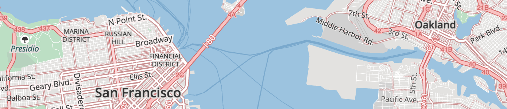

The [Mapzen vector tile service](https://mapzen.com/projects/vector-tiles) provides worldwide basemap coverage sourced from [OpenStreetMap](www.openstreetmap.org) and other open data projects, updated daily as a free & shared service.

Data is organized into several thematic layers, each of which is named, for example; `buildings`, `pois`, and `water`. A selection of these layers are typically used for base map rendering, and are provided under the short-hand name `all`. Each layer includes a simplified view of OpenStreetMap data for easier consumption, with common tags often condensed into a single `kind` field as noted below.

Need help displaying vector tiles in a map? We have several [examples](display-tiles.md) using Mapzen vector tiles to style in your favorite graphics library including Tangram, Mapbox GL, D3, and Hoverboard.

### Overview

#### Data sources and attribution

Mapzen primarily sources from OpenStreetMap, but includes a variety of other open data. For a full listing, view the [data sources](data-sources.md). Each source may require [attribution](attribution.md) in your project.

#### Name localization

Mapzen vector tile features include the default `name` property. We include all language variants of the `name:*`, `alt_name:*`, `alt_name_`, `old_name:*` values to enable full internationalization (when different than `name`). Tangram supports all language scripts.

For features in the `boundaries` layer, we support two additional variants `left:name:*` and `right:name:*` to support oriented labeling on the appropriate side of the boundary line (so the labeled polygon's text can appear inside that polygon consistently).

#### Geometry types

Individual Mapzen vector tile layers can include mixed geometry types. This is common in the `landuse`, `water`, and `buildings` layers.

A tile geometry can be one of 3 types:

* Point, MultiPoint
* LineString, MultiLineString
* Polygon, MultiPolygon

In Tangram, Mapzen's GL graphics library, the keyword `$geometry` matches the feature's geometry type, for cases when a FeatureCollection includes more than one type of kind of geometry. Valid geometry types are:

* `point`: matches Point, MultiPoint
* `line`: matches LineString, MultiLineString
* `polygon`: matches Polygon, MultiPolygon

**Tangram scene file examples:**

```
filter: { $geometry: polygon }            # matches polygons only
filter: { $geometry: [point, line] }      # matches points & lines
filter: function() { return $geometry === 'line' }  # matches lines
```

Mapnik supports geometry filtering via the special `mapnik::geometry_type` keyword.

**CartoCSS Examples:**

```
#layer['mapnik::geometry_type'=1] { /* point styles */ }
#layer['mapnik::geometry_type'=2] { /* line styles */ }
#layer['mapnik::geometry_type'=3] { /* polygon styles */ }
```

#### Data updates

Most Mapzen vector tile content is updated minutely from OpenStreetMap. Low and mid-zoom tiles are updated approximately monthly. Some source data rarely updates – Natural Earth updates approximately yearly.

#### Changelog

The current version of Mapzen vector tiles is **v0.9**. Our tiles are still in active development, but we try to minimize backwards incompatable breaking changes. We're also interested in your feedback at hello@mapzen.com!

If you're signed up for a [Mapzen Vector Tiles API key](https://mapzen.com/developers) you should receive an email notifying you of upcoming changes before they are rolled out to production.

Read the full details in the project [CHANGELOG](https://github.com/mapzen/vector-datasource/blob/v0.9/CHANGELOG.md).

#### Feature ordering

Ordering of features - which ones draw "on top of" other features - can be an important feature of display maps. To help out with this, we export a `sort_key` property on some features which suggests in what order the features should appear. Lower numbers mean that features should appear "towards the back" and higher numbers mean "towards the front". These numbers are consistent across layers. The layers which include `sort_key` on their features are: `boundaries`, `buildings`, `earth`, `landuse`, `roads`, `transit` and `water`.

To facilitate **data visualization** overlays and underlays, the following client-side `order` ranges are suggested:

* `0-9`: Under everything. _Tip: disable earth layer._
* `190-199`: Under water. Above earth and most landuse.
* `290-299`: Under roads. Above borders, water, landuse, and earth. **Your classic "underlay".**
* `490-499`: Over all line and polygon features. Under map labels (icons and text), under UI elements (like routeline and search result pins). **Your classic raster map overlay.**  

**Tangram scene file example:**

```
draw:
    polygons:
        order: 490
```

### Layer reference

Mapzen vector tiles include 9 layers:   

* `boundaries`, `buildings`, `earth`, `landuse`, `places`, `pois`, `roads`, `transit`, and `water`

These individual layers are grouped into an `all` layer – use this special layer for all your general purpose mapping needs.

We include one deprecated layer, `landuse-labels`, for backwards compatibility. Please don't build new maps against this layer, it will be removed in the v1.0 version of tiles.

## Boundaries & Barriers

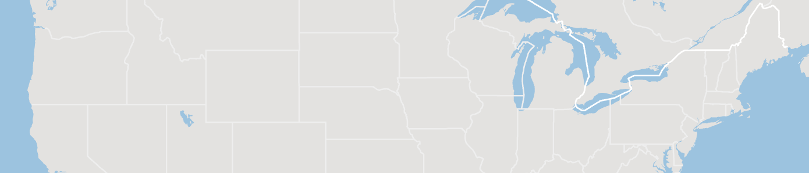

* Layer name: `boundaries`
* Geometry types: `line`

Combination of OpenStreetMap administrative boundaries (zoom >= 8), Natural Earth boundaries (zoom < 8), and some other `barrier` like goodies at high zooms.

(below) Fence lines around the petting zoo in San Francisco are included in the `boundaries` layer.


**Gotchas:** Boundary `kind` values are not yet normalized between OpenStreetMap and Natural Earth. See Boundary kind values (line) gotchas section below for more detail.

**Boundary properties (common):**

* `name`
* `id`
* `kind`: mapping of OpenStreetMap's `admin_level` int values to strings like `country` and `state`, plus `aboriginal_lands` boundary type, and inclusive of some barrier and man_made tags: `city_wall` (zoom 12+), `retaining_wall`, `snow_fence` (zoom 15+), and `fence` (zoom 16+ only). Also includes raw Natural Earth values.
* `sort_key`: a suggestion for which order to draw features. The value is an integer where smaller numbers suggest that features should be "behind" features with larger numbers.

**Boundary properties (common optional):**

* `admin_level`: values of `2` for countries, `4` for states (zoom 8+), and `6`, `8` (zoom 10+)
* `id:left`: For the relation on the left side of the boundary line.
* `id:right`: For the relation on the right side of the boundary line.
* `name:left`: See name section above, other variants like `old_name` also supported.
* `name:right`: See name section above, other variants like `old_name` also supported.
* `maritime_boundary`: a special Mapzen calculated value loosely coupled with OpenStreetMap's maritime tag, but with spatial buffer processing for lines falling in the ocean.
* `type`: required at zooms less than 8 coming from Natural Earth for country and state (zoom 2+) boundaries, roughly equivalent to OSM's `admin_level` values.

**Boundary properties (optional):**

* `labelrank`: from Natural Earth
* `scalerank`: from Natural Earth
* `osm_relation`: `true`, which can also be deduced from negative `id` values.

**Boundary kind values:**

* `1st Order Admin Lines`, `Admin-0 country`, `Admin-1 boundary`, `Admin-1 region boundary`, `city_wall`, `country`, `county`, `Disputed (please verify)`, `fence`, `Indefinite (please verify)`, `Indeterminant frontier`, `International boundary (verify)`, `Lease limit`, `Line of control (please verify)`, `municipality`, `Overlay limit`, `retaining_wall`, `snow_fence`, `state`.

    Gotchas:

    * `Admin-0 country` and `country` are equivalent, **both** should be used in filters.
    * `Admin-1 boundary` and `state` are equivalent, **both** should be used in filters.
    * Don't rely on `Admin-1 statistical boundary`, `Admin-1 statistical meta bounds`, those will probably be removed in future tile versions.

**Boundary type values:**

* `Country`, `Dependency`, `Disputed`, `Indeterminate`, `Lease`, `Sovereign country`, `Metropolitan county`, `Modern administrative boundary`

## Buildings and Addresses

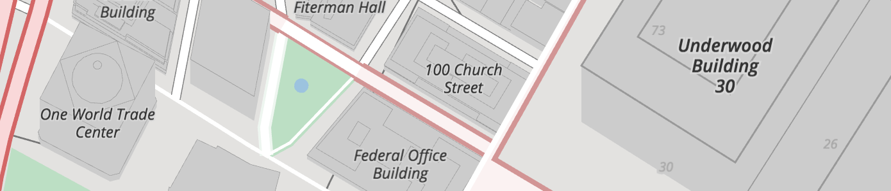

* Layer name: `buildings`
* Geometry types: `point` and `polygon`

Polygons from OpenStreetMap representing building footprint, building label_placment points, building:part features, and address points. Starts at zoom 13 by including huge buildings, progressively adding all buildings at zoom 16+. Address points are available at zoom 16+, but marked with `min_zoom: 17` to suggest that they are suitable for display at zoom level 17 and higher.

Individual `building:part` geometries following the [Simple 3D Buildings](http://wiki.openstreetmap.org/wiki/Simple_3D_Buildings) tags at higher zoom levels.

Mapzen calculates the `landuse_kind` value by intercutting `buildings` with the `landuse` layer to determine if a building is over a parks, hospitals, universities or other landuse features. Use this property to modify the visual appearance of buildings over these features. For instance, light grey buildings look great in general, but aren't legible over most landuse colors unless they are darkened (or colorized to match landuse styling).

**Building properties (common):**

* `name`
* `id`: from OpenStreetMap
* `kind`: see below
* `source`: `openstreetmap.org`
* `landuse_kind`: See description above, values match values in the `landuse` layer.
* `sort_key`: a suggestion for which order to draw features. The value is an integer where smaller numbers suggest that features should be "behind" features with larger numbers.

**Building properties (common optional):**

* `addr_housenumber`: value from OpenStreetMap's `addr:housenumber` tag
* `addr_street`: value from OpenStreetMap's `addr:street` tag
* `area`: in square meters (spherical Mercator, no real-world), `polygon` features only
* `height`: in meters, where available
* `layer`
* `location`: from OpenStreetMap to indicate if building is underground, similar to `layer`.
* `min_height`: value from `min_height` in meters, where available, otherwise estimated from `building:min_levels` if present
* `min_zoom`: a suggested minimum zoom at which the building should become visible based on area and volume limits. This is only present on buildings in tiles at zoom 16 and below.
* `roof_color`: from `roof:color` tag
* `roof_height`: from `roof:height` tag
* `roof_material`: from `roof:material` tag
* `roof_orientation`: from `roof:orientation` tag
* `roof_shape`: from `roof:shape` tag
* `volume`: calculated on feature's `area` and `height`, when `height` or `min_height` is available.

**Building kind values:**

* Buildings polygons and label_position points either have `kind` values that are a straight passthru of the raw OpenStreetMap `building=*` and `building:part` values. Label position points may also be one of `closed` or `historical` if the original building name ended in "(closed)" or "(historical)", respectively. These points will have a `min_zoom` of 17, suggesting that they are suitable for display only at high zooms.
* If either of `building=*` and `building:part` is `yes`, the `kind` property is dropped (and `kind:building` is implied).
* Address points are `kind` of value `address`.

**Address properties and kind value:**

* `name`
* `id`: osm_id
* `source`: `openstreetmap.org`
* `kind`: `address`
* `addr_housenumber`: value from OpenStreetMap's `addr:housenumber` tag
* `addr_street`: value from OpenStreetMap's `addr:street` tag

## Earth

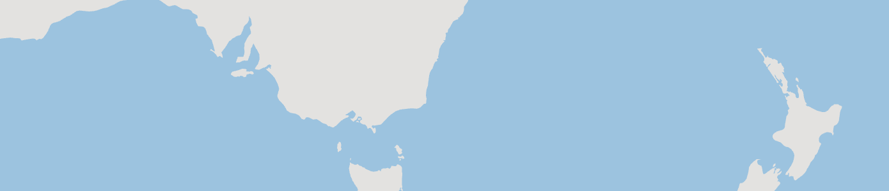

* Layer name: `earth`
* Geometry types: `polygon`

Polygons representing landmass. Uses coastline-derived land polygons from [openstreetmapdata.com](http://openstreetmapdata.com).

_Uses Natural Earth until zoom 8, then switches to OSM land at zoom 9+._

**Earth properties:**

* `id`: suspicious provenance
* `land`: `base`
* `sort_key`: a suggestion for which order to draw features. The value is an integer where smaller numbers suggest that features should be "behind" features with larger numbers.

## Landuse


* Layer name: `landuse`
* Geometry types: `point` and `polygon`

Landuse polygons from OpenStreetMap representing parks, forests, residential, commercial, industrial, university, sports and other areas. Includes OpenStreetMap data at higher zoom levels, and [Natural Earth](http://naturalearthdata.com) polygons at lower zoom levels. This layer also includes landuse `label_placement` points for labeling polygons de-duplicated across tile boundaries.

Zooms 4 and 5, 6 and 7 includes a mix of Natural Earth `urban area` (zooms 0-9 only) features and OpenStreetMap data for `national_park`, `protected_area`, and `nature_reserve` only. After that more more feature kinds are included, and they have a richer set of properties including `sport`, `religion`, `surface`, `attraction`, `zoo`, and `natural`. Feature selection is filtered per zoom until zoom 15.

_TIP: Some `landuse` features only exist as point features in OpenStreetMap. Find those in the `pois` layer._

**Landuse properties (common):**

* `name`
* `id`: osm_id
* `kind`: combination of the `landuse`, `leisure`, `natural`, `highway`, `aeroway`, `amenity`, `tourism`, `zoo`, `attraction`, `man_made`, `power`, and `boundary` OSM tags, or `urban area` and `park or protected land` for Natural Earth areas.
* `sort_key`: a suggestion for which order to draw features. The value is an integer where smaller numbers suggest that features should be "behind" features with larger numbers.
* `area`: in square meters (spherical Mercator, no real-world), `polygon` features only

**Landuse properties (common optional):**

* `protect_class`: Common values include `1`, `2`, `3`, `4`, `5`, `6`. See [OSM wiki](https://wiki.openstreetmap.org/wiki/Tag:boundary%3Dprotected_area#Protect_classes_for_various_countries) for more information.
* `operator`: e.g. `U.S. National Park Service` and `United States Forest Service`

**Landuse kind values:**

* `aerodrome`, `allotments`, `amusement_ride`, `animal`, `apron`, `aquarium`, `artwork`, `attraction`, `aviary`, `beach`, `breakwater`, `bridge`, `carousel`, `cemetery`, `cinema`, `college`, `commercial`, `common`, `cutline`, `dike`, `enclosure`, `farm`, `farmland`, `farmyard`, `footway`, `forest`, `fuel`, `garden`, `generator`, `glacier`, `golf_course`, `grass`, `groyne`, `hanami`, `hospital`, `industrial`, `land`, `library`, `maze`, `meadow`, `military`, `national_park`, `nature_reserve`, `park`, `park or protected land`, `parking`, `pedestrian`, `petting_zoo`, `pier`, `pitch`, `place_of_worship`, `plant`, `playground`, `prison`, `protected_area`, `quarry`, `railway`, `recreation_ground`, `residential`, `resort`, `retail`, `roller_coaster`, `runway`, `rural`, `school`, `scrub`, `sports_centre`, `stadium`, `substation`, `summer_toboggan`, `taxiway`, `theatre`, `theme_park`, `tower`, `trail_riding_station`, `university`, `urban`, `urban area`, `village_green`, `wastewater_plant`, `water_slide`, `water_works`, `wetland`, `wilderness_hut`, `wildlife_park`, `winery`, `winter_sports`, `wood`, `works`, `zoo`

### Landuse labels


* Layer name: `landuse_labels`
* Geometry types: `point`

This layer also includes the same landuse `label_placement` points for labeling polygons de-duplicated across tile boundaries as the `landuse` layer.

This layer is included to support legacy uses, but is not recommended for new projects.

## Places

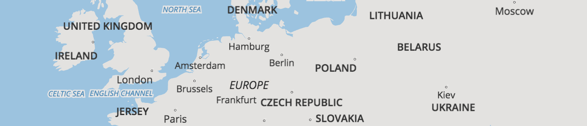

* Layer name: `places`
* Geometry types: `point`

Combination of OpenStreetMap `place` points, Natural Earth populated places, and Who's On First neighbourhoods.

Places with `kind` values of `continent`, `ocean`, `country`, with others added starting at zoom 3 for `sea`, zoom 4 for `state`, `province`, and `city`, `town` at zoom 8. A few more each zoom are added until zoom 13+ includes, `borough`, `suburb`, `quarter`, `village`, `hamlet`, `locality`, `isolated_dwelling`, and `farm`.

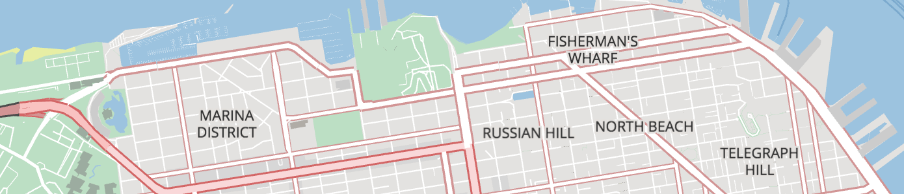

**Neighbourhoods:** [Who's On First](http://whosonfirst.mapzen.com) `neighbourhood` and `macrohood` features are added starting at zoom 12. Neighbourhoods are included one zoom earlier than their `min_zoom`, and stay included 1 zoom past their `max_zoom`.


**Gotchas:** There are a few water label features (`ocean`, `sea`) included in this layer, they will be moved to the `water` layer in a future release.

**Place properties (common):**

* `name`
* `id`: osm_id from OpenStreetMap or Natural Earth id
* `kind`: the original value of the OSM `place` tag and Natural Earth `featurecla`
* `population`: population integer values from OpenStreetMap or Natural Earth (`pop_max`)
* `scalerank`: scalerank value from Natural Earth, and invented for OpenStreetMap
* `source`: `openstreetmap` or `naturalearthdata.com`

**Place properties (common optional):**

* `capital`: a `yes` value normalizes values between OpenStreetMap and Natural Earth for kinds of `Admin-0 capital`, `Admin-0 capital alt`, and `Admin-0 region capital`.
* `state_capital`: a `yes` value normalizes values between OpenStreetMap and Natural Earth for kinds of `Admin-1 capital` and `Admin-1 region capital`.
* `labelrank`: labelrank value from Natural Earth
* `min_zoom`: Currently neighbourhoods only, from Who's On First
* `max_zoom`: Currently neighbourhoods only, from Who's On First
* `is_landuse_aoi`: Currently neighbourhoods only, from Who's On First

**Place kind values:**

* `Admin-0 capital alt`, `Admin-0 capital`, `Admin-0 region capital`, `Admin-1 capital`, `Admin-1 region capital`, `borough`, `city`, `continent`, `country`, `farm`, `hamlet`, `Historic place`, `isolated_dwelling`, `locality`, `macrohood`, `Meteorological Station`, `neighbourhood`, `ocean`, `Populated place`, `province`, `quarter`, `Scientific station`, `sea`, `state`, `suburb`, `town`, `village`

## Points of Interest

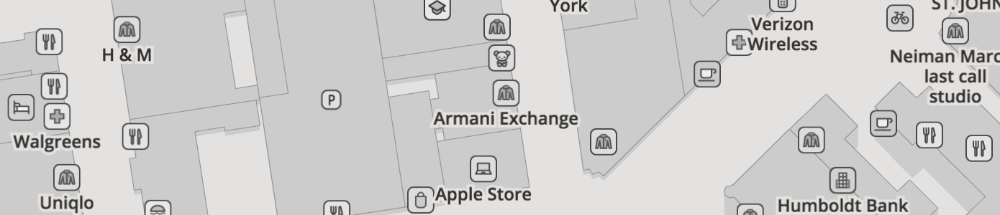

* Layer name: `pois`
* Geometry types: `point`

Over 200 points of interest (POI) kinds are supported. POIs are included starting at zoom 12 for major features like `airport`, `hospital`, `zoo`, and `motorway_junction`. Then progressively more features added at each additional zoom based on a combination of feature area (if available) and `kind` value. For instance, by zoom 15 most `police`, `library`, `university`, and `beach` features should be included, and by zoom 16 things like `car_sharing`, `picnic_site`, and `tree` are added. By zoom 16 all local features are added, like `amusement_ride`, `atm`, and `bus_stop`, but may be marked with a `min_zoom` property to suggest at which zoom levels they are suitable for display. For example, `bench` and `waste_basket` features may be marked `min_zoom: 18` to suggest that they are displayed at zoom 18 and higher.

The `pois` layer should be used in conjuction with `landuse` (parks, etc) label_position features and `buildings` label_position features, throttled by area.

Points of interest from OpenStreetMap, with per-zoom selections similar to the primary [OSM.org Mapnik stylesheet](https://trac.openstreetmap.org/browser/subversion/applications/rendering/mapnik).

Features from OpenStreetMap which are tagged `disused=*` for any other value than `disused=no` are not included in the data. Features which have certain parenthetical comments after their name are suppressed until zoom 17 and have their `kind` property set to that comment. Currently anything with a name ending in '(closed)' or '(historical)' will be suppressed in this manner.

**POI properties (common):**

* `name`
* `id`: osm_id
* `kind`: combination of the `aerialway`, `aeroway`, `amenity`, `attraction`, `barrier`, `craft`, `highway`, `historic`, `leisure`, `lock`, `man_made`, `natural`, `office`, `power`, `railway`, `rental`, `shop`, `tourism`, `waterway`, and `zoo` tags. Can also be one of `closed` or `historical` if the original feature was parenthetically commented as closed or historical.

Implied but not stated: `source`: `openstreetmap.org`.

**POI properties (common optional):**

* `aeroway`:
* `attraction`:
* `cuisine`:
* `exit_to`: only for highway exits
* `ref`: generally only for `gate` and `station_entrance` features
* `religion`:
* `sport`:
* `zoo`:

**POI properties (only on `kind:station`):**

* `state`: only on `kind:station`, status of the station. Values include: `proposed`, `connection`, `inuse`, `alternate`, `temporary`.
* `*_routes`: a list of the reference name/number or full name (if there is no `ref`) of the OSM route relations which are reachable by exploring the local public transport relations or site relations. These are:
  * `train_routes` a list of train routes, generally above-ground and commuter or inter-city "heavy" rail.
  * `subway_routes` a list of subway or underground routes, generally underground commuter rail.
  * `light_rail_routes` a list of light rail or rapid-transit passenger train routes.
  * `tram_routes` a list of tram routes.
* `is_*` a set of boolean flags indicating whether this station has any routes of the given type. These are: `is_train`, `is_subway`, `is_light_rail`, `is_tram`, corresponding to the above `*_routes`. This is provided as a convenience for styling.
* `root_relation_id` an integer ID (of an OSM relation) which can be used to link or group together features which are related by being part of a larger feature. A full explanation of [relations](http://wiki.openstreetmap.org/wiki/Relation) wouldn't fit here, but the general idea is that all the station features which are part of the same [site](http://wiki.openstreetmap.org/wiki/Relation:site), [stop area](http://wiki.openstreetmap.org/wiki/Tag:public_transport%3Dstop_area) or [stop area group](http://wiki.openstreetmap.org/wiki/Relation:public_transport) should have the same ID to show they're related. Note that this information is only present on some stations.


**POI kind values:**

* `accountant`, `administrative`, `advertising_agency`, `aerodrome`, `airport`, `alcohol`, `alpine_hut`, `ambulatory_care`, `amusement_ride`, `animal`, `aquarium`, `archaeological_site`, `architect`, `are_home`, `artwork`, `assisted_living`, `association`, `atm`, `attraction`, `aviary`, `bakery`, `bank`, `bar`, `beach`, `bed_and_breakfast`, `bench`, `bicycle_parking`, `bicycle_rental`, `bicycle`, `biergarten`, `block`, `bollard`, `books`, `brewery`, `bus_station`, `bus_stop`, `butcher`, `cafe`, `camp_site`, `car_repair`, `car_sharing`, `car`, `caravan_site`, `carousel`, `carpenter`, `cave_entrance`, `chalet`, `childcare`, `childrens_centre`, `cinema`, `clinic`, `clothes`, `club`, `college`, `community_centre`, `company`, `computer`, `confectionery`, `consulting`, `convenience`, `courthouse`, `dairy_kitchen`, `day_care`, `dentist`, `department_store`, `doctors`, `doityourself`, `dressmaker`, `drinking_water`, `dry_cleaning`, `educational_institution`, `electrician`, `electronics`, `embassy`, `emergency_phone`, `employment_agency`, `enclosure`, `estate_agent`, `fashion`, `fast_food`, `ferry_terminal`, `financial`, `fire_station`, `fitness_station`, `fitness`, `florist`, `food_bank`, `ford`, `foundation`, `fuel`, `gardener`, `gate`, `generator`, `gift`, `government`, `greengrocer`, `group_home`, `guest_house`, `hairdresser`, `halt`, `hanami`, `handicraft`, `hardware`, `healthcare`, `helipad`, `hospital`, `hostel`, `hotel`, `hvac`, `ice_cream`, `information`, `insurance`, `it`, `jewelry`, `kindergarten`, `landmark`, `laundry`, `lawyer`, `level_crossing`, `library`, `lift_gate`, `lighthouse`, `lock`, `mall`, `marina`, `mast`, `maze`, `memorial`, `metal_construction`, `midwife`, `mini_roundabout`, `mobile_phone`, `motel`, `motorway_junction`, `museum`, `music`, `newspaper`, `ngo`, `notary`, `nursing_home`, `nursing_home`, `optician`, `outreach`, `painter`, `parking`, `peak`, `pet`, `petting_zoo`, `pharmacy`, `phone`, `photographer`, `photographic_laboratory`, `physician`, `picnic_site`, `place_of_worship`, `playground`, `plumber`, `police`, `political_party`, `post_box`, `post_office`, `pottery`, `power_wind`, `prison`, `pub`, `recycling`, `refugee_camp`, `religion`, `research`, `residential_home`, `resort`, `restaurant`, `roller_coaster`, `sawmill`, `school`, `shelter`, `shelter`, `shoemaker`, `ski_rental`, `ski_school`, `ski`, `slipway`, `snow_cannon`, `social_facility`, `soup_kitchen`, `sports_centre`, `sports`, `spring`, `stadium`, `station`, `stonemason`, `subway_entrance`, `summer_toboggan`, `supermarket`, `tailor`, `tax_advisor`, `telecommunication`, `telephone`, `theatre`, `theme_park`, `therapist`, `toilets`, `toilets`, `townhall`, `toys`, `trade`, `traffic_signals`, `trail_riding_station`, `tram_stop`, `travel_agent`, `tree`, `university`, `veterinary`, `viewpoint`, `volcano`, `waste_basket`, `water_slide`, `water_tower`, `wilderness_hut`, `wildlife_park`, `windmill`, `wine`, `winery`, `workshop`, `yes`, `zoo`.

## Roads (Transportation)

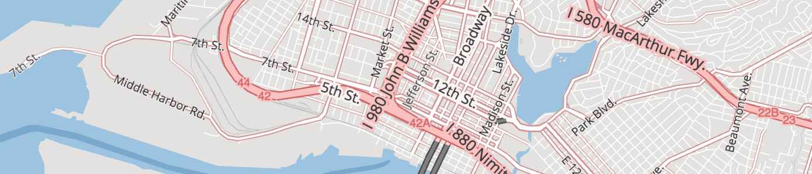

* Layer name: `roads`
* Geometry types: `line`

More than just roads, this OpenStreetMap and Natural Earth based transportation layer includes highways, major roads, minor roads, paths, railways, ferries, and ski pistes matching the selection found in High Road. Sort them with `sort_key` to correctly represent layered overpasses, bridges and tunnels. Natural Earth roads at zooms < 8 and OpenStreetMap at zooms 8+. See zoom ranges section below for more information per kind.

Road names are **abbreviated** so directionals like `North` is replaced with `N`, `Northeast` is replaced with `NE`, and common street suffixes like `Avenue` to `Ave.` and `Street` to `St.`. Full details in the [StreetNames](https://github.com/nvkelso/map-label-style-manual/blob/master/tools/street_names/StreetNames/__init__.py) library.

Mapzen calculates the `landuse_kind` value by intercutting `roads` with the `landuse` layer to determine if a road segment is over a parks, hospitals, universities or other landuse features. Use this property to modify the visual appearance of roads over these features. For instance, light grey minor roads look great in general, but aren't legible over most landuse colors unless they are darkened. 

To improve performance, some road segments are merged at low and mid-zooms. To facilitate this, certain properties are dropped at those zooms. Examples include `is_bridge` and `is_tunnel`, `name`, `network`, and `ref`. The exact zoom varies per feature class (major roads keep this properties over a wider range, minor roads drop them starting at zoom 14). When roads are merged, the original OSM `id` values are dropped.

**Road properties (common):**

* `name`: From OpenStreetMap, but transformed to abbreviated names as detailed above.
* `id`: From OpenStreetMap or Natural Earth
* `source`: `openstreetmap` or `naturalearthdata.com`
* `kind`: one of High Road's values for `highway`, `major_road`, `minor_road`, `rail`, `path`, `ferry`, `piste`, `aerialway`, `exit` (eg: "motorway_junction"), `racetrack`; or Natural Earth's `featurecla` value. You'll want to look at other tags like `highway` and `railway` for raw OpenStreetMap values. At low zooms, Natural Earth `featurecla` kinds of `Road` and `Ferry` are used. Look to `type` for more fidelity.
* `landuse_kind`: See description above, values match values in the `landuse` layer.
* `ref`: Used for road shields. Related, see `symbol` for pistes.
* `sort_key`: a suggestion for which order to draw features. The value is an integer where smaller numbers suggest that features should be "behind" features with larger numbers. At zooms >= 15, the `sort_key` is adjusted to realistically model bridge, tunnel, and layer ordering.

**Road properties (common optional):**

* `aerialway`: See kind list below.
* `aeroway`: See kind list below.
* `ferry`: See kind list below.
* `highway`: See kind list below.
* `is_bridge`: `yes` or `no`
* `is_bus_route`: If present and `true`, then buses or trolley-buses travel down this road. This property is determined based on whether the road is part of an OSM bus route relation, and is only present on roads at zoom 12 and higher.
* `is_link`: `yes` or `no`
* `is_tunnel`: `yes` or `no`
* `leisure`: See kind list below.
* `man_made`: See kind list below.
* `network`: eg: `US:I` for the United States Interstate network, useful for shields and road selections.
* `oneway`: `yes` or `no`
* `piste_type`: See kind list below.
* `railway`: the original OSM railway tag value
* `service`: See value list below, provided for `railway` and `highway=service` roads.
* `type`:  Natural Earth roads and ferry

**Road properties (optional):**

* `ascent`: ski pistes from OpenStreetMap
* `colour`: ski pistes from OpenStreetMap
* `descent`: ski pistes from OpenStreetMap
* `description`: OpenStreetMap features
* `distance`: ski pistes from OpenStreetMap
* `labelrank`: Natural Earth features
* `level`: Natural Earth features
* `motor_vehicle`: OpenStreetMap features
* `namealt`: Natural Earth features
* `namealtt`: Natural Earth features
* `operator`: OpenStreetMap features
* `piste_difficulty`: ski pistes from OpenStreetMap
* `piste_grooming`: ski pistes from OpenStreetMap
* `piste_name`: ski pistes from OpenStreetMap
* `roundtrip`: OpenStreetMap features 
* `route_name`: OpenStreetMap features
* `scalerank`: Natural Earth features
* `ski`: ski pistes from OpenStreetMap
* `snowshoe`: ski pistes from OpenStreetMap
* `sport`: OpenStreetMap features
* `state`: OpenStreetMap features
* `symbol`: ski pistes from OpenStreetMap

### Transportation kind values and zoom ranges

**Roads** from **OpenStreetMap** are shown starting at zoom 8 with `motorway`, `trunk`, `primary`. `secondary` are added starting at zoom 10, with `motorway_link`, `tertiary` added at zoom 11. Zoom 12 sees addition of `trunk_link`, `residential`, `unclassified`, `road`). Zoom 13 adds (`primary_link`, `secondary_link`, `track`, `pedestrian`, `living_street`). Zoom 14 adds (`tertiary_link`, `minor`, `footpath`, `footway`, `steps`, `path`, `cycleway`) and `alley` service roads. By zoom 15 all service roads are added, including driveway, `parking_aisle`, `drive-through`.

**Roads** from **Natural Earth**  are used at low zooms below 8. Road `kind` values are limited to `Road` and `Ferry` at these zooms. It's more useful to look at `type` values: `Beltway`, `Bypass`, `Ferry Route`, `Ferry, seasonal`, `Major Highway`, `Road`, `Secondary Highway`, `Track`, and `Unknown`.

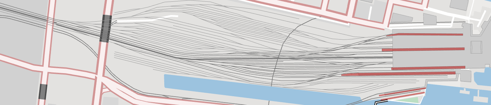

**Rail** is added starting at zoom 11, with minor railroad `spur` added at zoom 12+ (based on "service" values), and further detail for `yard` and `crossover` and 13 and 14 respectively with all railroads shown by zoom 15. Features for rail tracks are included in this layer, whereas geometries and further information about rail lines or routes is available in the `transit` layer.

Railway values in this layer include: `rail`, `tram`, `light_rail`, `narrow_gauge`, `monorail`, `subway`, and `funicular`.

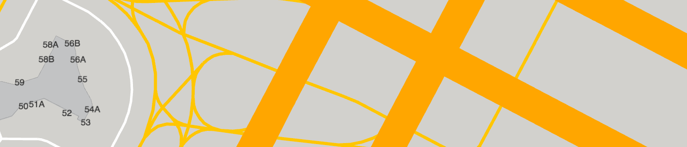

**Airport** aeroways with `kind` values of `runway` show up at zoom 9, with `taxiway` at zoom 11+.

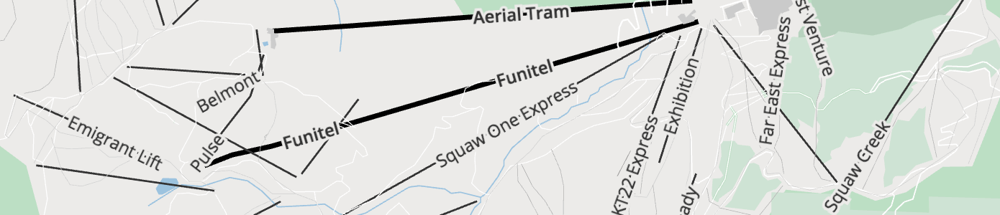

**Aerialways** with `kind` values of `gondola`, `cable_car` show up zoom 12+. `chair_lift` is added at zoom 13+, and by zoom 15 all are visible adding `drag_lift`, `platter`, `t-bar`, `goods`, `magic_carpet`, `rope_tow`, `yes`, `zip_line`, `j-bar`, `unknown`, `mixed_lift`, and `canopy`.

**Leisure** lines for various recreation tracks start showing up at zoom 14  with `kind` values of sport_values of `athletics`, `running`, `horse_racing`, `bmx`, `disc_golf`, `cycling`, `ski_jumping`, `motor`, `karting`,`obstacle_course`, `equestrian`, `alpine_slide`, `soap_box_derby`,`mud_truck_racing`, `skiing`, `drag_racing`, `archery`.

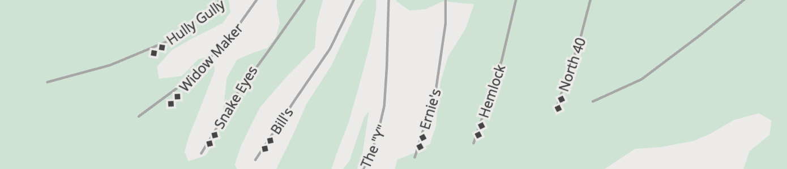

**Piste** type with `kind` values of `piste_type` including `nordic`, `downhill`, `sleigh`, `skitour`, `hike`, `sled`, `yes`, `snow_park`, `playground`, `ski_jump`. Abandoned pistes are not included in tiles.

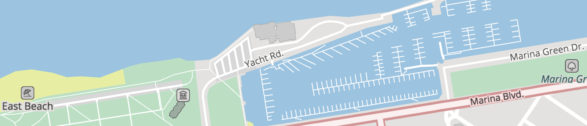

**Piers** start showing up at zoom 13+ with `kind` values of `pier`.

## Transit

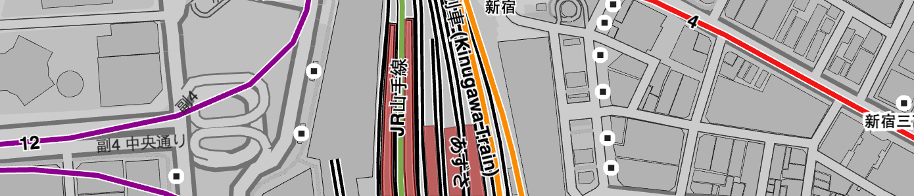

* Layer name: `transit`
* Geometry types: `line`, `polygon`

Transit line features from OpenStreetMap start appearing at zoom 5+ for national trains, with regional trains addded at zoom 6+. Then `subway`,`light_rail`, and `tram` are added at zoom 10+. `funicular` and `monorail` features are added at zoom 12+. Platform polygons are added zoom 14+.

_TIP: If you're looking for transit `station` and `station_entrance` features, look in the `pois` layer instead._

**Transit properties (common):**

* `name`: including localized name variants
* `id`: OpenStreetMap feature `osm_id`
* `kind`: detailed below, per geometry type
* `sort_key`: a suggestion for which order to draw features. The value is an integer where smaller numbers suggest that features should be "behind" features with larger numbers.

Implied but not stated: `source`: `openstreetmap.org`.

**Transit properties (common optional):**

Depending on upstream OpenStreetMap tagging, the following properties may be present:

* `ref`
* `network`
* `operator`
* `railway`
* `route`

A smaller set is also available for non-`platform` features:

* `colour`: either a `#rrggbb` hex value, or a CSS colour name (like `red`)
* `layer`
* `state`
* `symbol`
* `type`

**Transit properties (optional):**

Depending on OpenStreetMap tagging, the following properties may be present for non-`platform` features.

* `ascent`
* `descent`
* `description`
* `distance`
* `roundtrip`
* `route_name`

**Transit kind values (line):**

* `light_rail`, `platform`, `railway`, `subway`, `train`, and `tram`

## Water

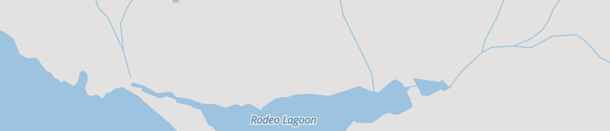

* Layer name: `water`
* Geometry types: `point`, `line`, and `polygon`

Water `polygons` representing oceans, riverbanks and lakes. Derived from a combination of the `waterway`, `natural`, and `landuse` OpenStreetMap tags. Includes coastline-derived water polygons from [openstreetmapdata.com](http://openstreetmapdata.com) and inland water directly from OpenStreetMap at higher zoom levels 9+, and [Natural Earth](http://naturalearthdata.com) polygons at lower zoom levels (0-8). Water polygons are progressively added based on an area filter until all water is shown at zoom 16+.

Also includes water `line` geometries for river and stream centerlines and "label_position" `points` for labeling polygons de-duplicated across tile boundaries. OpenStreetMap sourced waterway lines kinds of `river`, `canal`, and `stream` are included starting at zoom 11, adding `dam` (zoom 13+), and `ditch`, `drain` (zoom 16+).

Mapzen calculates the composite exterior edge for overlapping water polygons and marks the resulting line `boundary=yes`. Set to `yes` when present on `line` geometry, or from Natural Earth line source.

**Water properties (common):**

* `name`: including localized name variants
* `kind`: detailed below, per geometry type
* `source`: one of `naturalearthdata.com`, `openstreetmapdata.com`, `openstreetmap.org`
* `boundary`: `yes`, on lines only. See description above.
* `sort_key`: a suggestion for which order to draw features. The value is an integer where smaller numbers suggest that features should be "behind" features with larger numbers.

**Water properties (common optional):**

* `area`: in square meters (spherical Mercator, no real-world), `polygon` features only
* `id`: OpenStreetMap feature `osm_id`, when sourced from `openstreetmap.org`
* `is_tunnel`: for `line` features only (`yes` values only)

**Water kind values (point, polygon):**

* `Alkaline Lake`, `basin`, `dock`, `lake`, `Lake`, `ocean`, `Ocean`, `playa`, `Playa`, `reservoir`, `Reservoir`, `riverbank`, `swimming_pool`, and `water`

**Water kind values (point only):**

These are intended for label placement, and are included as points only.

* `bay`, `fjord`, `strait`

    Gotchas:

    * `Alkaline Lake` and `Playa` only exist in Natural Earth. Zooming in, your feature may disappear. Beware the desert around Great Salt Lake in Utah!
    * `ocean` and `Ocean` are equivalent, **both** should be used in filters.
    * `reservoir` and `Reservoir` are equivalent, **both** should be used in filters.
    * Some of the minor kinds (like `bay`, `strait`, and `fjord`) are used for label_placement points only, as their area would duplicate water polygons already present from openstreetmapdata.com.
    * The (capitalized) Natural Earth values don't seem to be coming thru, but should be, instead they're being grouped into `lake`, `playa`, and `ocean`.

**Water kind values (lines):**

* `canal`, `dam`, `ditch`, `drain`, `river`, and `stream`
