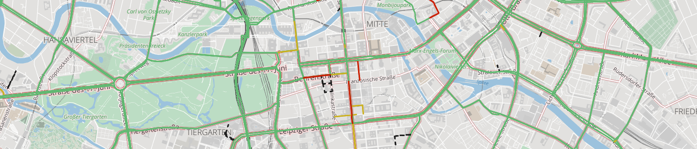

# Layers in Tilezen's vector tiles


The [Tilezen vector tiles](https://mapzen.com/projects/vector-tiles) provides worldwide basemap coverage sourced from [OpenStreetMap](www.openstreetmap.org) and other open data projects, updated intermittently as a free & shared service at [Nextzen.org](http://www.nextzen.org).

Data is organized into several thematic layers, each of which is named, for example; `buildings`, `pois`, and `water`. A selection of these layers are typically used for base map rendering, and are provided under the short-hand name `all`. Each layer includes a simplified view of OpenStreetMap data for easier consumption, with common tags often condensed into a single `kind` field as noted below.

Need help displaying vector tiles in a map? Here are several [examples](display-tiles.md) using Tilezen vector tiles to style in your favorite graphics library including Tangram, Mapbox GL, D3, and OpenLayers.

### Overview

#### Data sources and attribution

Tilezen primarily sources from OpenStreetMap, but includes a variety of other open data. For a full listing, view the [data sources](data-sources.md). Each source may require [attribution](https://github.com/tilezen/vector-datasource/blob/master/docs/attribution.md) in your project.

#### Feature names

Most Tilezen vector tile features include a basic name property (`common`):

* `name` - Generally the name the locals call the feature, in the local script.

It supports several additional name related properties (`optional`):

* `alt_name`
* `int_name`
* `loc_name`
* `name:short` - For example: `CA` for California. _See planned bug fix [#1102](https://github.com/tilezen/vector-datasource/issues/1102) and see planned bug fix [#1094](https://github.com/tilezen/vector-datasource/issues/1094) for abbreviated names._
* `name_left`
* `name_right`
* `nat_name`
* `official_name`
* `old_name`
* `reg_name`
* `short_name`

#### Name localization

Tilezen includes all language variants of the `name:*` values to enable full internationalization (when different from `name`).

Language variants are identified by an ISO 639-1 two-letter language code and optional country code, for example `en` for English and less commonly `en_GB` for British English. Mapzen [house styles](https://mapzen.com/products/maps/) designed in Tangram support displaying all language scripts.

We additionally localize `alt_name:*` and `old_name:*` properties for features across all layers.

For features in the `boundaries` layer, there are two additional variants `name:left` and `name:right` to support oriented labeling on the appropriate side of the boundary line (so the labeled polygon's text can appear inside that polygon consistently). _See planned bug fix [#1102](https://github.com/tilezen/vector-datasource/issues/1102)._

**Localized name properties** (`common-optional`)**:**

* `name:*`
* `alt_name:*`
* `old_name:*`
* `name:left:*` _See planned bug fix [#1102](https://github.com/tilezen/vector-datasource/issues/1102)._
* `name:right:*` _See planned bug fix [#1102](https://github.com/tilezen/vector-datasource/issues/1102)._

#### Geometry types

Individual Tilezen vector tile layers can include mixed geometry types. This is common in the `landuse`, `water`, and `buildings` layers.

A tile geometry can be one of three types:

* Point, MultiPoint
* LineString, MultiLineString
* Polygon, MultiPolygon

In Tangram, Mapzen's GL graphics library, the keyword `$geometry` matches the feature's geometry type, for cases when a FeatureCollection includes more than one type of kind of geometry. Valid geometry types are:

* `point`: matches Point, MultiPoint
* `line`: matches LineString, MultiLineString
* `polygon`: matches Polygon, MultiPolygon

**Tangram scene file examples:**

```
filter: { $geometry: polygon }            # matches polygons only
filter: { $geometry: [point, line] }      # matches points & lines
filter: function() { return $geometry === 'line' }  # matches lines
```

Mapnik supports geometry filtering via the special `mapnik::geometry_type` keyword.

**CartoCSS Examples:**

```
#layer['mapnik::geometry_type'=1] { /* point styles */ }
#layer['mapnik::geometry_type'=2] { /* line styles */ }
#layer['mapnik::geometry_type'=3] { /* polygon styles */ }
```

#### Data updates

Most Tilezen vector tile content is updated minutely from OpenStreetMap. Low and mid-zoom tiles are updated approximately monthly. Some source data rarely updates – Natural Earth updates approximately yearly.

#### Changelog

The current version of Tilezen vector tile data schema is **v1.6.0**.

Tiles are still in active development, but Tilezen promises to minimize backwards incompatible breaking changes. Data model promises are listed in the Tilezen [SEMANTIC VERSIONING](https://github.com/mapzen/vector-datasource/tree/master/SEMANTIC-VERSIONING.md) statement.

You can send your feedback at hello@nextzen.org or via our [Gitter chat](https://gitter.im/tilezen/tilezen-chat) room.

Read the full details in the project [CHANGELOG](https://github.com/mapzen/vector-datasource/tree/v1.6.0/CHANGELOG.md).

#### Feature ordering

Ordering of features - which ones draw "on top of" other features - can be an important feature of display maps. To help out with this, there is a `sort_rank` property on some features which suggests in what order the features should appear. Lower numbers mean that features should appear "towards the back" and higher numbers mean "towards the front". These numbers are consistent across layers. The layers which include `sort_rank` on their features are: `boundaries`, `buildings`, `earth`, `landuse`, `roads`, `transit` and `water`.

To facilitate **data visualization** overlays and underlays, the following client-side `order` ranges are suggested:

* `0-9`: Under everything. _Tip: disable earth layer._
* `190-199`: Under water. Above earth and most landuse.
* `290-299`: Under roads. Above borders, water, landuse, and earth. **Your classic "underlay".**
* `490-499`: Over all line and polygon features. Under map labels (icons and text), under UI elements (like routeline and search result pins). **Your classic raster map overlay.**

**Tangram scene file example:**

```
draw:
    polygons:
        order: 490
```

### Layer reference

Tilezen vector tiles include 9 default layers (and 2 optional layers):

* `boundaries`, `buildings`, `earth`, `landuse`, `places`, `pois`, `roads`, `transit`, and `water`

These individual layers are grouped into an `all` layer – use this special layer for all your general purpose mapping needs.

While the service can return just a single layer or combination of layers, the `all` layer is more performant.

The Tilezen vector tiles schema defines 2 optional layers:

* `traffic_flow` and `traffic_incidents`


## Boundaries


* Layer name: `boundaries`
* Geometry types: `line`

Combination of OpenStreetMap administrative boundaries (zoom >= 8) and Natural Earth boundaries (zoom < 8).


#### Boundaries properties (common):

* `name`: A suggested label, formed from the left and right region names, if available. If the name appears to be too long to be rendered on the geometry at a particular zoom it may be omitted.
* `id`: Identifier for the feature, only provided at zoom 13+.
* `kind`: mapping of OpenStreetMap's `admin_level` int values to strings like `country` and `state`, plus `aboriginal_lands` boundary type, and also includes normalized Natural Earth values. To handle disagreements about the location of borders, the `kind` may be prefixed with `unrecognized_`, e.g: `unrecognized_country`, for some differing viewpoints (see `kind:xx` below).
* `kind:xx`: alternate `kind` according to the viewpoint `XX`. If you want to show features according to a particular viewpoint, then use `kind:xx` if it exists and fall back to `kind` if not. The range of values is the same as for `kind`. Note that the viewpoints are either lower-case [ISO 3166-1 alpha-2](https://en.wikipedia.org/wiki/ISO_3166-1_alpha-2) codes or the pseudo-code `iso`.
* `kind_detail`: mapping of OpenStreetMap's `admin_level` values. `2` for countries, `4` for regions, and `6`, `8` (zoom 10+)
* `source`: `openstreetmap.org` or `naturalearthdata.com`
* `sort_rank`: a suggestion for which order to draw features. The value is an integer where smaller numbers suggest that features should be "behind" features with larger numbers.
* `min_zoom`: a suggested minimum zoom at which the boundary line should become visible based on scalerank value from Natural Earth, and invented for OpenStreetMap, a float.

#### Boundaries properties (common optional):

* `id:left`: For the relation on the left side of the boundary line. This is only provided at zoom 13+.
* `id:right`: For the relation on the right side of the boundary line. This is only provided at zoom 13+.
* `name:left`: See name section above, other variants like `old_name` also supported. _See planned bug fix in [#1102](https://github.com/tilezen/vector-datasource/issues/1102)._
* `name:right`: See name section above, other variants like `old_name` also supported. _See planned bug fix in [#1102](https://github.com/tilezen/vector-datasource/issues/1102)._
* `maritime_boundary`: a special Tilezen calculated value loosely coupled with OpenStreetMap's maritime tag, but with spatial buffer processing for lines falling in the ocean.

#### Boundaries properties (optional):

* `osm_relation`: `true`, which can also be deduced from negative `id` values.

#### Boundary `kind` values:

* `aboriginal_lands`
* `country`
* `county`
* `disputed`
* `indefinite`
* `indeterminate`
* `lease_limit`
* `line_of_control`
* `locality`
* `macroregion`
* `map_unit`
* `overlay_limit`
* `region`

## Buildings and Addresses


* Layer name: `buildings`
* Geometry types: `point` and `polygon`

Polygons from OpenStreetMap representing building footprints, building label placement points, `building_part` features, address points, and entrance and exit points. Starts at zoom 13 by including huge buildings, progressively adding all buildings at zoom 16+. Address points are available at zoom 16+, but marked with `min_zoom: 17` to suggest that they are suitable for display at zoom level 17 and higher.

Individual `building_part` geometries from OpenStreetMap following the [Simple 3D Buildings](http://wiki.openstreetmap.org/wiki/Simple_3D_Buildings) tags at higher zoom levels. Building parts may receive a `root_id` corresponding to the building feature, if any, with which they intersect.

Tilezen calculates the `landuse_kind` value by intercutting `buildings` with the `landuse` layer to determine if a building is over a parks, hospitals, universities or other landuse features. Use this property to modify the visual appearance of buildings over these features. For instance, light grey buildings look great in general, but aren't legible over most landuse colors unless they are darkened (or colorized to match landuse styling).

Label position points may also have `closed` or `historical` kind_detail values if the original building name ended in "(closed)" or "(historical)", respectively. These points will have a `min_zoom` of 17, suggesting that they are suitable for display only at high zooms. _See related bug fix in [#1026](https://github.com/tilezen/vector-datasource/issues/1026)._

Values for `kind_detail`  are sourced from OpenStreetMap's `building` tag for building footprints and from `building:part` tag for building parts.

Note that building geometries, like most geometries in Tilezen tiles, are clipped to the bounds of the tile, even if the building extends beyond the tile. This means that it might be necessary to assemble geometry from several neighbouring tiles to recreate the full building. Some buildings are exceptionally large and span many tiles, so this can be tricky.

#### Building properties (common):

* `name`
* `id`: from OpenStreetMap
* `kind`: see below
* `kind_detail`: see below
* `source`: `openstreetmap.org`
* `landuse_kind`: See description above, values match values in the `landuse` layer.
* `sort_rank`: a suggestion for which order to draw features. The value is an integer where smaller numbers suggest that features should be "behind" features with larger numbers.
* `min_zoom`: a suggested minimum zoom at which the building should become visible based on area and volume limits.

#### Building properties (common optional):

* `addr_housenumber`: value from OpenStreetMap's `addr:housenumber` tag
* `addr_street`: value from OpenStreetMap's `addr:street` tag
* `area`: in square meters (spherical Mercator, no real-world), `polygon` features only.
* `building_material`: A description of the material covering the outside of the building or building part, if the information is available. Common values are: `brick`, `cement_block`, `clay`, `concrete`, `glass`, `masonry`, `metal`, `mud`, `other`, `permanent`, `plaster`, `sandstone`, `semi-permanent`, `steel`, `stone`, `timber-framing`, `tin`, `traditional` and `wood`, and there are many other less common values.
* `height`: in meters, where available
* `layer`
* `location`: from OpenStreetMap to indicate if building is underground, similar to `layer`.
* `min_height`: value from `min_height` in meters, where available, otherwise estimated from `building:min_levels` if present
* `roof_color`: from `roof:color` tag
* `roof_height`: from `roof:height` tag
* `roof_material`: from `roof:material` tag
* `roof_orientation`: from `roof:orientation` tag
* `roof_shape`: from `roof:shape` tag
* `scale_rank`: calculation of a feature's importance
* `volume`: calculated on feature's `area` and `height`, when `height` or `min_height` is available.

#### Building layer `kind` values:

* `building`
* `building_part`
* `address`
* `entrance`
* `exit`

#### Building footprint and label placement `kind_detail` values:

* `abandoned`
* `administrative`
* `agricultural`
* `airport`
* `allotment_house`
* `apartments`
* `arbour`
* `bank`
* `barn`
* `basilica`
* `beach_hut`
* `bell_tower`
* `boathouse`
* `brewery`
* `bridge`
* `bungalow`
* `bunker`
* `cabin`
* `carport`
* `castle`
* `cathedral`
* `chapel`
* `chimney`
* `church`
* `civic`
* `clinic`
* `closed`. _See planned bug fix in [#1026](https://github.com/tilezen/vector-datasource/issues/1026)._
* `clubhouse`
* `collapsed`
* `college`
* `commercial`
* `construction`
* `container`
* `convent`
* `cowshed`
* `dam`
* `damaged`
* `depot`
* `destroyed`
* `detached`
* `disused`
* `dormitory`
* `duplex`
* `factory`
* `farm`
* `farm_auxiliary`
* `fire_station`
* `garage`
* `garages`
* `gazebo`
* `ger`
* `glasshouse`
* `government`
* `grandstand`
* `greenhouse`
* `hangar`
* `healthcare`
* `hermitage`
* `historical`. _See planned bug fix in [#1026](https://github.com/tilezen/vector-datasource/issues/1026)._
* `hospital`
* `hotel`
* `house`
* `houseboat`
* `hut`
* `industrial`
* `kindergarten`
* `kiosk`
* `library`
* `mall`
* `manor`
* `manufacture`
* `mixed_use`
* `mobile_home`
* `monastery`
* `mortuary`
* `mosque`
* `museum`
* `office`
* `outbuilding`
* `parking`
* `pavilion`
* `power`
* `prison`
* `proposed`
* `pub`
* `public`
* `residential`
* `restaurant`
* `retail`
* `roof`
* `ruin`
* `ruins`
* `school`
* `semidetached_house`
* `service`
* `shed`
* `shelter`
* `shop`
* `shrine`
* `silo`
* `slurry_tank`
* `stable`
* `stadium`
* `static_caravan`
* `storage`
* `storage_tank`
* `store`
* `substation`
* `summer_cottage`
* `summer_house`
* `supermarket`
* `synagogue`
* `tank`
* `temple`
* `terrace`
* `tower`
* `train_station`
* `transformer_tower`
* `transportation`
* `university`
* `utility`
* `veranda`
* `warehouse`
* `wayside_shrine`
* `works`

Additional `kind_detail` values are provided from POI `kind`s where one is not available from the building feature. This means that you could see any POI `kind` value as a building `kind_detail` value.

#### Building part `kind_detail` values:

* `arch`
* `balcony`
* `base`
* `column`
* `door`
* `elevator`
* `entrance`
* `floor`
* `hall`
* `main`
* `passageway`
* `pillar`
* `porch`
* `ramp`
* `roof`
* `room`
* `steps`
* `stilobate`
* `tier`
* `tower`
* `verticalpassage`
* `wall`
* `window`

#### Entrance and exit `kind_detail` values

Entrances can have an optional `kind_detail`. If present, it will be one of:

* `garage`
* `home`
* `main`
* `private`
* `residence`
* `secondary`
* `service`
* `staircase`
* `unisex` - seems to be mostly mapped on building containing toilets.

Exits can have an optional `kind_detail`. If present, it will be one of:

* `emergency`
* `fire_exit`

## Earth


* Layer name: `earth`
* Geometry types: `polygon`, `line`, `point`.

Polygons representing earth landmass and natural feature lines. Uses coastline-derived land polygons from [osmdata.openstreetmap.de](https://osmdata.openstreetmap.de). Natural lines from OpenStreetMap representing cliffs, aretes. This layer also includes earth `label_placement` lines for ridges and valleys (which should not otherwise be symbolized).

_Uses Natural Earth until zoom 7, then switches to OSM land at zoom 8+._

**Earth properties:**

* `name`: generally only for lines or label placement points
* `id`: The `osm_id` **or** funky value when from Natural Earth or OSMData.OpenStreetMap.de
* `kind`: either `earth` or "natural" value from OSM tag.
* `source`: `openstreetmap.org` or `naturalearthdata.com`
* `sort_rank`: a suggestion for which order to draw features. The value is an integer where smaller numbers suggest that features should be "behind" features with larger numbers.
* `min_zoom`: a suggestion for which zoom to draw a feature. The value is a float. _See planned bug fix in [#1073](https://github.com/tilezen/vector-datasource/issues/1073)._

#### Earth `kind` values:

* `archipelago` - point, intended for label placement only
* `arete` - line
* `cliff` - line, intended for label placement only
* `continent` - point, intended for label placement only
* `earth` - polygon
* `island` - point, intended for label placement only
* `islet` - point, intended for label placement only
* `ridge` - line, intended for label placement only
* `valley` - line, intended for label placement only

## Landuse


* Layer name: `landuse`
* Geometry types: `point` and `polygon`

Landuse polygons from OpenStreetMap representing parks, forests, residential, commercial, industrial, university, sports and other areas. Includes OpenStreetMap data at higher zoom levels, and [Natural Earth](http://naturalearthdata.com) polygons at lower zoom levels. This layer also includes landuse `label_placement` points for labeling polygons de-duplicated across tile boundaries.

Zooms 4 and 5, 6 and 7 includes a mix of Natural Earth `urban_area` (zooms 0-9 only) features and OpenStreetMap data for `national_park`, `protected_area`, and `nature_reserve` only. After that more more feature kinds are included, and they have a richer set of properties including `sport`, `religion`, `surface`, `attraction`, `zoo`, and `natural`. Feature selection is filtered per zoom until zoom 15.

At mid- and low-zooms, between 4-12, some landuse polygons are merged to reduce payload size. To facilitate this, the name of the landuse area may be dropped for small polygons. When polygons are merged, the original `id` properties are dropped, and the `area` is re-calculated for the new size.

_TIP: Some `landuse` features only exist as point features in OpenStreetMap. Find those in the `pois` layer._

(below) Fence lines around the petting zoo in San Francisco are included in the `landuse` layer.


#### Landuse properties (common):

* `name`
* `id`: From OpenStreetMap or Natural Earth. Dropped at low- and mid-zooms when features are merged.
* `kind`: combination of the `landuse`, `leisure`, `natural`, `highway`, `aeroway`, `amenity`, `tourism`, `zoo`, `attraction`, `man_made`, `power`, and `boundary` OSM tags, or `urban_area` for Natural Earth features. Also includes of some `barrier` and `waterway` tags: `city_wall` (zoom 12+), `dam` (zoom 12+), `power_line` (zoom 14+), `retaining_wall`, `snow_fence` (zoom 15+), `crane`, `fence`, `gate`, `wall` (zoom 16+ only), and `power_minor_line` (zoom 17+).
* `source`: `openstreetmap.org` or `naturalearthdata.com`
* `sort_rank`: a suggestion for which order to draw features. The value is an integer where smaller numbers suggest that features should be "behind" features with larger numbers.
* `area`: in square meters (spherical Mercator, no real-world), `polygon` features only
* `min_zoom`: a suggestion for which zoom to draw a feature. The value is a float.

#### Landuse properties (common optional):

* `protect_class`: Common values include: `1`, `2`, `3`, `4`, `5`, `6`. See [OSM wiki](https://wiki.openstreetmap.org/wiki/Tag:boundary%3Dprotected_area#Protect_classes_for_various_countries) for more information.
* `operator`: e.g. `United States National Park Service`, `United States Forest Service`, `National Parks & Wildlife Service NSW`.
* `mooring`: Common values include: `no`, `yes`, `commercial`, `cruise`, `customers`, `declaration`, `ferry`, `guest`, `private`, `public`, `waiting`, `yacht` or `yachts`.

#### Landuse `kind` values:

* `aerodrome` - with `kind_detail` in `public`, `private`, `military_public`, `airfield`, `international`, `regional`, `gliding`. And _optional_ `passenger_count` giving the number of passengers through the aerodrome per year.
* `airfield`
* `allotments`
* `amusement_ride`
* `animal`
* `apron`
* `aquarium`
* `artwork`
* `attraction`
* `aviary`
* `bare_rock`
* `barren` - Only used at mid and low zooms, see "Low zoom consolidation" below.
* `battlefield`
* `beach` - Where the land meets the sea gradually.
* `boatyard` - a place for building, fixing, and storing boats.
* `breakwater`
* `bridge`
* `camp_site`
* `caravan_site`
* `carousel`
* `cemetery` with `kind_detail` and `denomination` properties. 
* `cinema`
* `city_wall`
* `college`
* `commercial`
* `common`
* `container_terminal`
* `crane`
* `cutline`
* `cutting` - A lowered area of land, usually to carry a road or railway.
* `dam` - polygon, line
* `danger_area` - e.g: military training zones, firing ranges.
* `desert`
* `dike`
* `ditch` line.
* `dog_park`
* `embankment` - A raised area of land, usually to carry a road or railway.
* `enclosure`
* `farm`
* `farmland`
* `farmyard`
* `fence` with `kind_detail` property.
* `ferry_terminal`
* `footway`
* `forest` with `kind_detail` property.
* `fort`
* `fuel`
* `garden`
* `gate`
* `generator`
* `glacier`
* `golf_course`
* `grass`
* `grassland`
* `grave_yard` with `kind_detail` and `denomination` properties. 
* `groyne`
* `guard_rail` line.
* `hanami`
* `harbour`
* `heath`
* `hospital`
* `industrial`
* `kerb` line.
* `land`
* `library`
* `low_emission_zone` - An area beloging to a low emission zone, such as the [London Low Emission Zone](https://en.wikipedia.org/wiki/London_low_emission_zone). Check also the [OSM wiki](https://wiki.openstreetmap.org/wiki/Tag:boundary%3Dlow_emission_zone).
* `maze`
* `meadow`
* `military`
* `mud` - An area where the surface is bare mud.
* `national_park`
* `natural_forest`
* `natural_park`
* `natural_wood`
* `nature_reserve`
* `naval_base`
* `orchard` - An area intentionally planted with trees or shrubs for their crops, rather than their wood. With `kind_detail` property.
* `park`
* `parking`
* `pedestrian`
* `petting_zoo`
* `picnic_site`
* `pier` with mooring property.
* `pitch`
* `place_of_worship`
* `plant_nursery` - Land used for growing young plants.
* `plant`
* `playground`
* `port_terminal`
* `port`
* `power_line` line.
* `power_minor_line` line.
* `prison`
* `protected_area`
* `quarry`
* `quay` with mooring property.
* `railway`
* `range` - e.g: military training zones where soldiers practice with their weapons
* `recreation_ground`
* `recreation_track`
* `residential`
* `resort`
* `rest_area`
* `retail`
* `retaining_wall`
* `rock`
* `roller_coaster`
* `runway`
* `rural`
* `sand`
* `school`
* `scree`
* `scrub`
* `service_area`
* `shingle`
* `shipyard`
* `snow_fence`
* `sports_centre`
* `stadium`
* `stone`
* `substation`
* `summer_toboggan`
* `taxiway`
* `theatre`
* `theme_park`
* `tower`
* `trail_riding_station`
* `university`
* `urban_area` - Only used at mid and low zooms, see "Low zoom consolidation" below.
* `urban`
* `village_green`
* `vineyard`
* `wall` line with `kind_detail` property.
* `wastewater_plant`
* `water_park`
* `water_slide`
* `water_works`
* `wetland` with `kind_detail` property.
* `wharf`
* `wilderness_hut`
* `wildlife_park`
* `winery`
* `winter_sports`
* `wood` with `kind_detail` property.
* `works`
* `zoo`

#### Beach `kind_detail` values:

If known, `kind_detail` gives the surface type, one of: `grass`, `gravel`, `pebbles`, `pebblestone`, `rocky`, `sand`.

#### Cemetery and grave_yard `kind_detail` values:

The value of the OpenStreetMap `religion` tag is used for `kind_detail` on `cemetery` and `grave_yard` features. Common values include `animist`, `bahai`, `buddhist`, `caodaism`, `catholic`, `christian`, `confucian`, `hindu`, `jain`, `jewish`, `multifaith`, `muslim`, `pagan`, `pastafarian`, `scientologist`, `shinto`, `sikh`, `spiritualist`, `taoist`, `tenrikyo`, `unitarian_universalist`, `voodoo`, `yazidi`, and `zoroastrian`.

NOTE: A `denomination` attribute is also available with the value of the OpenStreetMap denomination tag. Common values include `adventist`, `anglican`, `armenian_apostolic`, `assemblies_of_god`, `baptist`, `buddhist`, `bulgarian_orthodox`, `catholic`, `christian`, `church_of_scotland`, `episcopal`, `evangelical`, `greek_catholic`, `greek_orthodox`, `iglesia_ni_cristo`, `jehovahs_witness`, `lutheran`, `mennonite`, `methodist`, `mormon`, `new_apostolic`, `nondenominational`, `orthodox`, `pentecostal`, `presbyterian`, `protestant`, `quaker`, `reformed`, `roman_catholic`, `romanian_orthodox`, `russian_orthodox`, `salvation_army`, `serbian_orthodox`, `seventh_day_adventist`, `shia`, `shingon_shu`, `sunni`, `theravada`, `tibetan`, `united`, `united_methodist`, `united_reformed`, `uniting`, and `曹洞宗`.

#### Fence `kind_detail` values:

The value of the OpenStreetMap `fence_type` tag. Common values include `avalanche`, `barbed_wire`, `bars`, `brick`, `chain`, `chain_link`, `concrete`, `electric`, `hedge`, `metal`, `metal_bars`, `net`, `pole`, `railing`, `split_rail`, `stone`, `wall`, `wire`, and `wood`.

#### Wall `kind_detail` values:

The value of the OpenStreetMap `wall` tag. Common values include `brick`, `castle_wall`, `concrete`, `dry_stone`, `drystone`, `flood_wall`, `gabion`, `jersey_barrier`, `noise_barrier`, `pise`, `retaining_wall`, `seawall`, `stone`, and `stone_bank`.

##### Wetland `kind_detail` values:

The value of the OpenStreetMap `wetland` tag. If available, value will be one of: `bog`, `fen`, `mangrove`, `marsh`, `mud`, `reedbed`, `saltern`, `saltmarsh`, `string_bog`, `swamp`, `tidalflat`, `wet_meadow`.

#### Wood and forest `kind_detail` values

* The value of the OpenStreetMap `leaf_type` tag, whitelisted to `broadleaved`, `needleleaved`, `mixed` or `leafless`.

#### Orchard `kind_detail` values

The tree or shrub type. Values are: `agave_plants`, `almond_trees`, `apple_trees`, `avocado_trees`, `banana_plants`, `cherry_trees`, `coconut_palms`, `coffea_plants`, `date_palms`, `hazel_plants`, `hop_plants`, `kiwi_plants`, `macadamia_trees`, `mango_trees`, `oil_palms`, `olive_trees`, `orange_trees`, `papaya_trees`, `peach_trees`, `persimmon_trees`, `pineapple_plants`, `pitaya_plants`, `plum_trees`, `rubber_trees`, `tea_plants`, and `walnut_trees`.

### Low zoom consolidation

At zoom 12 and below, we consolidate some landuse kinds to reduce the amount of superfluous detail and give adjacent landuse areas a better chance to merge together. This merging allows them to form an appropriately-sized polygon for the zoom level, and avoid the "billion colour patchwork" that comes from keeping each distinct feature.

The current mappings are:

* `airfield` -> `aerodrome`
* `allotments` -> `urban_area`
* `artwork` -> `urban_area`
* `attraction` -> `urban_area`
* `bare_rock` -> `desert`
* `college` -> `university`
* `commercial` -> `urban_area`
* `common` -> `grassland`
* `dam` -> `barren`
* `danger_area` -> `military`
* `farm` -> `farmland`
* `fort` -> `urban_area`
* `generator` -> `urban_area`
* `grass` -> `grassland`
* `heath` -> `grassland`
* `industrial` -> `urban_area`
* `land` -> `barren`
* `meadow` -> `grassland`
* `mud` -> `wetland`
* `natural_wood` -> `forest`
* `orchard` -> `farmland`
* `pitch` -> `urban_area`
* `place_of_worship` -> `urban_area`
* `plant` -> `urban_area`
* `plant_nursery` -> `farmland`
* `prison` -> `urban_area`
* `quarry` -> `barren`
* `railway` -> `urban_area`
* `range` -> `military`
* `residential` -> `urban_area`
* `retail` -> `urban_area`
* `rock` -> `barren`
* `sand` -> `desert`
* `scree` -> `barren`
* `scrub` -> `grassland`
* `shingle` -> `barren`
* `stone` -> `barren`
* `village_green` -> `urban_area`
* `vineyard` -> `farmland`
* `wastewater_plant` -> `urban_area`
* `water_works` -> `urban_area`
* `wood` -> `forest`
* `works` -> `urban_area`


## Places


* Layer name: `places`
* Geometry types: `point`

Combination of OpenStreetMap `place` points, Natural Earth populated places, and Who's On First neighbourhoods.

Places with `kind` values of `continent`, `country`, with others added starting at zoom 4 for `region` and starting at zoom 8 for `locality`. Specific `locality` and `region` types are added to the `kind_detail` tag.


**Neighbourhoods:** [Who's On First](http://www.whosonfirst.org/) `neighbourhood` and `macrohood` features are added starting at zoom 12. Neighbourhoods are included one zoom earlier than their `min_zoom`, and stay included 1 zoom past their `max_zoom`.


#### Place properties (common):

* `name`
* `id`: The `osm_id` from OpenStreetMap or Natural Earth id
* `kind`: normalized values between OpenStreetMap and Natural Earth
* `population`: population integer values from OpenStreetMap or Natural Earth's maximum population value.
* `population_rank`: A value from 18 down to 0, indicating how large the population is on a particular place. A larger value indicates a bigger population. See "Population Rank" below for more details.
* `source`: `openstreetmap`, `naturalearthdata.com`, or `whosonfirst.org`
* `min_zoom`: a suggested minimum zoom at which the place should become visible based on scalerank and population values from Natural Earth, and invented for OpenStreetMap. Note that this is not an integer, and may contain fractional parts.

#### Place properties (common optional):

* `country_capital`: a `true` value normalizes values between OpenStreetMap and Natural Earth for kinds of `Admin-0 capital`, `Admin-0 capital alt`, and `Admin-0 region capital`.
* `country_capital:xx`: when present, either `true` or `false` to override the `country_capital` value for XX's viewpoint. Note that the viewpoints are either lower-case [ISO 3166-1 alpha-2](https://en.wikipedia.org/wiki/ISO_3166-1_alpha-2) codes or the pseudo-code `iso`, same as for `kind:xx` on boundaries.
* `region_capital`: a `true` value normalizes values between OpenStreetMap and Natural Earth for kinds of `Admin-1 capital` and `Admin-1 region capital`.
* `region_capital:xx`: when present, either `true` or `false` to override the `region_capital` value for XX's viewpoint. Note that the viewpoints are either lower-case [ISO 3166-1 alpha-2](https://en.wikipedia.org/wiki/ISO_3166-1_alpha-2) codes or the pseudo-code `iso`, same as for `kind:xx` on boundaries.
* `max_zoom`: a suggested maximum zoom beyond which the place should not be visible. Currently neighbourhoods only, from Who's On First.
* `is_landuse_aoi`: Currently neighbourhoods only, from Who's On First
* `kind_detail`: the original value of the OSM `place` tag and Natural Earth `featurecla`, see below.
* `wikidata_id`: when present, the [Wikidata](https://www.wikidata.org) ID corresponding to this feature.

#### Place `kind` values:

* `borough`
* `country`
* `locality`
* `macrohood`
* `microhood`
* `neighbourhood`
* `region`

#### Place `kind_detail` values:

Primarily these are available for features of kind `locality` or `region`.

* `city`
* `farm`
* `hamlet`
* `isolated_dwelling`
* `locality`
* `province`
* `scientific_station`
* `state`
* `town`
* `village`

#### Population Rank

The values of population rank are derived from the `population` value as follows:

* 18: Over 1b
* 17: 100m to 1b
* 16: 50m to 100m
* 15: 20m to 50m
* 14: 10m to 20m
* 13: 5m to 10m
* 12: 1m to 5m
* 11: 500k to 1m
* 10: 200k to 500k
* 9: 100k to 200k
* 8: 50k to 100k
* 7: 20k to 50k
* 6: 10k to 20k
* 5: 5k to 10k
* 4: 2k to 5k
* 3: 1k to 2k
* 2: 200 to 1k
* 1: Less than 200
* 0: No `population` value available.

## Points of Interest


* Layer name: `pois`
* Geometry types: `point`

Over 400 points of interest (POI) kinds are supported. POIs are included starting at zoom 4 for `national_park`, zoom 9 for `park`, and zoom 12 for other major features like `airport`, `hospital`, `zoo`, and `motorway_junction`. Progressively more features are added at each additional zoom based on a combination of feature area (if available) and `kind` value. For instance, by zoom 15 most `police`, `library`, `university`, and `beach` features are included, and by zoom 16 things like `car_sharing`, `picnic_site`, and `tree` are added. By zoom 16 all local features are added, like `amusement_ride`, `atm`, and `bus_stop`, but may be marked with a `min_zoom` property to suggest at which zoom levels they are suitable for display. For example, `bench` and `waste_basket` features may be marked `min_zoom: 18` to suggest that they are displayed at zoom 18 and higher.  Note that `min_zoom` is not an integer, and may contain a fractional component.

NOTE: The `pois` layer includes point "labels" for most polygon features otherwise found in the `landuse` layer (eg: `national_park` and `park`); these points are suitable for drawing as icon-and-text labels. The remaining `label_position` points in the `landuse` layer and `buildings` layer are suitable for text-only labels.

Points of interest from OpenStreetMap, with per-zoom selections similar to the primary [openstreetmap.org carto stylesheet](https://github.com/gravitystorm/openstreetmap-carto).

The range of kinds has expanded to cover nearly all of the basic OpenStreetMap.org cartography, iD editor preset icons, Maki icons, Humanitarian OpenStreetMap Team's map style, and more. Icons are provided in the related Mapzen icon library project.

Features from OpenStreetMap which are tagged `disused=*` for any other value than `disused=no` are not included in the data. Features which have certain parenthetical comments after their name are suppressed until zoom 17 and have their `kind` property set to that comment. Currently anything with a name ending in '(closed)' or '(historical)' will be suppressed in this manner. Railway stops, halts, stations and tram stops from OpenStreetMap tagged with a `historic` tag are also not included in the data.

To resolve inconsistency in data tagging in OpenStreetMap we normalize several operator values for United States National Parks as `United States National Park Service`, several United States Forest Service values as `United States Forest Service`, and several values for New South Wales National Parks in Australia as `National Parks & Wildlife Service NSW`.

#### POI properties (common):

* `name`
* `id`
* `source`: `openstreetmap.org`
* `kind`: combination of the `aerialway`, `aeroway`, `amenity`, `attraction`, `barrier`, `craft`, `highway`, `historic`, `leisure`, `lock`, `man_made`, `natural`, `office`, `power`, `railway`, `rental`, `shop`, `tourism`, `waterway`, and `zoo` tags. Can also be one of `closed` or `historical` if the original feature was parenthetically commented as closed or historical.
* `min_zoom`: a suggested minimum zoom at which the POI should become visible. Note that this is not an integer, and may contain fractional parts.

#### POI properties (common optional):

* `kind_detail`: cuisine, sport
* `attraction`: TODO
* `exit_to`: only for highway exits
* `ref`: generally only for `aeroway_gate` and `station_entrance` features
* `religion`: TODO
* `wikidata_id`: when present, the [Wikidata](https://www.wikidata.org) ID corresponding to this feature.
* `zoo`: TODO

#### POI properties (only on `kind:station`):

* `state`: only on `kind:station`, status of the station. Values include: `proposed`, `connection`, `inuse`, `alternate`, `temporary`.
* `*_routes`: a list of the reference name/number or full name (if there is no `ref`) of the OSM route relations which are reachable by exploring the local public transport relations or site relations. These are:
  * `train_routes` a list of train routes, generally above-ground and commuter or inter-city "heavy" rail.
  * `subway_routes` a list of subway or underground routes, generally underground commuter rail.
  * `light_rail_routes` a list of light rail or rapid-transit passenger train routes.
  * `tram_routes` a list of tram routes.
* `is_*` a set of boolean flags indicating whether this station has any routes of the given type. These are: `is_train`, `is_subway`, `is_light_rail`, `is_tram`, corresponding to the above `*_routes`. This is provided as a convenience for styling.
* `root_id` an integer ID (of an OSM relation) which can be used to link or group together features which are related by being part of a larger feature. A full explanation of [relations](http://wiki.openstreetmap.org/wiki/Relation) wouldn't fit here, but the general idea is that all the station features which are part of the same [site](http://wiki.openstreetmap.org/wiki/Relation:site), [stop area](http://wiki.openstreetmap.org/wiki/Tag:public_transport%3Dstop_area) or [stop area group](http://wiki.openstreetmap.org/wiki/Relation:public_transport) should have the same ID to show they're related. Note that this information is only present on some stations.

#### POI properties (only on `kind:bicycle_rental_station`):

* `capacity`: Approximate number of total rental bicycles at the bike share station.
* `network`: The common (sometimes branded) name of the bike share network, eg: "Citi Bike".
* `operator`: Who actually runs the bike share station, eg: "NYC Bike Share".
* `ref`: The reference of this rental station, if one is available.

#### POI properties (only on `kind:bicycle_parking` and `kind:motorcycle_parking`):

* `access`: Whether the parking is for general public use (`yes`, `permissive`, `public`) or for customers only (`customers`) or private use only (`private`, `no`).
* `capacity`: Approximate number of total bicycle parking spots.
* `covered`: Is the parking area covered.
* `fee`: If present, indicates whether a fee must be paid to use the parking. A value of `true` means a fee must be paid, a value of `false` means no fee is required. If the property is not present, then it is unknown whether a fee is required or not.
* `operator`: Who runs the parking lot.
* `maxstay`: A duration indicating the maximum time a bike is allowed to be parked.
* `surveillance`: If present, then indicates whether there is surveillance. A value of `true` means the parking is covered by surveillance, a value of `false` means it is not. If the property is not present, then it is unknown whether surveillance is in place or not.

#### POI properties (only on `kind:peak` and `kind:volcano`):

* `elevation`: Elevation of the peak or volcano in meters, where available.
* `kind_tile_rank`: A rank of each peak or volcano, with 1 being the most important. Both peaks and volcanos are scored in the same scale. When the zoom is less than 16, only five of these features are included in each tile. At zoom 16, all the features are - although it's rare to have more than 5 peaks in a zoom 16 tile.

#### POI properties (only on `kind:marina`, `kind:camp_site` and `kind:caravan_site`)

* `sanitary_dump_station`: One of `yes`, `customers` or `public` if there are sanitary dump facilities at this location, and who is permitted to use them.

#### POI properties (only on `charging_station`):

* `bicycle`, `scooter`, `car`, `truck`: True, false, or omitted based on if that type of vehicle can be charged, or if the information is not present

#### POI properties (only on `quary`, `wharf`):

* `mooring` with values: `no`, `yes`, `commercial`, `cruise`, `customers`, `declaration`, `ferry`, `guest`, `private`, `public`, `waiting`, `yacht` or `yachts`.

#### POI `kind` values:

* `accountant`
* `adit`
* `administrative`
* `adult_gaming_centre`
* `advertising_agency`
* `aerodrome` - with `kind_detail` in `public`, `private`, `military_public`, `airfield`, `international`, `regional`, `gliding`. And _optional_ `passenger_count` giving the number of passengers through the aerodrome per year.
* `aeroway_gate`
* `airfield` for military use.
* `airport`
* `alcohol`
* `alpine_hut`
* `ambulatory_care`
* `amusement_ride`
* `animal`
* `aquarium`
* `archaeological_site`
* `architect`
* `art`
* `arts_centre` - A venue where arts are performed or exhibited.
* `artwork`
* `assisted_living`
* `association`
* `atm`
* `attraction`
* `atv`
* `aviary`
* `baby_hatch`
* `bakery`
* `bank`
* `bar`
* `battlefield`
* `bbq`
* `beach_resort`
* `beach` - Where the land meets the sea gradually. With `kind_detail` property.
* `beacon`
* `beauty`
* `bed_and_breakfast`
* `bench`
* `bicycle_junction` - Common in Europe for signed bicycle routes with named junctions. The cycle network reference point's `ref` value is derived from one of `icn_ref`, `ncn_ref`, `rcn_ref` or `lcn_ref`, in descending order and is suitable for naming or use in a shield.
* `bicycle_parking`
* `bicycle_rental_station` - Bike share station offering free or low cost bicycle rentals as part of a public bike scheme.
* `bicycle_rental` - Bicycle rental shop.
* `bicycle_repair_station`
* `bicycle` - Bicycle sales shop, often with bike repair service.
* `biergarten`
* `block`
* `blood_bank`
* `boat_lift`
* `boat_rental`
* `boat_storage`
* `boatyard` - a place for building, fixing, and storing boats.
* `bollard`
* `bookmaker`
* `books`
* `border_control`
* `brewery`
* `bunker` - A reinforced military building. With `kind_detail` property.
* `bureau_de_change`
* `bus_station`
* `bus_stop`
* `butcher`
* `cafe`
* `camera` - A shop selling cameras.
* `camp_site`
* `car_parts` - A shop selling car parts.
* `car_rental` - A business which rents cars.
* `car_repair`
* `car_sharing`
* `car_wash`
* `car`
* `caravan_site`
* `care_home`
* `carousel`
* `carpenter`
* `casino` - A venue for gambling.
* `cattle_grid` barrier
* `cave_entrance`
* `cemetery` with `kind_detail` and `denomination` properties.
* `chain` barrier
* `chalet`
* `charging_station` - May also have `bicycle`, `scooter`, `car`, and `truck` set to true or false
* `charity` - A shop selling items, often second-hand clothes, in order to raise money for charity.
* `chemist` - A shop selling household chemicals, often including soaps, toothpaste and cosmetics.
* `childcare`
* `childrens_centre`
* `chiropractor`
* `cinema`
* `clinic` with `kind_detail` property.
* `closed`. _See planned bug fix in [#1026](https://github.com/tilezen/vector-datasource/issues/1026)._
* `clothes`
* `club`
* `coffee`
* `college`
* `communications_tower`
* `community_centre`
* `company`
* `computer`
* `confectionery`
* `consulting`
* `container_terminal`
* `convenience`
* `copyshop` - A shop offering photocopying and printing services.
* `cosmetics` - A specialty shop selling cosmetics.
* `courthouse`
* `craft` - A shop or workshop producing craft items. Used when the POI doesn't match a more specific craft, such as `brewery`, `carpenter`, `confectionery`, `dressmaker`, etc...
* `crane` with `kind_detail` property.
* `cross`
* `customs` - A place where border control is carried out, which may involve [customs taxes](https://en.wikipedia.org/wiki/Customs_(tax)).
* `cycle_barrier` - Barrier for bicycles.
* `dairy_kitchen`
* `dam`
* `danger_area` - e.g: military training zones, firing ranges.
* `day_care`
* `defibrillator`
* `deli`
* `dentist` with `kind_detail` property.
* `department_store`
* `dispensary`
* `dive_centre`
* `doctors` with `kind_detail` property.
* `dog_park`
* `doityourself`
* `dressmaker`
* `drinking_water`
* `dry_cleaning`
* `dune`
* `educational_institution`
* `egress`
* `electrician`
* `electronics`
* `elevator` - An enclosure for vertical travel.
* `embassy`
* `emergency_phone`
* `employment_agency`
* `enclosure` - at a zoo
* `estate_agent`
* `farm`
* `fashion`
* `fast_food`
* `ferry_terminal`
* `field_hospital` with `kind_detail` property.
* `financial`
* `fire_hydrant`
* `fire_station`
* `firepit`
* `fishing_area`
* `fishing`
* `fishmonger` - A shop selling fish and seafood.
* `fitness_station`
* `fitness`
* `florist`
* `food_bank`
* `ford`
* `forest`
* `fort`
* `foundation`
* `fuel` - Fuel stations provide liquid gas (or diesel) for automotive use.
* `funeral_directors` - A venue offering funerary services.
* `furniture`
* `gallery` - An art gallery.
* `gambling`
* `garden_centre`
* `garden`
* `gardener`
* `gas_canister` - Shop selling bottled gas for cooking. Some offer gas canister refills.
* `gate` with `kind_detail` property.
* `generator` - A building or structure which generates power. With `kind_detail` property.
* `geyser`
* `gift`
* `golf_course`
* `golf` - Shop selling golf equipment.
* `government`
* `grave_yard` with `kind_detail` and `denomination` properties. 
* `greengrocer` - Shop selling fruits and vegetables.
* `grocery` - Shop selling non-perishable food often similar to, but smaller than, a `supermarket`. See also [grocery store on Wikipedia](https://en.wikipedia.org/wiki/Grocery_store).
* `group_home`
* `guest_house`
* `hairdresser`
* `halt`
* `hanami`
* `handicraft`
* `harbourmaster`
* `hardware`
* `hazard`
* `health_centre`
* `healthcare_alternative`
* `healthcare_centre`
* `healthcare_laboratory`
* `healthcare` with `kind_detail` property.
* `helipad`
* `heliport`
* `hifi`
* `historical` – _See planned bug fix in [#1026](https://github.com/tilezen/vector-datasource/issues/1026)._
* `horse_riding`
* `hospice`
* `hospital` with `kind_detail` property.
* `hostel`
* `hot_spring`
* `hotel`
* `hunting_stand`
* `hunting`
* `hvac`
* `ice_cream` - _See planned bug fix in [#532](https://github.com/tilezen/vector-datasource/issues/532)._
* `industrial` - An industrial POI which didn't match a more specific kind.
* `information`
* `insurance`
* `it`
* `jewelry`
* `karaoke_box`
* `karaoke`
* `kindergarten`
* `landmark`
* `laundry`
* `lawyer`
* `level_crossing`
* `library`
* `life_ring`
* `lifeguard_tower`
* `lighthouse`
* `lock`
* `lottery` - A shop selling lottery tickets.
* `love_hotel`
* `mall`
* `marina`
* `marketplace`
* `mast`
* `maze`
* `memorial`
* `metal_construction`
* `midwife`
* `military`
* `mineshaft`
* `mini_roundabout` - has optional property `drives_on_left` to indicate whether the roundabout is in a country which drives on the left (`drives_on_left=true`) and therefore goes around the mini roundabout in  a clockwise direction as seen from above. The property is omitted when the country drives on the right and has counter-clockwise mini roundabouts (i.e: default `false`).
* `miniature_golf` - A venue for playing miniature golf.
* `mobile_phone`
* `money_transfer` - A business which specialises in transferring money between people, often internationally.
* `monument`
* `mooring` with `kind_detail` property.
* `motel`
* `motorcycle_parking`
* `motorcycle`
* `motorway_junction`
* `museum`
* `music`
* `national_park`
* `nature_reserve`
* `naval_base`
* `newsagent`
* `newspaper`
* `ngo`
* `nightclub`
* `notary`
* `nursing_home` with `kind_detail` property.
* `obelisk` - A tall structure, usually a monument or memorial. If known, the `kind_detail` will be set to either `monument` or `memorial`.
* `observatory`
* `occupational_therapist`
* `office` - An office which didn't match a more specific kind.
* `offshore_platform`
* `optician`
* `optometrist`
* `orchard` - An area intentionally planted with trees or shrubs for their crops, rather than their wood. Optional `kind_detail` property.
* `outdoor`
* `outreach`
* `paediatrics`
* `painter`
* `park`
* `parking_garage` parking type is `multi-storey`, `underground`, or `rooftop`.
* `parking`
* `peak` A mountain peak. See above for properties available on peaks and volcanos.
* `perfumery`
* `pet`
* `petroleum_well`
* `petting_zoo`
* `pharmacy` with `kind_detail` property.
* `phone`
* `photo` - A shop offering photograph processing services, e.g: developing or mounting.
* `photographer`
* `photographic_laboratory`
* `physician`
* `physiotherapist`
* `picnic_site`
* `picnic_table`
* `pitch` - With `kind_detail` optionally describing the sport. Common values are `baseball`, `basketball`, `football`, `hockey`, `soccer, `tennis`.
* `place_of_worship`
* `plant`
* `plaque` - A memorial plaque.
* `playground`
* `plumber`
* `podiatrist`
* `police`
* `political_party`
* `port_terminal`
* `post_box`
* `post_office`
* `pottery`
* `power_pole`
* `power_tower`
* `power_wind`
* `prison`
* `protected_area`
* `psychotherapist`
* `pub`
* `put_in_egress`
* `put_in`
* `pylon`
* `quarry`
* `quay` - if available, with `mooring` property.
* `range` - e.g: military training zones where soldiers practice with their weapons
* `ranger_station`
* `rapid`
* `recreation_ground`
* `recreation_track`
* `recycling`
* `refugee_camp`
* `rehabilitation`
* `religion`
* `research`
* `residential_home`
* `resort`
* `rest_area`
* `restaurant`
* `rock`
* `roller_coaster`
* `saddle`
* `sanitary_dump_station`
* `sawmill`
* `school`
* `scuba_diving`
* `service_area`
* `shelter`
* `ship_chandler`
* `shipyard`
* `shoemaker`
* `shoes`
* `shop` - A shop or store which didn't match a more specific kind.
* `shower`
* `sinkhole`
* `ski_rental`
* `ski_school`
* `ski`
* `slaughterhouse`
* `slipway`
* `snow_cannon`
* `snowmobile`
* `social_facility` with `kind_detail` property.
* `soup_kitchen`
* `speech_therapist`
* `sports_centre`
* `sports`
* `spring`
* `stadium`
* `station` - _See planned bug fix in [#532](https://github.com/tilezen/vector-datasource/issues/532)._
* `stationery`
* `stone`
* `stonemason`
* `street_lamp`
* `studio` - A specialised location for making audio or video recordings. If known, the type will be in `kind_detail`, one of: `audio`, `cinema`, `photography`, `radio`, `television`, `video`.
* `substation`
* `subway_entrance`
* `summer_camp`
* `summer_toboggan`
* `supermarket`
* `swimming_area`
* `tailor`
* `tax_advisor`
* `taxi` for taxi stands.
* `telecommunication`
* `telephone`
* `telescope`
* `theatre`
* `theme_park`
* `therapist`
* `tobacco`
* `toilets` with `kind_detail` property.
* `toll_booth`
* `townhall`
* `toys`
* `trade`
* `traffic_signals`
* `trail_riding_station`
* `trailhead`
* `tram_stop`
* `travel_agency`
* `travel_agent`
* `tree`
* `turning_circle`
* `turning_loop`
* `tyres` - A shop selling car tyres or tires.
* `university`
* `variety_store`
* `veterinary` with `kind_detail` property.
* `viewpoint`
* `volcano` The peak of a volcano. See above for properties available on peaks and volcanos.
* `walking_junction` - Common in Europe for signed walking routes with named junctions. The walking network reference point's `ref` value is derived from one of `iwn_ref`, `nwn_ref`, `rwn_ref` or `lwn_ref`, in descending order and is suitable for naming or use in a shield.
* `waste_basket`
* `waste_disposal`
* `wastewater_plant`
* `water_park`
* `water_point`
* `water_slide`
* `water_tower`
* `water_well` - A location where water can be extracted from the ground. With `kind_detail` property.
* `water_works`
* `waterfall`
* `watering_place`
* `watermill` - A structure for using water power to do work. Note that this is different from a modern structure to generate electric power from water, which would be a `generator`. Abandoned or disused features are not shown unless they are attractions, landmarks or other kinds.
* `waterway_fuel`
* `wayside_cross`
* `wetland` with `kind_detail` property.
* `wharf` with mooring property.
* `wilderness_hut`
* `wildlife_park`
* `windmill`
* `wine`
* `winery` - _See planned bug fix in [#532](https://github.com/tilezen/vector-datasource/issues/532)._
* `winter_sports`
* `wood`
* `works`
* `workshop`
* `zoo`

#### Beach `kind_detail` values:

The value of the OpenStreetMap `surface` tag. Common values include `grass`, ` gravel`, ` pebbles`, ` pebblestone`, ` rocky`, and ` sand`.

#### Bunker `kind_detail` values:

Where known, the `kind_detail` will be one of: `blockhouse`, `gun_emplacement`, `hardened_aircraft_shelter`, `mg_nest`, `missile_silo`, `munitions`, `pillbox`, `technical`.

#### Cemetery and grave_yard `kind_detail` values:

The value of the OpenStreetMap `religion` tag is used for `kind_detail` on `cemetery` and `grave_yard` features. Common values include `animist`, `bahai`, `buddhist`, `caodaism`, `catholic`, `christian`, `confucian`, `hindu`, `jain`, `jewish`, `multifaith`, `muslim`, `pagan`, `pastafarian`, `scientologist`, `shinto`, `sikh`, `spiritualist`, `taoist`, `tenrikyo`, `unitarian_universalist`, `voodoo`, `yazidi`, and `zoroastrian`.

NOTE: A `denomination` attribute is also available with the value of the OpenStreetMap denomination tag. Common values include `adventist`, `anglican`, `armenian_apostolic`, `assemblies_of_god`, `baptist`, `buddhist`, `bulgarian_orthodox`, `catholic`, `christian`, `church_of_scotland`, `episcopal`, `evangelical`, `greek_catholic`, `greek_orthodox`, `iglesia_ni_cristo`, `jehovahs_witness`, `lutheran`, `mennonite`, `methodist`, `mormon`, `new_apostolic`, `nondenominational`, `orthodox`, `pentecostal`, `presbyterian`, `protestant`, `quaker`, `reformed`, `roman_catholic`, `romanian_orthodox`, `russian_orthodox`, `salvation_army`, `serbian_orthodox`, `seventh_day_adventist`, `shia`, `shingon_shu`, `sunni`, `theravada`, `tibetan`, `united`, `united_methodist`, `united_reformed`, `uniting`, and `曹洞宗`.

### Crane `kind_detail` values:

Common values include: `container_crane`, `floor_mounted_crane`, `gantry_crane`, `portal_crane`, `travellift`.

_See planned fix in https://github.com/tilezen/vector-datasource/issues/1597._

#### Clinic, dentist, doctors, field_hospital, healthcare, hospital, `nursing_home`, pharmacy, `social_facility`, and veterinary `kind_detail` values:

Indicate heath care facility type, common values include: `office`, `dispensary`, `clinic`, `laboratory`, `health_centre`, `hospital`, `health_center`, `CSCom`, `first_aid`, `pharmacy`, `chemist_dispensing`, `counselling_centre`, `medical_clinic`.

#### Gate `kind_detail` values:

One of `chain`, `gate`, `kissing_gate`, `lift_gate`, `stile`, `swing_gate`.

#### Generator `kind_detail` values:

The value of the OpenStreetMap `generator:source` tag or, if that tag is missing, an interpolation from the `generator:method` tag. Common values include `biofuel`, `biogas`, `biomass`, `coal`, `diesel`, `gas`, `geothermal`, `hydro`, `nuclear`, `oil`, `solar`, `waste`, `wind`.

#### Mooring `kind_detail` values:

A place to tie up a boat. If available, with `kind_detail` one of `commercial`, `cruise`, `customers`, `declaration`, `ferry`, `guest`, `pile`, `private`, `public`, `waiting`, `yacht` or `yachts`.

#### Orchard `kind_detail` values:

Common values include: `agave_plants`, `almond_trees`, `apple_trees`, `avocado_trees`, `banana_plants`, `cherry_trees`, `coconut_palms`, `coffea_plants`, `date_palms`, `hazel_plants`, `hop_plants`, `kiwi_plants`, `macadamia_trees`, `mango_trees`, `oil_palms`, `olive_trees`, `orange_trees`, `papaya_trees`, `peach_trees`, `persimmon_trees`, `pineapple_plants`, `pitaya_plants`, `plum_trees`, `rubber_trees`, `tea_plants`, and `walnut_trees`.

#### Toilet `kind_detail` values:

Common values include `pit_latrine`, ` flush`, ` chemical`, ` pour_flush`, ` bucket`.

#### **water_well** `kind_detail` values:

Common values include: `drinkable_powered`, `drinkable_manual`, `drinkable_no_pump`, `drinkable`, `not_drinkable_powered`, `not_drinkable_manual`, `not_drinkable_no_pump`, `not_drinkable`.

#### Wetland `kind_detail` values

The value of the OpenStreetMap `wetland` tag. If available, value will be one of: `bog`, `fen`, `mangrove`, `marsh`, `mud`, `reedbed`, `saltern`, `saltmarsh`, `string_bog`, `swamp`, `tidalflat`, `wet_meadow`.


## Roads (Transportation)


* Layer name: `roads`
* Geometry types: `line`, `point`

More than just roads, this OpenStreetMap and Natural Earth based transportation layer includes highways, major roads, minor roads, paths, railways, ferries, and ski pistes matching the selection found in High Road. Sort them with `sort_rank` to correctly represent layered overpasses, bridges and tunnels. Natural Earth roads at zooms < 8 and OpenStreetMap at zooms 8+. See zoom ranges section below for more information per kind.

Road names are **abbreviated** so directionals like `North` is replaced with `N`, `Northeast` is replaced with `NE`, and common street suffixes like `Avenue` to `Ave.` and `Street` to `St.`. Full details in the [StreetNames](https://github.com/nvkelso/map-label-style-manual/blob/master/tools/street_names/StreetNames/__init__.py) library.

Tilezen calculates the `landuse_kind` value by intercutting `roads` with the `landuse` layer to determine if a road segment is over a parks, hospitals, universities or other landuse features. Use this property to modify the visual appearance of roads over these features. For instance, light grey minor roads look great in general, but aren't legible over most landuse colors unless they are darkened.

To improve performance, some road segments are merged at low and mid-zooms. To facilitate this, certain properties are dropped at those zooms. Examples include `is_bridge` and `is_tunnel`, `name`, `network`, `oneway`, and `ref`. The exact zoom varies per feature class (major roads keep this properties over a wider range, minor roads drop them starting at zoom 14). When roads are merged, the original OSM `id` values are dropped.

#### Road properties (common):

* `name`: From OpenStreetMap, but transformed to abbreviated names as detailed above.
* `id`: From OpenStreetMap or Natural Earth. Dropped at low- and mid-zooms when features are merged. _See planned bug fix [#1002](https://github.com/tilezen/vector-datasource/issues/1002)._
* `source`: `openstreetmap` or `naturalearthdata.com`
* `kind`: one of High Road's values for `highway`, `major_road`, `minor_road`, `rail`, `path`, `ferry`, `piste`, `aerialway`, `aeroway`, `racetrack`, `portage_way`, `construction`.
* `kind_detail`: See kind detail list below, sourced from the OpenStreetMap values.
* `landuse_kind`: See description above, values match values in the `landuse` layer.
* `sort_rank`: a suggestion for which order to draw features. The value is an integer where smaller numbers suggest that features should be "behind" features with larger numbers. At zooms >= 15, the `sort_rank` is adjusted to realistically model bridge, tunnel, and layer ordering.
* `min_zoom`: a suggestion for which zoom to draw a feature. The value is a float.
* `ref`: Commonly-used reference for roads, for example "I 90" for Interstate 90. To use with shields, see `network` and `shield_text`. Related, see `symbol` for pistes.
* `all_networks` and `all_shield_texts`: All the networks of which this road is a part, and all of the shield texts. See `network` and `shield_text` below. **Note** that these properties will not be present on MVT format tiles, as we cannot currently encode lists as values.
* `network`: eg: `US:I` for the United States Interstate network, useful for shields and road selections. This only contains _road_ network types. Please see `bicycle_network` and `walking_network` for bicycle and walking networks, respectively. Note that networks may include "modifier" information, for example `US:I:Business` for a business route or `US:I:Truck` for a truck route. The whitelist of "modifier" values is; `Alternate`, `Business`, `Bypass`, `Connector`, `Historic`, `Scenic`, `Spur`, `Toll` and `Truck`.
* `shield_text`: Contains text to display on a shield. For example, I 90 would have a `network` of `US:I` and a `shield_text` of `90`. The `ref`, `I 90`, is less useful for shield display without further processing. For some roads, this can include non-numeric characters, for example the M1 motorway in the UK will have a `shield_text` of `M1`, rather than just `1`. Whitepsace, punctuation, and prefixes are generally stripped.

#### Road properties (common optional):

* `cycleway`: `cycleway` tag from feature. If no `cycleway` tag is present but `cycleway:both` exists, we source from that tag instead.
* `cycleway_left`: `cycleway_left` tag from feature
* `cycleway_right`: `cycleway_right` tag from feature
* `sidewalk`: `sidewalk` tag from feature. If no `sidewalk` tag is present but `sidewalk:both` exists, we source from that tag instead.
* `sidewalk_left`: `sidewalk:left` tag from feature
* `sidewalk_right`: `sidewalk:right` tag from feature
* `ferry`: See kind list below.
* `footway`: sidewalk or crossing
* `is_bicycle_related`: Present and `true` when road features is a dedicated cycleway, part of an OSM bicycle network route relation, or includes cycleway infrastructure like bike lanes, or tagged bicycle=yes or bicycle=designated for shared use.
* `is_bridge`: `true` if the road is part of a bridge. The property will not be present if the road is not part of a bridge.
* `is_bus_route`: If present and `true`, then buses or trolley-buses travel down this road. This property is determined based on whether the road is part of an OSM bus route relation, and is only present on roads at zoom 12 and higher.
* `is_link`: `true` if the road is part of a highway link or ramp. The property will not be present if the road is not part of a highway link or ramp.
* `is_tunnel`: `true` if the road is part of a tunnel. The property will not be present if the road is not part of a tunnel.
* `leisure`: See kind list below.
* `man_made`: See kind list below.
* `oneway_bicycle`: `oneway:bicycle` tag from feature. _See bug fix planned in [#1028](https://github.com/tilezen/vector-datasource/issues/1028)._
* `oneway`: `yes` or `no`. _See bug fix planned in [#1028](https://github.com/tilezen/vector-datasource/issues/1028)._
* `segregated`: Set to `true` when a path allows both pedestrian and bicycle traffic, but when pedestrian traffic is segregated from bicycle traffic.
* `service`: See value list below, provided for `railway` and `kind_detail=service` roads.
* `all_walking_networks` and `all_walking_shield_texts`: All of the walking networks of which this road is a part, and each corresponding shield text. See `walking_network` and `walking_shield_text` below. **Note** that these properties will not be present on MVT format tiles, as we cannot currently encode lists as values.
* `walking_network`: e.g: `nwn` for a "National Walking Network". Other common values include `iwn` for international, `rwn` for regional and `lwn` for local walking networks.
* `walking_shield_text`: Contains text intended to be displayed on a shield related to the walking network. This is the value from the `ref` tag and is _not_ guaranteed to be numeric, or even concise.
* `all_bicycle_networks` and `all_bicycle_shield_texts`: All of the bicycle networks of which this road is a part, and each corresponding shield text. See `bicycle_network` and `bicycle_shield_text` below. **Note** that these properties will not be present on MVT format tiles, as we cannot currently encode lists as values.
* `bicycle_network`: Present if the feature is part of a cycling network. If so, the value will be one of `icn` for International Cycling Network, `ncn` for National Cycling Network, `rcn` for Regional Cycling Network, `lcn` for Local Cycling Network.
* `bicycle_shield_text`: Contains text intended to be displayed on a shield related to the bicycle network. This is the value from the `ref` tag and is _not_ guaranteed to be numeric, or even concise.
* `all_bus_networks` and `all_bus_shield_texts`: All of the bus and trolley-bus routes of which this road is a part, and each corresponding shield text. See `bus_network` and `bus_shield_text` below. **Note** that these properties will not be present on MVT format tiles, as we cannot currently encode lists as values.
* `bus_network`: Note that this is often not present for bus routes / networks. This may be replaced with `operator` in the future, see [issue 1194](https://github.com/tilezen/vector-datasource/issues/1194).
* `bus_shield_text`: Contains text intended to be displayed on a shield related to the bus or trolley-bus network. This is the value from the `ref` tag and is _not_ guaranteed to be numeric, or even concise.
* `surface`: Common values include `asphalt`, `unpaved`, `paved`, `ground`, `gravel`, `dirt`, `concrete`, `grass`, `paving_stones`, `compacted`, `sand`, and `cobblestone`. `cobblestone:flattened`, `concrete:plates` and `concrete:lanes` values are transformed to `cobblestone_flattened`, `concrete_plates` and `concrete_lanes` respectively. These values are simplified at lower zooms, see the section "Roads surface values simplification" for more details.

#### Road properties (optional):

* `ascent`: ski pistes from OpenStreetMap
* `access`: `private`, `yes`, `no`, `permissive`, `customers`, `destination`, and other values from OpenStreetMap
* `bicycle`: `yes`, `no`, `designated`, `dismount`, and other values from OpenStreetMap
* `cutting`: If the road or railway is in a cutting the value will be one of `yes`, `left` or `right` depending on whether the cutting is on both sides, the left side or the right side, respectively.
* `colour`: ski pistes from OpenStreetMap
* `descent`: ski pistes from OpenStreetMap
* `description`: OpenStreetMap features
* `distance`: ski pistes from OpenStreetMap
* `embankment`: If the road or railway is on an embankment the value will be one of `yes`, `left` or `right` depending on whether the embankment is on both sides, the left side or the right side, respectively.
* `hgv`: optional property indicating general truck heavy goods vehicle truck access. See below for list of values.
* `hgv_restriction`: optional property indicating limitations to heavy goods vehicle truck access. See below for list of values. Available on both point and line geometries. See also `hgv_restriction_shield_text`.
* `hgv_restriction_shield_text`: optional and paired with `hgv_restriction` points with values like `5.1m`. Because the units are different per restriction an abbreviation should be provided. Values in meters can be specified with one decimal precision but value of 5.0m should be given as 5m.
* `motor_vehicle`: OpenStreetMap features
* `operator`: OpenStreetMap features
* `piste_difficulty`: ski pistes from OpenStreetMap
* `piste_grooming`: ski pistes from OpenStreetMap
* `piste_name`: ski pistes from OpenStreetMap
* `ramp`: OpenStreetMap features
* `ramp_bicycle`: OpenStreetMap features
* `roundtrip`: OpenStreetMap features
* `route_name`: OpenStreetMap features
* `ski`: ski pistes from OpenStreetMap
* `snowshoe`: ski pistes from OpenStreetMap
* `sport`: OpenStreetMap features
* `state`: OpenStreetMap features
* `symbol`: ski pistes from OpenStreetMap
* `toll`: optional `boolean` value indicating whether a fee must be paid by general traffic to travel the feature.
* `toll_hgv`: optional `boolean` value when tool only applies to certain classes of vehicles like heavy good vehicle trucks.

#### Road transportation `kind` values (lines):

* `aerialway`
* `aeroway`
* `construction` - Indicates that the road is under construction and may not be usable by some or all types of traffic.
* `ferry`
* `highway`
* `major_road`
* `minor_road`
* `path`
* `piste`
* `quay`
* `racetrack`
* `rail`

#### Road transportation `kind_detail` values and zoom ranges:

**Roads** from **Natural Earth**  are used at low zooms below 8. Road `kind_detail` values are limited to `motorway`, `trunk`, `primary`, `secondary`, `tertiary`.

**Roads** from **OpenStreetMap** are shown starting at zoom 8 with `motorway`, `trunk`, `primary`. `secondary` are added starting at zoom 10, with `motorway_link`, `tertiary`, `unclassified`, and paved grade1 `track` added at zoom 11. Zoom 12 sees addition of `trunk_link`, `residential`, `road`, and grade1 and grade2 `track`. Zoom 13 adds `primary_link`, `secondary_link`, `raceway`, remaining `track`, `pedestrian`, `living_street`, `cycleway` and `bridleway`. Zoom 14 adds `tertiary_link`, all remaining `path`, `footway`, and `steps`, `corridor`, and `alley` service roads. By zoom 15 all remaining service roads are added, including `driveway`, `parking_aisle`, `drive_through`. Internationally and nationally significant paths (`path`, `footway`, `steps`) are added at zoom 9, regionally significant paths are added at zoom 11, locally significant at zoom 12, and named or designated paths at zoom 13. Internationally and nationally significant bicycle routes are added at zoom 8, regionally significant bike routes at zoom 10, and locally significant at zoom 11.

**Ferries** from both Natural Earth and OpenStreetMap are shown starting at zoom 5 with `kind` values of `ferry`.


**Rail** is added starting at zoom 11, with minor railroad `spur` added at zoom 12+ (based on "service" values), and further detail for `yard` and `crossover` and 13 and 14 respectively with all railroads shown by zoom 15. Features for rail tracks are included in this layer, whereas geometries and further information about rail lines or routes is available in the `transit` layer.

Railway `kind_detail` values in this layer include: `disused`, `funicular`, `light_rail`, `miniature`, `monorail`, `narrow_gauge`, `preserved`, `rail`, `subway`, `tram`.

Railway `service` values are:

* `spur`
* `siding`
* `yard`
* `crossover`
* `branch`
* `connector`
* `wye`
* `runaway`
* `interchange`
* `switch`
* `industrial`
* `disused`
* `driveway`
* `passing_loop`


**Airport** aeroways with `kind_detail` values of `runway` show up at zoom 9, with `taxiway` at zoom 11+.


**Aerialways** with `kind_detail` values of `gondola`, `cable_car` show up zoom 12+. `chair_lift` is added at zoom 13+, and by zoom 15 all are visible adding `drag_lift`, `platter`, `t_bar`, `goods`, `magic_carpet`, `rope_tow`, `zip_line`, `j_bar`, `unknown`, `mixed_lift`, and `canopy`.

**Racetrack** lines for various recreation tracks start showing up at zoom 14  with `kind_detail` values of sport_values of `athletics`, `running`, `horse_racing`, `bmx`, `disc_golf`, `cycling`, `ski_jumping`, `motor`, `karting`,`obstacle_course`, `equestrian`, `alpine_slide`, `soap_box_derby`,`mud_truck_racing`, `skiing`, `drag_racing`, `archery`.


**Piste** type with `kind_detail` values of `nordic`, `downhill`, `sleigh`, `skitour`, `hike`, `sled`, `yes`, `snow_park`, `playground`, `ski_jump`. Abandoned pistes are not included in tiles.


**Piers** and **quays** start showing up at zoom 13+ with `kind_detail` values of `pier` and `quay`, respectively. If mooring information is available, the `mooring` property will be one of `no`, `yes`, `commercial`, `cruise`, `customers`, `declaration`, `ferry`, `guest`, `private`, `public`, `waiting`, `yacht` or `yachts`.

**Roads `hgv` values:**

The `hgv` property indicates general truck heavy goods vehicle truck access, values include: `no`, `designated`, `destination`, `delivery`, `local` and `agricultural`.

**Roads `hgv_restriction` values:**

For `hgv_restriction` property indicates general truck heavy goods vehicle truck access restrictions, values (units vary) include: `weight` (metric tonnes), `height` (metres), `length` (metres), `width` (metres), `wpa` (weight per axle, in metric tonnes), `kpra` (king pin to rear axle length, in metric tonnes), `hazmat` (true if restricted, otherwise omitted), `other` and `multiple` if more than one.


#### Roads layer network values

Any road with `shield_text` will include a `network` property with a value like `AA:bcdef` where `AA` is a 2-character country code, followed by a `:` separator, and `bcdef` category value which either indicates the "region" (state or province) or "level" of the road network. There are exceptions to this for trans-national networks like `e-road`. In some cases, like the United States and Canada an additional _modifier_ to appended to indicate `Truck` and other alternate routes, or further network disambiguation.

When a network value can't be determined from the upstream data source we calculate where the road is located and provide the relevant 2-char country code as the network value. See table below for mapping of country codes to country names.

Tilezen normalizes upstream data sources to well known values. While it's common for OpenStreetMap to include road network relations in the United States and Canada, most other countries lack this information and we [synthesize Tilezen network values from OpenStreetMap](roads-network-values-openstreetmap.md) from a combination of network, ref, and country spatial joins.

Network value include:

* `AM:AM`
* `AR:national`
* `AR:provincial`
* `AsianHighway`
* `AT:A-road`
* `AU:A-road`
* `AU:B-road`
* `AU:C-road`
* `AU:M-road`
* `AU:Metro-road`
* `AU:N-route`
* `AU:R-route`
* `AU:S-route`
* `AU:T-drive`
* `BE:A-road`
* `BE:N-road`
* `BE:R-road`
* `BR:AC`
* `BR:AL`
* `BR:AM`
* `BR:AP`
* `BR:BA`
* `BR:BR`
* `BR:CE`
* `BR:DF`
* `BR:ES`
* `BR:GO`
* `BR:MA`
* `BR:MG:local`
* `BR:MG`
* `BR:MS`
* `BR:MT`
* `BR:PA`
* `BR:PB`
* `BR:PE`
* `BR:PI`
* `BR:PR`
* `BR:PR`
* `BR:RJ`
* `BR:RN`
* `BR:RO`
* `BR:RR`
* `BR:RS`
* `BR:SC`
* `BR:SE`
* `BR:SP:PLN`
* `BR:SP:SCA`
* `BR:SP`
* `BR:TO`
* `BR:Trans-Amazonian`
* `BR`
* `CA:AB:primary`
* `CA:AB:trunk`
* `CA:AB`
* `CA:BC:primary`
* `CA:BC:trunk`
* `CA:BC`
* `CA:MB:PTH`
* `CA:MB`
* `CA:NB`
* `CA:NB2`
* `CA:NB3`
* `CA:NS:R`
* `CA:NS:T`
* `CA:NS:T`
* `CA:NT`
* `CA:ON:primary`
* `CA:ON:secondary`
* `CA:PEI`
* `CA:QC:A`
* `CA:QC:R`
* `CA:SK:primary`
* `CA:SK:secondary`
* `CA:SK:tertiary`
* `CA:transcanada`
* `CA:yellowhead`
* `CA:YT`
* `CD:RRIG`
* `CH:motorway`
* `CH:national`
* `CH:regional`
* `CL:national`
* `CL:regional`
* `CN:expressway:regional`
* `CN:expressway`
* `CN:JX`
* `CN:road`
* `CZ:national`
* `CZ:regional`
* `DE:BAB`
* `DE:BS`
* `DE:Hamburg:Ring`
* `DE:KS`
* `DE:LS`
* `DE:STS`
* `DE`
* `DK:national`
* `e-road`
* `ES:A-road`
* `ES:autonoma`
* `ES:city`
* `ES:N-road`
* `ES:province`
* `ES`
* `FR:A-road`
* `FR:D-road`
* `FR:N-road`
* `FR`
* `GA:L-road`
* `GA:national`
* `GB:A-road-green`
* `GB:A-road-white`
* `GB:B-road`
* `GB:M-road`
* `GB`
* `GR:motorway`
* `GR:national`
* `GR:provincial`
* `GR`
* `HU:national`
* `ID:national`
* `IN:MDR`
* `IN:NH`
* `IN:SH`
* `IR:national`
* `IR:freeway`
* `IT:A-road`
* `IT:B-road`
* `IT`
* `JP:expressway`
* `JP:national`
* `JP:prefectural`
* `JP`
* `KR:expressway`
* `KR:local`
* `KR:metropolitan`
* `KR:national`
* `KZ:national`
* `KZ:regional`
* `LA:national`
* `MX:AGU`
* `MX:BCN`
* `MX:BCS`
* `MX:CAM`
* `MX:CHH`
* `MX:CHP`
* `MX:CMX:EXT`
* `MX:CMX:INT`
* `MX:COA`
* `MX:COL`
* `MX:DUR`
* `MX:GRO`
* `MX:GUA`
* `MX:HID`
* `MX:JAL`
* `MX:MEX`
* `MX:MIC`
* `MX:MOR`
* `MX:NAY`
* `MX:NLE`
* `MX:OAX`
* `MX:PUE`
* `MX:QUE`
* `MX:ROO`
* `MX:SIN`
* `MX:SLP`
* `MX:SON`
* `MX:TAB`
* `MX:TAM`
* `MX:VER`
* `MX:YUC`
* `MX:ZAC`
* `MY:expressway`
* `MY:federal`
* `MY:JHR`
* `MY:KDH`
* `MY:KTN`
* `MY:MLK`
* `MY:NSN`
* `MY:PHG`
* `MY:PLS`
* `MY:PNG`
* `MY:PRK`
* `MY:SBH`
* `MY:SGR:municipal`
* `MY:SGR`
* `MY:SWK`
* `MY:TRG`
* `NL:A-road`
* `NL:N-road`
* `NO:fylkesvei`
* `NO:oslo:ring`
* `NO:riksvei`
* `NZ:SH`
* `NZ:SR`
* `PE:AM`
* `PE:AN`
* `PE:AP`
* `PE:AR`
* `PE:AY`
* `PE:CA`
* `PE:CU`
* `PE:HU`
* `PE:HV`
* `PE:IC`
* `PE:JU`
* `PE:LA`
* `PE:LI`
* `PE:LM`
* `PE:LO`
* `PE:MD`
* `PE:MO`
* `PE:PA`
* `PE:PE`
* `PE:PI`
* `PE:PU`
* `PE:SM`
* `PE:TA`
* `PE:TU`
* `PE:UC`
* `PH:NHN`
* `PK`
* `PL:expressway`
* `PL:motorway`
* `PL:national`
* `PL:regional`
* `PT:express`
* `PT:motorway`
* `PT:municipal`
* `PT:national`
* `PT:primary`
* `PT:rapid`
* `PT:regional`
* `PT:secondary`
* `PT`
* `RO:county`
* `RO:local`
* `RO:motorway`
* `RO:national`
* `RU:national`
* `RU:regional`
* `SG:expressway`
* `TR:highway`
* `TR:motorway`
* `TR:provincial`
* `UA:international`
* `UA:national`
* `UA:regional`
* `UA:territorial`
* `US:AK`
* `US:AL`
* `US:AR`
* `US:AZ`
* `US:BIA`
* `US:BLM`
* `US:CA`
* `US:CO`
* `US:CT`
* `US:DC`
* `US:DE`
* `US:FL`
* `US:FSH`
* `US:FSR`
* `US:GA`
* `US:HI`
* `US:I:Alternate`
* `US:I:Business`
* `US:I:Bypass`
* `US:I:Connector`
* `US:I:Historic`
* `US:I:Scenic`
* `US:I:Spur`
* `US:I:Toll`
* `US:I:Truck`
* `US:I`
* `US:IA`
* `US:ID`
* `US:IL`
* `US:IN`
* `US:KS`
* `US:KY`
* `US:LA`
* `US:MA`
* `US:MD`
* `US:ME`
* `US:MI`
* `US:MN`
* `US:MO`
* `US:MS`
* `US:MT`
* `US:NC`
* `US:ND`
* `US:NE`
* `US:NH`
* `US:NJ`
* `US:NM`
* `US:NV`
* `US:NY`
* `US:OH`
* `US:OK`
* `US:OR`
* `US:PA`
* `US:RI`
* `US:SC`
* `US:SD`
* `US:TN`
* `US:TX`
* `US:US:Alternate`
* `US:US:Business`
* `US:US:Bypass`
* `US:US:Connector`
* `US:US:Historic`
* `US:US:Scenic`
* `US:US:Spur`
* `US:US:Toll`
* `US:US:Truck`
* `US:US`
* `US:UT`
* `US:VA`
* `US:VT`
* `US:WA`
* `US:WI`
* `US:WV`
* `US:WY`
* `VN:expressway`
* `VN:national`
* `VN:provincial`
* `VN:road`
* `ZA:kruger`
* `ZA:metropolitan`
* `ZA:national`
* `ZA:provincial`
* `ZA:regional`
* `ZA:S-road`


Country lookup table:

Alpha-2 code | Country
------------ | -------
`AF` | Afghanistan
`AX` | Åland Islands
`AL` | Albania
`DZ` | Algeria
`AS` | American Samoa
`AD` | Andorra
`AO` | Angola
`AI` | Anguilla
`AQ` | Antarctica
`AG` | Antigua and Barbuda
`AR` | Argentina
`AM` | Armenia
`AW` | Aruba
`AU` | Australia
`AT` | Austria
`AZ` | Azerbaijan
`BS` | Bahamas
`BH` | Bahrain
`BD` | Bangladesh
`BB` | Barbados
`BY` | Belarus
`BE` | Belgium
`BZ` | Belize
`BJ` | Benin
`BM` | Bermuda
`BT` | Bhutan
`BO` | Bolivia
`BQ` | Bonaire, Sint Eustatius and Saba
`BA` | Bosnia and Herzegovina
`BW` | Botswana
`BV` | Bouvet Island
`BR` | Brazil
`IO` | British Indian Ocean Territory
`BN` | Brunei Darussalam
`BG` | Bulgaria
`BF` | Burkina Faso
`BI` | Burundi
`CV` | Cabo Verde
`KH` | Cambodia
`CM` | Cameroon
`CA` | Canada
`KY` | Cayman Islands
`CF` | Central African Republic
`TD` | Chad
`CL` | Chile
`CN` | China
`CX` | Christmas Island
`CC` | Cocos (Keeling) Islands
`CO` | Colombia
`KM` | Comoros
`CG` | Congo
`CD` | Democratic Republic of the Congo
`CK` | Cook Islands
`CR` | Costa Rica
`CI` | Côte d'Ivoire
`HR` | Croatia
`CU` | Cuba
`CW` | Curaçao
`CY` | Cyprus
`CZ` | Czechia
`DK` | Denmark
`DJ` | Djibouti
`DM` | Dominica
`DO` | Dominican Republic
`EC` | Ecuador
`EG` | Egypt
`SV` | El Salvador
`GQ` | Equatorial Guinea
`ER` | Eritrea
`EE` | Estonia
`SZ` | Eswatini
`ET` | Ethiopia
`FK` | Falkland Islands (Malvinas)
`FO` | Faroe Islands
`FJ` | Fiji
`FI` | Finland
`FR` | France
`GF` | French Guiana
`PF` | French Polynesia
`TF` | French Southern Territories
`GA` | Gabon
`GM` | Gambia
`GE` | Georgia
`DE` | Germany
`GH` | Ghana
`GI` | Gibraltar
`GR` | Greece
`GL` | Greenland
`GD` | Grenada
`GP` | Guadeloupe
`GU` | Guam
`GT` | Guatemala
`GG` | Guernsey
`GN` | Guinea
`GW` | Guinea-Bissau
`GY` | Guyana
`HT` | Haiti
`HM` | Heard Island and McDonald Islands
`VA` | Holy See
`HN` | Honduras
`HK` | Hong Kong
`HU` | Hungary
`IS` | Iceland
`IN` | India
`ID` | Indonesia
`IR` | Iran
`IQ` | Iraq
`IE` | Ireland
`IM` | Isle of Man
`IL` | Israel
`IT` | Italy
`JM` | Jamaica
`JP` | Japan
`JE` | Jersey
`JO` | Jordan
`KZ` | Kazakhstan
`KE` | Kenya
`KI` | Kiribati
`KP` | North Korea
`KR` | South Korea
`KW` | Kuwait
`KG` | Kyrgyzstan
`LA` | Laos
`LV` | Latvia
`LB` | Lebanon
`LS` | Lesotho
`LR` | Liberia
`LY` | Libya
`LI` | Liechtenstein
`LT` | Lithuania
`LU` | Luxembourg
`MO` | Macao
`MK` | Macedonia
`MG` | Madagascar
`MW` | Malawi
`MY` | Malaysia
`MV` | Maldives
`ML` | Mali
`MT` | Malta
`MH` | Marshall Islands
`MQ` | Martinique
`MR` | Mauritania
`MU` | Mauritius
`YT` | Mayotte
`MX` | Mexico
`FM` | Micronesia
`MD` | Moldova
`MC` | Monaco
`MN` | Mongolia
`ME` | Montenegro
`MS` | Montserrat
`MA` | Morocco
`MZ` | Mozambique
`MM` | Myanmar
`NA` | Namibia
`NR` | Nauru
`NP` | Nepal
`NL` | Netherlands
`NC` | New Caledonia
`NZ` | New Zealand
`NI` | Nicaragua
`NE` | Niger
`NG` | Nigeria
`NU` | Niue
`NF` | Norfolk Island
`MP` | Northern Mariana Islands
`NO` | Norway
`OM` | Oman
`PK` | Pakistan
`PW` | Palau
`PS` | Palestine
`PA` | Panama
`PG` | Papua New Guinea
`PY` | Paraguay
`PE` | Peru
`PH` | Philippines
`PN` | Pitcairn
`PL` | Poland
`PT` | Portugal
`PR` | Puerto Rico
`QA` | Qatar
`RE` | Réunion
`RO` | Romania
`RU` | Russian Federation
`RW` | Rwanda
`BL` | Saint Barthélemy
`SH` | Saint Helena, Ascension and Tristan da Cunha
`KN` | Saint Kitts and Nevis
`LC` | Saint Lucia
`MF` | Saint Martin (French part)
`PM` | Saint Pierre and Miquelon
`VC` | Saint Vincent and the Grenadines
`WS` | Samoa
`SM` | San Marino
`ST` | Sao Tome and Principe
`SA` | Saudi Arabia
`SN` | Senegal
`RS` | Serbia
`SC` | Seychelles
`SL` | Sierra Leone
`SG` | Singapore
`SX` | Sint Maarten (Dutch part)
`SK` | Slovakia
`SI` | Slovenia
`SB` | Solomon Islands
`SO` | Somalia
`ZA` | South Africa
`GS` | South Georgia and the South Sandwich Islands
`SS` | South Sudan
`ES` | Spain
`LK` | Sri Lanka
`SD` | Sudan
`SR` | Suriname
`SJ` | Svalbard and Jan Mayen
`SE` | Sweden
`CH` | Switzerland
`SY` | Syria
`TW` | Taiwan
`TJ` | Tajikistan
`TZ` | Tanzania, United Republic of
`TH` | Thailand
`TL` | Timor-Leste
`TG` | Togo
`TK` | Tokelau
`TO` | Tonga
`TT` | Trinidad and Tobago
`TN` | Tunisia
`TR` | Turkey
`TM` | Turkmenistan
`TC` | Turks and Caicos Islands
`TV` | Tuvalu
`UG` | Uganda
`UA` | Ukraine
`AE` | United Arab Emirates
`GB` | United Kingdom
`US` | United States of America
`UM` | U.S. Minor Outlying Islands
`UY` | Uruguay
`UZ` | Uzbekistan
`VU` | Vanuatu
`VE` | Venezuela
`VN` | Vietnam
`VG` | Virgin Is. (British)
`VI` | Virgin Is. (U.S.)
`WF` | Wallis and Futuna
`EH` | Western Sahara
`YE` | Yemen
`ZM` | Zambia
`ZW` | Zimbabwe


#### Roads surface values simplification

At lower zooms,

* 14 or lower for `minor_road`,
* 12 or lower for `path` and
* 11 or lower for `major_road`

The range of `surface` values is simplified to just 3: `paved`, `compacted` or `unpaved`. The detailed range of values is mapped down as follows:

* `asphalt`, `metal`, `metal_grid`, `paved`, `tartan`, `wood` are simplified to `paved`.
* `concrete`, `paving_stones`, `sett` are simplified to `compacted`.
* `artificial_turf`, `clay`, `cobblestone`, `cobblestone_flattened`, `concrete_lanes`, `concrete_plates`, `decoturf`, `dirt`, `earth`, `fine_gravel`, `grass`, `grass_paver`, `gravel`, `ground`, `mud`, `pebblestone`, `salt`, `sand`, `woodchips` are simplified to `unpaved`.

## Transit


* Layer name: `transit`
* Geometry types: `line`, `polygon`

Transit line features from OpenStreetMap start appearing at zoom 5+ for national trains, with regional trains addded at zoom 6+. Then `subway`,`light_rail`, and `tram` are added at zoom 10+. `funicular` and `monorail` features are added at zoom 12+. Platform polygons are added zoom 14+.

_TIP: If you're looking for transit `station` and `station_entrance` features, look in the `pois` layer instead._

#### Transit properties (common):

* `name`: including localized name variants
* `id`: OpenStreetMap feature `osm_id`
* `kind`: detailed below, per geometry type
* `source`: `openstreetmap.org`
* `sort_rank`: a suggestion for which order to draw features. The value is an integer where smaller numbers suggest that features should be "behind" features with larger numbers.
* `min_zoom`: a suggestion for which zoom to draw a feature. The value is a float.

#### Transit properties (common optional):

Depending on upstream OpenStreetMap tagging, the following properties may be present:

* `ref`
* `network`
* `operator`
* `railway`
* `route`

A smaller set is also available for non-`platform` features:

* `colour`: either a `#rrggbb` hex value, or a CSS colour name (like `red`)
* `colour_name`: A colour name from a fixed palette, see description below.
* `layer`
* `state`
* `symbol`
* `type`

#### Transit properties (optional):

Depending on OpenStreetMap tagging, the following properties may be present for non-`platform` features.

* `ascent`
* `descent`
* `description`
* `distance`
* `roundtrip`

#### Transit `kind` values (line, polygon):

* `light_rail`
* `platform`
* `railway`
* `subway`
* `train`
* `tram`

#### Transit `colour_name` values:

Transit lines may have their colours mapped onto one of these CSS colours. The intention is that designers can take this limited palette set and remap them onto a set which is more appropriate and in keeping with the other colours in the design. Inspired by [py-cooperhewitt-swatchbook](https://github.com/cooperhewitt/py-cooperhewitt-swatchbook).

* `aqua`
* `aquamarine`
* `black`
* `blue`
* `brown`
* `crimson`
* `darkgrey`
* `darkorchid`
* `darkred`
* `darkseagreen`
* `dodgerblue`
* `fuchsia`
* `gainsboro`
* `gold`
* `goldenrod`
* `green`
* `grey`
* `hotpink`
* `indigo`
* `khaki`
* `lightblue`
* `lightcoral`
* `lightgreen`
* `lightteal`
* `lime`
* `limegreen`
* `mediumpurple`
* `mediumseagreen`
* `mediumturquoise`
* `navy`
* `olivedrab`
* `orange`
* `orangered`
* `peru`
* `pink`
* `plum`
* `purple`
* `red`
* `royalblue`
* `sandybrown`
* `silver`
* `steelblue`
* `tan`
* `teal`
* `tomato`
* `violet`
* `white`
* `yellow`
* `yellowgreen`

## Traffic Flow



This **optional** layer is meant to be updated every few minutes, due to the highly dynamic nature of the data. Consideration should be given to rendering the features from this layer linked to the **roads** layer when linear referencing is available, or as an overlay

* Layer name: `traffic_flow`
* Geometry types: `line`

#### `common` properties:

* `id`: Unique traffic event ID. Can be referenced when checking for updated traffic information for specified event
* `kind`: the **severity** of the flow information as seen by traffic provider to indicate the traffic "color"
* `min_zoom`: this value is derived from combination of `road_kind`, `kind`, and `kind_detail` values. A suggestion for which zoom to draw a feature. The value is a float

#### Possible `kind` values for traffic flow:

* `unknown`: traffic status unknown
* `free`: Free flowing, not disturbed, traffic
* `minor`: Minor traffic
* `slow`: Slowly moving traffic
* `queuing`: The traffic is in queues but still moves slowly
* `stationary`: Stationary traffic, congestion
* `none`: No traffic flow due to blockage or closure

#### `common-optional` properties:

* `source`: provider of traffic information
* `congestion`: the level of traffic flow, with 0.0 representing completely free flowing traffic to 1.0 completely congested traffic
* `speed`: speed in km/h
* `drives_on_left`: set to `true` when the country drives on the left, e.g. In the U.K
* `sort_rank`: a suggestion for which order to draw flow features. The value is an integer where smaller numbers suggest that features should be "behind" features with larger numbers

#### `optional` properties:

If the roads layer features include `linear_ref_id`, then traffic flow layer features may include the following, in which case the traffic data should be delivered without geometry and run-time linked with the roads layer.

* `linear_ref_id`: identifier link to a linear references system, eg [SharedStreet](https://github.com/sharedstreets/sharedstreets-ref-system/blob/master/OSMLR.md).

However, if the roads layer does not include `linear_ref_id`, then it should be delivered with geometry and the following properties to enable sizing and layering of the traffic overlay with respect to the roads network:

* `road_kind`: [kind of the road](https://github.com/tilezen/vector-datasource/blob/master/docs/layers.md#road-properties-common)
* `road_kind_detail`: [kind_detail of the road](https://github.com/tilezen/vector-datasource/blob/master/docs/layers.md#road-properties-common)
* `is_bridge`: set to `true` when the linear is a bridge
* `is_tunnel`: set to `true` when the linear is a tunnel
* `is_link`: set to true when the linear is a slip-road
* `is_hov_lane`: set to `true` when the linear is an HOV (High-Occupancy Vechicle) express lane

## Traffic Incidents


This **optional** layer is meant to be updated every few minutes, due to the highly dynamic nature of the information contained within this layer. Consideration should be given to rendering the features from this layer either linked to the **roads** layer for linear geometries or as an overlay, and always as an overlay for point geometries

* Layer name: `traffic_incidents`
* Geometry types: `line`, `point`

#### `common` properties:

* `id`: Unique traffic event ID. Can be referenced when checking for updated traffic information for specified event
* `kind`: type of the incident
* `min_zoom`: this value is derived from the `warning_level`. A suggestion for which zoom to draw a feature. The value is a float

#### Possible values for the incident `kind` are:

* `accident`: there has been a collision
* `congestion`: there has been a build up of vehicles
* `construction`: building or roadworks are taking place
* `disabled_vehicle`: a vehicle is unable to move and is obstructing the road
* `mass_transit`: a large amount of people are migrating from one location to another
* `planned_event`: an organised event is taking place causing disruption
* `road_closure`: the road has been closed, e.g. police presence
* `road_hazard`: there are dangerous objects on the surface of the road
* `weather`: weather conditions are causing disruptions
* `other`: an incident not explainable with the labels above has occurred

#### `common-optional` properties:

* `source`: provider of traffic information
* `sort_rank`: a suggestion for which order to draw flow features (for traffic incident line geometries only). The value is an integer where smaller numbers suggest that features should be "behind" features with larger numbers
* `start_time`: the time the incident begins/begun as [unix time](https://en.wikipedia.org/wiki/Unix_time). At least one of the `start_time` or `stop_time` must be set
* `stop_time`: the time the incident ends/ended as [unix time](https://en.wikipedia.org/wiki/Unix_time). At least one of the `start_time` or `stop_time` must be set
* `title`: a short description of the incident, localized, such as `title:en` for English and `title:de` for German. Could be used for a title of a pop-up shown in the screen
* `description`: potentially long description and comment on the incident. Localized, like `title` mentioned above

#### `optional` properties:

* `warning_level`: the severity of the incident that has occured, with three possible values: `low` (least severer), `minor`, `major`, and `critical` (most severer).

If the roads layer features include `linear_ref_id`, then traffic incidents layer features may include the following, in which case the traffic data should be delivered without geometry and run-time linked with the roads layer.

* `linear_ref_id`: identifier link to a linear references system, eg [SharedStreet](https://github.com/sharedstreets/sharedstreets-ref-system/blob/master/OSMLR.md).

However, if the roads layer does not include `linear_ref_id`, then it should be delivered with geometry and the following properties to enable sizing and layering of the traffic overlay with respect to the roads network:

* `road_kind`: [kind of the road](https://github.com/tilezen/vector-datasource/blob/master/docs/layers.md#road-properties-common)
* `road_kind_detail`: [kind_detail of the road](https://github.com/tilezen/vector-datasource/blob/master/docs/layers.md#road-properties-common)
* `is_bridge`: set to `true` when the linear is a bridge
* `is_tunnel`: set to `true` when the linear is a tunnel
* `is_link`: set to true when the linear is a slip-road
* `drives_on_left`: set to `true` when the country drives on the left (e.g. in the United Kingdom)
* `is_hov_lane`: set to `true` when the linear is, or the incident affects, a HOV (High-Occupancy Vechicle) express lane


## Water


* Layer name: `water`
* Geometry types: `point`, `line`, and `polygon`

Water `polygons` representing oceans, riverbanks and lakes. Derived from a combination of the `waterway`, `natural`, and `landuse` OpenStreetMap tags. Includes coastline-derived water polygons from [osmdata.openstreetmap.de](https://osmdata.openstreetmap.de) and inland water directly from OpenStreetMap at higher zoom levels 8+, and [Natural Earth](http://naturalearthdata.com) polygons at lower zoom levels (0-7). Water polygons are progressively added based on an area filter until all water is shown at zoom 16+.

Also includes water `line` geometries for river and stream centerlines and "label_position" `points` for labeling polygons de-duplicated across tile boundaries. OpenStreetMap sourced waterway lines kinds of `river`, `canal`, and `stream` are included starting at zoom 11 and `ditch`, `drain` (zoom 16+).

Tilezen calculates the composite exterior edge for overlapping water polygons and marks the resulting line `boundary=true`. Set to `true` when present on `line` geometry, or from Natural Earth line source.

#### Water properties (common):

* `name`: including localized name variants
* `kind`: detailed below, per geometry type
* `source`: one of `naturalearthdata.com`, `osmdata.openstreetmap.de`, `openstreetmap.org`
* `boundary`: `true`, on lines only. See description above. _See proposed bug fix in [#735](https://github.com/tilezen/vector-datasource/issues/735)._
* `sort_rank`: a suggestion for which order to draw features. The value is an integer where smaller numbers suggest that features should be "behind" features with larger numbers.
* `min_zoom`: a suggestion for which zoom to draw a feature. The value is a float.

#### Water properties (common optional):

* `area`: in square meters (spherical Mercator, no real-world), `polygon` features only
* `id`: OpenStreetMap feature `osm_id`, when sourced from `openstreetmap.org`
* `is_tunnel`: for `line` features only (`true` values only)
* `wikidata_id`: when present, the [Wikidata](https://www.wikidata.org) ID corresponding to this feature.

#### Water `kind` values:

* `basin` - polygon
* `bay` - point, intended for label placement only. With `tile_kind_rank`, see below.
* `canal` - line
* `ditch` - line
* `dock` - polygon
* `drain` - line
* `fjord` - point, intended for label placement only. With `tile_kind_rank`, see below.
* `fountain` - polygon
* `lake` - polygon
* `ocean` - polygon, point is intended for label placement only
* `playa` - polygon
* `reef` - polygon. A solid feature just under the surface of the ocean, usually made from rock, sand or coral. If known, the `kind_detail` will be given as one of `coral`, `rock`, `sand`.
* `river` - line
* `riverbank` - polygon
* `sea` - point, intended for label placement only
* `stream` - line
* `strait` - point, intended for label placement only. With `tile_kind_rank`, see below.
* `swimming_pool` - polygon
* `water` - polygon

Additionally, a `reservoir: true` or `alkaline: true` value can be present on the appropriate `kind=lake` features. Intermittent water features that sometimes run dry or disappear seasonally are marked `intermittent: true`.

The kinds `bay`, `strait` and `fjord` are ranked by size and given a `kind_tile_rank` property that starts from 1 and counts up as the feature gets smaller. Note that the ranking is done on a "metatile", which means that each tile (of size 256px, 512px or other) won't necessarily contain the full range from 1 to N of `kind_tile_rank`s.

**Gotchas:**

* `lake` features with `alkaline: true` and `playa` features are sourced solely from Natural Earth. Zooming in, your feature may disappear (there is no equivalent in OpenStreetMap). Beware the desert around Great Salt Lake in Utah!
* `lake` features from Natural Earth sometimes change to `water` features on zoom into OpenStreetMap data. _See planned bug fix in [#984](https://github.com/tilezen/vector-datasource/issues/984)._
* Some of the minor kinds (like `bay`, `strait`, and `fjord`) are used for label_placement points only, as their area would duplicate water polygons already present from osmdata.openstreetmap.de.
